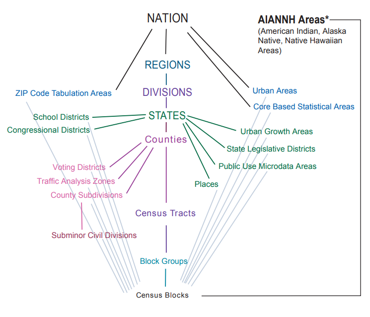

```{r setup, include = FALSE}
library(learnr)
library(tutorial.helpers)
library(tidycensus)
library(tidyverse)
library(knitr)
library(scales)
library(ggridges)
library(geofacet)
library(ggbeeswarm)
library(plotly)

knitr::opts_chunk$set(echo = FALSE)
options(tutorial.exercise.timelimit = 60, 
        tutorial.storage = "local") 

# We want the tutorial to run even if students do not have an internet
# connection, so we need to save all the downloaded data. Save the creation code
# to make replication/improvements easier.

# ga_wide <- get_acs(
#   geography = "county",
#   state = "Georgia",
#   variables = c(medinc = "B19013_001",
#                 medage = "B01002_001"),
#   output = "wide",
#   year = 2020
# )
# write_rds(ga_wide, "data/ga_wide.rds")

ga_wide <- read_rds("data/ga_wide.rds")

# metros <- get_acs(
#   geography = "cbsa",
#   variables = "DP03_0021P",
#   summary_var = "B01003_001",
#   survey = "acs1",
#   year = 2019
# ) |> 
# slice_max(summary_est, n = 20)
# write_rds(metros, "data/metros.rds")
metros <- read_rds("data/metros.rds")

# maine_income <- get_acs(
#  state = "Maine",
#  geography = "county",
#  variables = c(hhincome = "B19013_001"),
#  year = 2020
#) |>
#  mutate(NAME = str_remove(NAME, " County, Maine"))
# write_rds(maine_income, "data/main_income.rds")
 maine_income <- read_rds( "data/main_income.rds")


# years <- 2005:2019
#names(years) <- years

#deschutes_value <- map_dfr(years, ~{
 # get_acs(
 #   geography = "county",
 #   variables = "B25077_001",
  #  state = "OR",
  #  county = "Deschutes",
 #   year = .x,
 #   survey = "acs1"
 # )
#}, .id = "year")
#  write_rds(deschutes_value, "data/deschutes_value.rds")
deschutes_value <- read_rds("data/deschutes_value.rds")
  
  

  
  
   # utah <- get_estimates(
 # geography = "state",
 #  state = "UT",
 # product = "characteristics",
 # breakdown = c("SEX", "AGEGROUP"),
 # breakdown_labels = TRUE,
 # year = 2019
#) 
 # write_rds(utah, "data/utah.rds")
utah <-  read_rds("data/utah.rds")
  
 # utah_filtered <- filter(utah, str_detect(AGEGROUP, "^Age"), 
 #                SEX != "Both sexes") |>
  #mutate(value = ifelse(SEX == "Male", -value, value))
  
#  write_rds(utah_filtered, "data/utah_filtered.rds")
utah_filtered <- read_rds("data/utah_filtered.rds")
  
utah_pyramid <- ggplot(utah_filtered, 
                       aes(x = value, 
                           y = AGEGROUP, 
                           fill = SEX)) + 
  geom_col(width = 0.95, alpha = 0.75) + 
  theme_minimal(base_family = "Verdana", 
                base_size = 12) + 
  scale_x_continuous(
    labels = ~ number_format(scale = .001, suffix = "k")(abs(.x)),
    limits = 140000 * c(-1,1)
  ) + 
  scale_y_discrete(labels = ~ str_remove_all(.x, "Age\\s|\\syears")) + 
  scale_fill_manual(values = c("darkred", "navy")) + 
  labs(x = "", 
       y = "2019 Census Bureau population estimate", 
       title = "Population structure in Utah", 
       fill = "", 
       caption = "Data source: US Census Bureau population estimates & tidycensus R package")
  
 # housing_val <- get_acs(
  #geography = "tract", 
  #variables = "B25077_001", 
  #state = "OR", 
#  county = c(
 #   "Multnomah", 
  #  "Clackamas", 
   # "Washington",
    #"Yamhill", 
  #  "Marion", 
  #  "Columbia"
  #),
  #year = 2020
#)
  
#write_rds(housing_val, "data/housing_val.rds")
housing_val <- read_rds("data/housing_val.rds")

#housing_val2 <- separate(
 # housing_val, 
  #NAME, 
  #into = c("tract", "county", "state"), 
  #sep = ", "
#)
#write_rds(housing_val2, "data/housing_val2.rds")
housing_val2 <- read_rds("data/housing_val2.rds")

#ny_race_income <- get_acs(
#  geography = "tract", 
#  state = "NY",  
#  county = c("New York", "Bronx", "Queens", "Richmond", "Kings"),
#  variables = c(White = "B03002_003", 
#                Black = "B03002_004", 
#                Asian = "B03002_006",
#                Hispanic = "B03002_012"), 
#  summary_var = "B19013_001",
#  year = 2020
#)
#write_rds(ny_race_income, "data/ny_race_income.rds")
ny_race_income <- read_rds("data/ny_race_income.rds")


#us_pyramid_data <- get_estimates(
#  geography = "state",
#  product = "characteristics",
#  breakdown = c("SEX", "AGEGROUP"),
#  breakdown_labels = TRUE,
#  year = 2019
#) |> 
#  filter(str_detect(AGEGROUP, "^Age"),
#         SEX != "Both sexes") |>
#  group_by(NAME) |>
#  mutate(prop = value / sum(value, na.rm = TRUE)) |>
#  ungroup() |>
#  mutate(prop = ifelse(SEX == "Male", -prop, prop))
#write_rds(us_pyramid_data, "data/us_pyramid_data.rds")
us_pyramid_data <- read_rds("data/us_pyramid_data.rds")

```

```{r copy-code-chunk, child = system.file("child_documents/copy_button.Rmd", package = "tutorial.helpers")}
```

```{r info-section, child = system.file("child_documents/info_section.Rmd", package = "tutorial.helpers")}
```

## Introduction
### 

This tutorial covers [Chapter 4: Exploring US Census data with visualization](https://walker-data.com/census-r/exploring-us-census-data-with-visualization.html#visualizing-margins-of-error) from [*Analyzing US Census Data: Methods, Maps, and Models in R*](https://walker-data.com/census-r/index.html) by Kyle Walker. You will learn about using the [**ggplot**](https://ggplot2.tidyverse.org/) package for mapping and for visualizing the margin of error.


## Basic Census visualization with **ggplot2**
### 

A critical part of the Census data analysis process is data visualization, where an analyst examines patterns and trends found in their data graphically. This first section illustrates some examples for getting started with exploratory Census data visualization with [ggplot2](https://ggplot2.tidyverse.org/).

### Exercise 1

Load in **tidycensus** package. 

```{r basic-census-visualization-wit-1, exercise = TRUE}

```

```{r basic-census-visualization-wit-1-hint-1, eval = FALSE}
library(...)
```

```{r basic-census-visualization-wit-1-test, include = FALSE}
library(tidycensus)
```

### 

Aggregate data from the decennial US Census, American Community Survey, and other Census surveys are made available to the public at different enumeration units. Enumeration units are geographies at which Census data are tabulated. 

### Exercise 2

Let's get access to the data on median household income and median age by county in the state of Georgia from the 2016-2020 ACS. Use the function `get_acs()` and set `geography = "county"`, `state = "Georgia"`, `variables = c(medinc = "B19013_001", medage = "B01002_001")`, and `year = 2020` as arguments. 
 
```{r basic-census-visualization-wit-2, exercise = TRUE}

```

```{r basic-census-visualization-wit-2-hint-1, eval = FALSE}
get_acs(
  geography = ...,
  state = ...,
  variables = c(medinc = ..., medage = ...),
  year = ...
)
```

### 

Enumeration units represent different levels of the Census hierarchy. This hierarchy is summarized in the graphic below

```{r echo = FALSE}

```

### Exercise 3

We have assigned the object created with the previous code to `ga_wide`. Type `ga_wide`.

```{r basic-census-visualization-wit-3, exercise = TRUE}

```

```{r basic-census-visualization-wit-3-hint-1, eval = FALSE}
ga_wide
```

```{r basic-census-visualization-wit-3-test, include = FALSE}
ga_wide
```

### 

The core visualization package within the *[Tidyverse](https://www.tidyverse.org/)* suite of packages is **[ggplot2](https://ggplot2.tidyverse.org/)**. **ggplot2** allows R users to visualize data using a layered grammar of graphics approach, in which plot objects are initialized upon which the R user layers plot elements.

### Exercise 4

Run the function `ggplot()` on `ga_wide`, setting the `aes()` argument to `x = midincE`. Note that this will return a plain graph.

```{r basic-census-visualization-wit-4, exercise = TRUE}

```

```{r basic-census-visualization-wit-4-hint-1, eval = FALSE}
ggplot(ga_wide, aes(x = ...))
```

```{r basic-census-visualization-wit-4-test, include = FALSE}
ggplot(ga_wide, aes(x = medincE))
```

### 

**ggplot2** is an ideal package for visualization of US Census data, especially when obtained in tidy format by the **tidycensus** package. It has powerful capacity for basic charts, group-wise comparisons, and advanced chart types such as maps.

### Exercise 5

Copy the previous code and add `geom_histogram()`. Hit "Run Code."

```{r basic-census-visualization-wit-5, exercise = TRUE}

```

<button onclick = "transfer_code(this)">Copy previous code</button>

```{r basic-census-visualization-wit-5-hint-1, eval = FALSE}
ggplot(ga_wide, aes(x = medincE)) + 
  ...
```

```{r basic-census-visualization-wit-5-test, include = FALSE}
ggplot(ga_wide, aes(x = medincE)) + 
  geom_histogram()
```

### 

The histogram shows that the modal median household income of Georgia counties is around $40,000 per year, with a longer tail of wealthier counties on the right-hand side of the plot. 

### Exercise 6

Copy the previous code, within the `geom_histogram()` function, set `bins = 15`. Hit "Run Code."

```{r basic-census-visualization-wit-6, exercise = TRUE}

```

<button onclick = "transfer_code(this)">Copy previous code</button>

```{r basic-census-visualization-wit-6-hint-1, eval = FALSE}
ggplot(ga_wide, aes(x = medincE)) + 
  geom_histogram(...)

```

```{r basic-census-visualization-wit-6-test, include = FALSE}
ggplot(ga_wide, aes(x = medincE)) + 
  geom_histogram(bins = 15)
```

### 

In the histogram, counties are organized into “bins”, which are groups of equal width along the X-axis. The Y-axis then represents the number of counties that fall within each bin.

### Exercise 7

Add title, subtitle, x-axis label to the histogram using `labs()`. You may also want to add:`scale_x_continuous(labels = scales::label_dollar()) ` to make the x-axis more readable.

```{r basic-census-visualization-wit-7, exercise = TRUE}

```

<button onclick = "transfer_code(this)">Copy previous code</button>

```{r basic-census-visualization-wit-7-hint-1, eval = FALSE}
ggplot(ga_wide, aes(x = medincE)) + 
  geom_histogram(bins = 15) + 
  scale_x_continuous(labels = scales::label_dollar()) +
  labs(title = ..., 
       subtitle = ..., 
       x = ...)
```

```{r basic-census-visualization-wit-7-test, include = FALSE}
ggplot(ga_wide, aes(x = medincE)) + 
  scale_x_continuous(labels = scales::label_dollar()) +
  geom_histogram(bins = 15) + 
  labs(title = "Median household income in Georgia counties",
       subtitle = "Most counties have the median household income around $30000 to $50000",
       x = "Median household income")
```

### 

Remember this is what your graph should look like

```{r}
ggplot(ga_wide, aes(x = medincE)) + 
  scale_x_continuous(labels = scales::label_dollar()) +
  geom_histogram(bins = 15) + 
  labs(title = "Median household income in Georgia counties",
       subtitle = "Most counties have the median household income around $30000 to $50000",
       x = "Median household income")
```

### Exercise 8

Histograms are not the only options for visualizing univariate data distributions. Run the function `ggplot()` on `ga_wide`, setting the `aes()` argument to `x = medageE`. Hit "Run Code."

```{r basic-census-visualization-wit-8, exercise = TRUE}

```

```{r basic-census-visualization-wit-8-hint-1, eval = FALSE}
ggplot(ga_wide, aes(x = ...))
```

```{r basic-census-visualization-wit-8-test, include = FALSE}
ggplot(ga_wide, aes(y = medincE))
```

### 

A popular alternative is the box-and-whisker plot, which is implemented in **ggplot2** with [geom_boxplot()](https://ggplot2.tidyverse.org/reference/geom_boxplot.html)

### Exercise 9

Copy the previous code and add `geom_boxplot`. Hit "Run Code."

```{r basic-census-visualization-wit-9, exercise = TRUE}

```

<button onclick = "transfer_code(this)">Copy previous code</button>

```{r basic-census-visualization-wit-9-hint-1, eval = FALSE}
ggplot(ga_wide, aes(y = medincE)) + 
  ...
```

```{r basic-census-visualization-wit-9-test, include = FALSE}
ggplot(ga_wide, aes(y = medincE)) + 
  geom_boxplot()
```

### 

In this example, the column `medincE` is passed to the `y` parameter instead of `x`; this creates a vertical rather than horizontal box plot.

### Exercise 10

Add title, subtitle, and y-axis label to the box plot using `labs()`. You may also want to add `scale_y_continuous(labels = scales::label_dollar())` to make the y-axis more readable.

```{r basic-census-visualization-wit-10, exercise = TRUE}

```

<button onclick = "transfer_code(this)">Copy previous code</button>

```{r basic-census-visualization-wit-10-hint-1, eval = FALSE}
ggplot(ga_wide, aes(y = medincE)) + 
  geom_boxplot() + 
  scale_y_continuous(labels = scales::label_dollar()) +
  labs(title = ..., 
       subtitle = ..., 
       y = ...)
```

```{r basic-census-visualization-wit-10-test, include = FALSE}
ggplot(ga_wide, aes(y = medincE)) + 
  scale_y_continuous(labels = scales::label_dollar()) +
  geom_boxplot() + 
  labs(title = "Median household income in Georgia counties",
       subtitle = "Most counties have the median household income around $30000 to $50000",
       y = "Median household income")
```

### 

Remember this is what your graph should look like

```{r}
ggplot(ga_wide, aes(y = medincE)) + 
  scale_y_continuous(labels = scales::label_dollar()) +
  geom_boxplot() + 
  labs(title = "Median household income in Georgia counties",
       subtitle = "Most counties have the median household income around $30000 to $50000",
       y = "Median household income")
```

### Exercise 11

Now we want to see both the median household income and median age of counties in the Georgia state. Run the function `ggplot()` on `ga_wide`, setting the `aes()` argument to `x = medageE` and `y = medincE`. Hit "Run Code."

```{r basic-census-visualization-wit-11, exercise = TRUE}

```

```{r basic-census-visualization-wit-11-hint-1, eval = FALSE}
ggplot(ga_wide, aes(x = ..., y = ...))
```

```{r basic-census-visualization-wit-11-test, include = FALSE}
ggplot(ga_wide, aes(x = medageE, y = medincE))
```

### 

For two numeric variables, a common exploratory chart is a scatter plot, which maps values in one column to the X-axis and values in another column to the Y-axis. The resulting plot then gives the analyst a sense of the nature of the relationship between the two variables.

### Exercise 12

Copy the previous code and add `geom_point()`. Hit "Run Code."

```{r basic-census-visualization-wit-12, exercise = TRUE}

```

<button onclick = "transfer_code(this)">Copy previous code</button>

```{r basic-census-visualization-wit-12-hint-1, eval = FALSE}
ggplot(ga_wide, aes(x = medageE, y = medincE)) + 
  ...
```

```{r basic-census-visualization-wit-12-test, include = FALSE}
ggplot(ga_wide, aes(x = medageE, y = medincE)) + 
  geom_point()
```

### 

Scatter plots are implemented in ggplot2 with the [geom_point()](https://ggplot2.tidyverse.org/reference/geom_point.html) function, which plots points on a chart relative to X and Y values for observations in a dataset. 

### Exercise 13

Let's see whether there is a relationship between median household income and median age in Georgia counties. Copy previous code, and add `geom_smooth()` to the plot, set the argument `method = "lm"`. Hit "Run Code."

```{r basic-census-visualization-wit-13, exercise = TRUE}

```

<button onclick = "transfer_code(this)">Copy previous code</button>

```{r basic-census-visualization-wit-13-hint-1, eval = FALSE}
ggplot(ga_wide, aes(x = medageE, y = medincE)) + 
  geom_point() + 
  geom_smooth(method = ...)
```

```{r basic-census-visualization-wit-13-test, include = FALSE}
ggplot(ga_wide, aes(x = medageE, y = medincE)) + 
  geom_point() + 
  geom_smooth(method = "lm")
```

### 

The [geom_smooth()](https://ggplot2.tidyverse.org/reference/geom_smooth.html) function draws a fitted line representing the relationship between the two columns on the plot. 

### Exercise 14

Add title, subtitle, and x and y-axis labels to the scatter plot using `labs()`. You may also want to add`scale_y_continuous(labels = scales::label_dollar())` to make the y-axis more readable.

```{r basic-census-visualization-wit-14, exercise = TRUE}

```

<button onclick = "transfer_code(this)">Copy previous code</button>

```{r basic-census-visualization-wit-14-hint-1, eval = FALSE}
ggplot(ga_wide, aes(x = medageE, y = medincE)) + 
  geom_point() + 
  geom_smooth(method = "lm") + 
  labs(title = ..., 
       subtitle = ..., 
       x = ..., 
       y = ...) +
  scale_y_continuous(labels = ...)
```

```{r basic-census-visualization-wit-14-test, include = FALSE}
ggplot(ga_wide, aes(x = medageE, y = medincE)) + 
  geom_point() + 
  geom_smooth(method = "lm") + 
  labs(title = "Median household income and median age in Georgia counties",
       subtitle = "County median household income in Georgia tends to decline slightly as median age increases",
       x = "Median age",
       y = "Median household income") + 
  scale_y_continuous(labels = scales::label_dollar())
```

### 

Remember this is what your graph should look like

```{r}
ggplot(ga_wide, aes(x = medageE, y = medincE)) + 
  geom_point() + 
  geom_smooth(method = "lm") + 
  labs(title = "Median household income and median age in Georgia counties",
       subtitle = "county median household income in Georgia tends to decline slightly as median age increases",
       x = "Median age",
       y = "Median household income") + 
  scale_y_continuous(labels = scales::label_dollar())
```

## Customizing **ggplot2** Visualizations
### 

The attractive defaults of [ggplot2](https://ggplot2.tidyverse.org/) visualizations allow for the creation of legible graphics with little to no customization. This helps greatly with exploratory data analysis tasks where the primary audience is the analyst exploring the dataset.This section covers how to take a Census data visualization that is relatively illegible by default and polish it up for eventual presentation and export from R.

### Exercise 1

Load in **tidyverse** package. 

```{r customizing-ggplot2-visualizat-1, exercise = TRUE}

```

```{r customizing-ggplot2-visualizat-1-hint-1, eval = FALSE}
library(...)
```

```{r customizing-ggplot2-visualizat-1-test, include = FALSE}
library(tidyverse)
```

### 

In this example, we will create a visualization that illustrates the percent of commuters that take public transportation to work for the largest metropolitan areas in the United States.

### Exercise 2

Use the function `get_acs()` and set `geography = "cbsa"`, `variables = "DP03_0021P"`, ` summary_var = "B01003_001"`, `survey = "acs1"` and `year = 2019` as arguments. 

```{r customizing-ggplot2-visualizat-2, exercise = TRUE}

```

```{r customizing-ggplot2-visualizat-2-hint-1, eval = FALSE}
get_acs(
  geography = ...,
  variables = ...,
  summary_var = ...,
  survey = ...,
  year = ...
)
```

```{r customizing-ggplot2-visualizat-2-test, include = FALSE}
get_acs(
  geography = "cbsa",
  variables = "DP03_0021P",
  summary_var = "B01003_001",
  survey = "acs1",
  year = 2019
)
```

### 

The data come from the 2019 1-year American Community Survey Data Profile, variable `DP03_0021P`. To determine this information, we can use tidyverse tools to sort our data by descending order of a summary variable representing total population and then retaining the 20 largest metropolitan areas by population using the `slice_max()` function.

### Exercise 3

Copy the previous code, pipe it to the `slice_max()` function with `summary_est` and `n=20` as arguments. 

```{r customizing-ggplot2-visualizat-3, exercise = TRUE}

```

<button onclick = "transfer_code(this)">Copy previous code</button>

```{r customizing-ggplot2-visualizat-3-hint-1, eval = FALSE}
... |> 
  slice_max(..., n = ...)
```

```{r customizing-ggplot2-visualizat-3-test, include = FALSE}
get_acs(
  geography = "cbsa",
  variables = "DP03_0021P",
  summary_var = "B01003_001",
  survey = "acs1",
  year = 2019
) |> 
  slice_max(summary_est, n = 20)
```

### 

This command sort our data by descending order of a summary variable representing total population and then retaining the 20 largest metropolitan areas by population

### Exercise 4

We have assigned the previous code to the variable `metros`. Print `metros` to ensure it works.

```{r customizing-ggplot2-visualizat-4, exercise = TRUE}

```

```{r customizing-ggplot2-visualizat-4-hint-1, eval = FALSE}
metros 
```

```{r customizing-ggplot2-visualizat-4-test, include = FALSE}
metros 
```

### 

The largest one is New York-Newark-Jersey City, NY-NJ-PA Metro Area. We will learn how to create a plot to visualize the public transit commute share for these 20 largest metropolitan areas.

```{r}
library(scales)

metros |>
  mutate(NAME = str_remove(NAME, "-.*$")) |>
  mutate(NAME = str_remove(NAME, ",.*$")) |>
  ggplot(aes(y = reorder(NAME, estimate), x = estimate)) + 
  geom_col(color = "navy", fill = "navy", 
           alpha = 0.5, width = 0.85) +  
  theme_minimal(base_size = 12, base_family = "Verdana") + 
  scale_x_continuous(labels = label_percent(scale = 1)) + 
  labs(title = "Public transit commute share", 
       subtitle = "2019 1-year ACS estimates", 
       y = "", 
       x = "ACS estimate", 
       caption = "Source: ACS Data Profile variable DP03_0021P via the tidycensus R package") 
```

### Exercise 5

Run the function `ggplot()` on `metros`, setting the `aes()` argument to `x = NAME`, and `y = estimatet`. Hit "Run Code."

```{r customizing-ggplot2-visualizat-5, exercise = TRUE}

```

```{r customizing-ggplot2-visualizat-5-hint-1, eval = FALSE}
ggplot(metros, aes(x = ..., y = ...))
```

```{r customizing-ggplot2-visualizat-5-test, include = FALSE}
ggplot(metros, aes(x = NAME, y = estimate)) 
```

### 

The first argument to [ggplot()](https://ggplot2.tidyverse.org/reference/ggplot.html) in the example below is the name of our dataset; the second argument is an aesthetic mapping of columns to plot elements, specified inside the [aes()](https://ggplot2.tidyverse.org/reference/ggplot.html) function. 

### Exercise 6

Copy the previous code and add `geom_col()`. Hit "Run Code."

```{r customizing-ggplot2-visualizat-6, exercise = TRUE}

```

<button onclick = "transfer_code(this)">Copy previous code</button>

```{r customizing-ggplot2-visualizat-6-hint-1, eval = FALSE}
ggplot(metros, aes(x = NAME, y = estimate)) + 
  ...
```

```{r customizing-ggplot2-visualizat-6-test, include = FALSE}
ggplot(metros, aes(x = NAME, y = estimate)) + 
  geom_col()
```

### 

We can hardly see anything from this graph! The x-axis labels are so lengthy that they overlap and are impossible to read; the axis titles are not intuitive; and the data are not sorted, making it difficult to compare similar observations.

### Exercise 7

The first step to take in making the plot looks nicer is reformat the `NAME` column since something like "New York-Newark-Jersey City, NY-NJ-PA Metro Area" is too long. Pipe `metros` to the `mutate()` function and pass in `NAME = str_remove()` as the argument. Within `str_remove()` pass in `NAME = str_remove(NAME, "-.*$")"` as an argument. 

```{r customizing-ggplot2-visualizat-7, exercise = TRUE}

```

<button onclick = "transfer_code(this)">Copy previous code</button>

```{r customizing-ggplot2-visualizat-7-hint-1, eval = FALSE}

```

```{r customizing-ggplot2-visualizat-7-test, include = FALSE}
metros |>
  mutate(NAME = str_remove(NAME, "-.*$"))
```

### 

This removes everything from the first `"-"` to the end of the string.

### Exercise 8

Continue the pipe to the `mutate()` function and pass in `NAME = str_remove(NAME, ",.*$")` as an argument. Hit "Run Code."

```{r customizing-ggplot2-visualizat-8, exercise = TRUE}

```

<button onclick = "transfer_code(this)">Copy previous code</button>

```{r customizing-ggplot2-visualizat-8-hint-1, eval = FALSE}

```

```{r customizing-ggplot2-visualizat-8-test, include = FALSE}
metros |>
  mutate(NAME = str_remove(NAME, "-.*$")) |>
  mutate(NAME = str_remove(NAME, ",.*$"))
```

### 

The second mutate removes everything from the first `","` to the end of the string if no dash was originally present

### Exercise 9

Copy previous code, pipe it to the `ggplot()` function, setting the `aes()` argument to `x = estimate`, and `y = reorder(NAME, estimate)`. Hit "Run Code."

```{r customizing-ggplot2-visualizat-9, exercise = TRUE}

```

<button onclick = "transfer_code(this)">Copy previous code</button>

```{r customizing-ggplot2-visualizat-9-hint-1, eval = FALSE}
... |> 
  ggplot(aes(y = reorder(NAME, estimate), x = estimate))
```

```{r customizing-ggplot2-visualizat-9-test, include = FALSE}
metros |>
  mutate(NAME = str_remove(NAME, "-.*$")) |>
  mutate(NAME = str_remove(NAME, ",.*$")) |>
  ggplot(aes(y = reorder(NAME, estimate), x = estimate))
```

### 

The legibility can be further improved by mapping the metro name to the y-axis and the ACS estimate to the x-axis, and plotting the points in descending order of their estimate values. 

### Exercise 10

Add `geom_col()` to the plot. Hit "Run Code."

```{r customizing-ggplot2-visualizat-10, exercise = TRUE}

```

<button onclick = "transfer_code(this)">Copy previous code</button>

```{r customizing-ggplot2-visualizat-10-hint-1, eval = FALSE}
... |> 
  ggplot(aes(y = reorder(NAME, estimate), x = estimate)) + 
  geom_col()
```

```{r customizing-ggplot2-visualizat-10-test, include = FALSE}
metros |>
  mutate(NAME = str_remove(NAME, "-.*$")) |>
  mutate(NAME = str_remove(NAME, ",.*$")) |>
  ggplot(aes(y = reorder(NAME, estimate), x = estimate)) + 
  geom_col()
```

### 

The plot is much more legible after our modifications. Metropolitan areas can be directly compared with one another, and the metro area labels convey enough information about the different places without overwhelming the plot with long axis labels.

### Exercise 11

Add title, subtitle, and x-axis and y-axis labels, caption to the plot using `labs()`. 

```{r customizing-ggplot2-visualizat-11, exercise = TRUE}

```

<button onclick = "transfer_code(this)">Copy previous code</button>

```{r customizing-ggplot2-visualizat-11-hint-1, eval = FALSE}
... |> 
  ggplot(aes(y = reorder(NAME, estimate), x = estimate)) + 
  geom_col() + 
  labs(title = ..., 
       subtitle = ..., 
       x = ..., 
       y = "", 
       caption = ...)
```

```{r customizing-ggplot2-visualizat-11-test, include = FALSE}
metros |>
  mutate(NAME = str_remove(NAME, "-.*$")) |>
  mutate(NAME = str_remove(NAME, ",.*$")) |>
  ggplot(aes(y = reorder(NAME, estimate), x = estimate)) + 
  geom_col() + 
  labs(title = "Public transit commute share", 
       subtitle = "2019 1-year ACS estimates", 
       y = "", 
       x = "ACS estimate", 
       caption = "Source: ACS Data Profile variable DP03_0021P via the tidycensus R package") 
```

### 

Remember this is what your graph should look like

```{r}
metros |>
  mutate(NAME = str_remove(NAME, "-.*$")) |>
  mutate(NAME = str_remove(NAME, ",.*$")) |>
  ggplot(aes(y = reorder(NAME, estimate), x = estimate)) + 
  geom_col() +  
  theme_minimal() + 
  labs(title = "Public transit commute share", 
       subtitle = "2019 1-year ACS estimates", 
       y = "", 
       x = "ACS estimate", 
       caption = "Source: ACS Data Profile variable DP03_0021P via the tidycensus R package") 

```

### Exercise 12

You can still modify the plot to make it nicer. In the `geom_col()` function, set `color = "navy"`, `fill = "navy"`, `alpha = 0.5` and `width = 0.85`. Hit "Run Code."

```{r customizing-ggplot2-visualizat-12, exercise = TRUE}

```

<button onclick = "transfer_code(this)">Copy previous code</button>

```{r customizing-ggplot2-visualizat-12-hint-1, eval = FALSE}

```

```{r customizing-ggplot2-visualizat-12-test, include = FALSE}
metros |>
  mutate(NAME = str_remove(NAME, "-.*$")) |>
  mutate(NAME = str_remove(NAME, ",.*$")) |>
  ggplot(aes(y = reorder(NAME, estimate), x = estimate)) + 
  geom_col(color = "navy", fill = "navy", 
           alpha = 0.5, width = 0.85) + 
 labs(title = "Public transit commute share", 
       subtitle = "2019 1-year ACS estimates", 
       y = "", 
       x = "ACS estimate", 
       caption = "Source: ACS Data Profile variable DP03_0021P via the tidycensus R package") 
```

### 

To make the x-axis represent the percentage, we will rescale it using the **scales** package.

### Exercise 13

Copy the previous code of your graph. Add `scale_x_continuous(labels = label_percent(scale = 1))`. Note that you need to put `library(scales)` at the beginning of your code for it to run.


```{r customizing-ggplot2-visualizat-13, exercise = TRUE}

```

<button onclick = "transfer_code(this)">Copy previous code</button>

```{r customizing-ggplot2-visualizat-13-hint-1, eval = FALSE}
library(...)

... + 
  scale_x_continuous(labels = label_percent(scale = 1)) + 
  labs(...)
```

```{r customizing-ggplot2-visualizat-13-test, include = FALSE}
library(scales)

metros |>
  mutate(NAME = str_remove(NAME, "-.*$")) |>
  mutate(NAME = str_remove(NAME, ",.*$")) |>
  ggplot(aes(y = reorder(NAME, estimate), x = estimate)) + 
  geom_col(color = "navy", fill = "navy", 
           alpha = 0.5, width = 0.85) + 
  scale_x_continuous(labels = label_percent(scale = 1)) + 
  labs(title = "Public transit commute share", 
       subtitle = "2019 1-year ACS estimates", 
       y = "", 
       x = "ACS estimate", 
       caption = "Source: ACS Data Profile variable DP03_0021P via the tidycensus R package") 
```

### 

While an analyst may be comfortable with the plot as-is, **ggplot2** allows for significant customization with respect to stylistic presentation. This includes styling the bars on the plot with a different color and internal transparency; changing the font; and customizing the axis tick labels.

### Exercise 14

Add `theme_minimal()` to the plot, set `base_size = 12`, `base_family = "Verdana"`. Hit "Run Code."


```{r customizing-ggplot2-visualizat-14, exercise = TRUE}

```

<button onclick = "transfer_code(this)">Copy previous code</button>

```{r customizing-ggplot2-visualizat-14-hint-1, eval = FALSE}
... + 
  theme_minimal(base_size = 12, base_family = "Verdana")
```

```{r customizing-ggplot2-visualizat-14-test, include = FALSE}
metros |>
  mutate(NAME = str_remove(NAME, "-.*$")) |>
  mutate(NAME = str_remove(NAME, ",.*$")) |>
  ggplot(aes(y = reorder(NAME, estimate), x = estimate)) + 
  geom_col(color = "navy", fill = "navy", 
           alpha = 0.5, width = 0.85) + 
  scale_x_continuous(labels = label_percent(scale = 1)) + 
  labs(title = "Public transit commute share", 
       subtitle = "2019 1-year ACS estimates", 
       y = "", 
       x = "ACS estimate", 
       caption = "Source: ACS Data Profile variable DP03_0021P via the tidycensus R package") +
  theme_minimal(base_size = 12, base_family = "Verdana")
```

### 

Once an analyst has settled on a visualization design, they may want to export their image from R to display on a website, in a blog post, or in a report. You can do so by clicking the button **Export** in the plot window and then **Save as Image**

### Exercise 15

However, you can also do it by running the function `ggsave()` on your plot. Hit "Run Code."

```{r customizing-ggplot2-visualizat-15, exercise = TRUE}
ggsave(
  filename = "metro_transit.png",
  path = "~/images",
  width = 8,
  height = 5,
  units = "in",
  dpi = 300
)
```

### 

The [ggsave()](https://ggplot2.tidyverse.org/reference/ggsave.html) function in ggplot2 will save the last plot generated to an image file in the user’s current working directory by default. The specified file extension will control the output image format, e.g. .png.

## Visualizing Margins of Error
### 

Handling margins of error appropriately is of significant importance for analysts working with ACS data. While **tidycensus** has tools available for working with margins of error in a data wrangling workflow, it is also often useful to visualize those margins of error to illustrate the degree of uncertainty around estimates, especially when making comparisons between those estimates.

### Exercise 1

We can access the US Census API via the **tidycensus** package. The **tidycensus** package utilizes an API key to access Census data. Load the **tidycensus** package into your R session.

Run `search()` in the Console to see the libraries that you've currently loaded. CP/CR.

```{r visualizing-margins-of-error-1}
question_text(NULL,
    answer(NULL, correct = TRUE),
    allow_retry = TRUE,
    try_again_button = "Edit Answer",
    incorrect = NULL,
    rows = 3)
```

The output should include the string "package:tidycensus". Kyle Walker is also the author of the [**tidycensus**](https://walker-data.com/tidycensus/) package.

### Exercise 2

In the example below, we will compare the median household incomes of counties in the US state of Maine from the 2016-2020 ACS.

Use the function `get_decennial()` and passing in `state = "Maine"`, `geography = "county"`, `variables = c(totalpop = "P1_001N")`, and  `year = 2020` as arguments
 
```{r visualizing-margins-of-error-2, exercise = TRUE}

```

```{r visualizing-margins-of-error-2-hint-1, eval = FALSE}
get_decennial(
  state = ...,
  ... = "county",
  variables = c(... = "P1_001N"),
  year = 2020
) 
```

### 

In the above example visualization of public transportation mode share by metropolitan area for the largest metros in the United States, estimates are associated with margins of error though they are relatively small given the large population size of the geographic units represented in the plot. However, if studying demographic trends for geographies of smaller population size - like counties, Census tracts, or block groups - comparisons can be subject to a considerable degree of uncertainty.

### Exercise 3

Pipe the previous code into the function  `arrange()` with `desc(value)` as an argument.
 
```{r visualizing-margins-of-error-3, exercise = TRUE}

```

<button onclick = "transfer_code(this)">Copy previous code</button>

```{r visualizing-margins-of-error-3-hint-1, eval = FALSE}
get_decennial(
  state = ...,
  ... = "county",
  variables = c(... = "P1_001N"),
  year = 2020
) |>
   arrange(...(value))
```

### 

There are sixteen counties in Maine, ranging in population from a maximum of 303,069 to a minimum of 16,800. In turn, estimates for the counties with smaller population sizes are likely to be subject to a larger margin of error than those with larger baseline populations.

### Exercise 4

Comparing median household incomes of these sixteen counties illustrates this point. Let’s first obtain this data with tidycensus then clean up the NAME column with str_remove() to remove redundant information.
Delete the `arrange()` and anything within in it and replace it with the `mutate()` function and pass in `NAME = str_remove()` as the argument. withing `str_remove()` pass in `NAME, " County, Maine"` as an argument. 
 
```{r visualizing-margins-of-error-4, exercise = TRUE}

```

<button onclick = "transfer_code(this)">Copy previous code</button>

```{r visualizing-margins-of-error-4-hint-1, eval = FALSE}
get_decennial(
  state = ...,
  ... = "county",
  variables = c(... = "P1_001N"),
  year = 2020
) |>
   mutate(NAME = ....(..., " County, Maine"))
```

### 

This will clean up the NAME column replacing something like "York County, Maine" with just "York" instead.

### Exercise 5

We have assigned the previous code to the variable `main_income`. Print `main_income` to ensure it works.

```{r visualizing-margins-of-error-5, exercise = TRUE}

```

```{r visualizing-margins-of-error-5-hint-1, eval = FALSE}
maine_income
```

```{r visualizing-margins-of-error-5-test, include = FALSE}
maine_income
```

### 

We will produce the below graph to visualize the median household income of Maine counties. 

```{r}
ggplot(maine_income, aes(x = estimate, y = reorder(NAME, estimate))) + 
  geom_point(size = 3, color = "darkgreen") + 
  labs(title = "Median household income", 
       subtitle = "Counties in Maine", 
       x = "", 
       y = "ACS estimate") + 
  theme_minimal(base_size = 12.5) + 
  scale_x_continuous(labels = label_dollar())
```

### Exercise 6

Run `ggplot()` on `main_income`, setting the `aes()` argument to `x = estimate`, and `y = reorder(NAME, estimate)`. Hit "Run Code."

```{r visualizing-margins-of-error-6, exercise = TRUE}

```

<button onclick = "transfer_code(this)">Copy previous code</button>

```{r visualizing-margins-of-error-6-hint-1, eval = FALSE}
ggplot(..., aes(x = ..., y = reorder(NAME, ...)))
```

```{r visualizing-margins-of-error-6-test, include = FALSE}
ggplot(maine_income, aes(x = estimate, y = reorder(NAME, estimate)))
```

### 

Using some of the tips covered in the previous visualization section, we can produce a plot with appropriate styling and formatting to rank the counties.

### Exercise 7

Add `geom_point()` to the plot, set the argument `size = 3`, `color = "darkgreen"`. Hit "Run Code."

```{r visualizing-margins-of-error-7, exercise = TRUE}

```

<button onclick = "transfer_code(this)">Copy previous code</button>

```{r visualizing-margins-of-error-7-hint-1, eval = FALSE}
ggplot(..., aes(x = ..., y = reorder(NAME, ...))) +  
  geom_point(... = 3, color =  ...)
```

```{r visualizing-margins-of-error-7-test, include = FALSE}
ggplot(maine_income, aes(x = estimate, y = reorder(NAME, estimate))) +
  geom_point(size = 3, color = "darkgreen")
```

### 

The above visualization suggests a ranking of counties from the wealthiest (Cumberland) to the poorest (Piscataquis). However, the data used to generate this chart is significantly different from the metropolitan area data used in the previous example.

### Exercise 8

Add title, subtitle, and x and y-axis labels to the scatter plot using `labs()`. 

Remember this is what your graph should look like

```{r}
ggplot(maine_income, aes(x = estimate, y = reorder(NAME, estimate))) + 
  geom_point(size = 3, color = "darkgreen") + 
  labs(title = "Median household income", 
       subtitle = "Counties in Maine", 
       x = "", 
       y = "ACS estimate") + 
  theme_minimal(base_size = 12.5) + 
  scale_x_continuous(labels = label_dollar())
```

```{r visualizing-margins-of-error-8, exercise = TRUE}

```

<button onclick = "transfer_code(this)">Copy previous code</button>

```{r visualizing-margins-of-error-8-hint-1, eval = FALSE}
ggplot(..., aes(x = ..., y = reorder(NAME, ...))) +  
  geom_point(... = 3, color =  ...) + 
  labs(title = ..., 
       subtitle = ..., 
       x = "", 
       y = ...)
```

```{r visualizing-margins-of-error-8-test, include = FALSE}
ggplot(maine_income, aes(x = estimate, y = reorder(NAME, estimate))) + 
  geom_point(size = 3, color = "darkgreen") + 
  labs(title = "Median household income", 
       subtitle = "Counties in Maine", 
       x = "", 
       y = "ACS estimate") + 
  theme_minimal(base_size = 12.5) + 
  scale_x_continuous(labels = label_dollar())
```

### 

In our first example, ACS estimates covered the top 20 US metros by population - areas that all have populations exceeding 2.8 million. For these areas, margins of error are small enough that they do not meaningfully change the interpretation of the estimates given the large sample sizes used to generate them.

### Exercise 9

Add `theme_minimal()` to the plot, set `base_size = 12.5`. Hit "Run Code."

```{r visualizing-margins-of-error-9, exercise = TRUE}

```

<button onclick = "transfer_code(this)">Copy previous code</button>

```{r visualizing-margins-of-error-9-hint-1, eval = FALSE}
ggplot(..., aes(x = ..., y = reorder(NAME, ...))) +  
  geom_point(... = 3, color =  ...) + 
  labs(title = ..., 
       subtitle = ..., 
       x = "", 
       y = ...) + 
  theme_minimal(base_size = ...)
```

```{r visualizing-margins-of-error-9-test, include = FALSE}
ggplot(maine_income, aes(x = estimate, y = reorder(NAME, estimate))) + 
  geom_point(size = 3, color = "darkgreen") + 
  labs(title = "Median household income", 
       subtitle = "Counties in Maine", 
       x = "", 
       y = "ACS estimate") + 
  theme_minimal(base_size = 12.5) 
```

### 

However, as discussed in Section 3.5, smaller geographies may have much larger margins of error relative to their ACS estimates.

### Exercise 10

To add the dollar sign to the x-axis, use the `scale_x_continuous()` function with the `labels = label_dollar()` argument. Hit "Run Code."

```{r visualizing-margins-of-error-10, exercise = TRUE}

```

<button onclick = "transfer_code(this)">Copy previous code</button>

```{r visualizing-margins-of-error-10-hint-1, eval = FALSE}
ggplot(..., aes(x = ..., y = reorder(NAME, ...))) +  
  geom_point(... = 3, color =  ...) + 
  labs(title = ..., 
       subtitle = ..., 
       x = "", 
       y = ...) + 
  theme_minimal(base_size = ...) + 
  scale_x_continuous(labels = ...)
```

```{r visualizing-margins-of-error-10-test, include = FALSE}
ggplot(maine_income, aes(x = estimate, y = reorder(NAME, estimate))) + 
  geom_point(size = 3, color = "darkgreen") + 
  labs(title = "Median household income", 
       subtitle = "Counties in Maine", 
       x = "", 
       y = "ACS estimate") + 
  theme_minimal(base_size = 12.5) + 
  scale_x_continuous(labels = label_dollar())
```

### 

Several county estimates on the chart are quite close to one another, which may mean that the ranking of counties is misleading given the margin of error around those estimates

### Exercise 11

We can explore this by looking directly at the data. Pipe `main_income` to  `arrange(desc(moe))`

```{r visualizing-margins-of-error-11, exercise = TRUE}

```

<button onclick = "transfer_code(this)">Copy previous code</button>

```{r visualizing-margins-of-error-11-hint-1, eval = FALSE}
maine_income |>
  ...(desc(...))
```

```{r visualizing-margins-of-error-11-test, include = FALSE}
maine_income |>
  arrange(desc(moe))
```

### 

This will arrange the data in descending order of the margin of error, allowing us to see which estimates are most uncertain. We can also visualize it using `ggplot()`

```{r}
ggplot(maine_income, aes(x = estimate, y = reorder(NAME, estimate))) + 
  geom_errorbarh(aes(xmin = estimate - moe, xmax = estimate + moe)) + 
  geom_point(size = 3, color = "darkgreen") + 
  theme_minimal(base_size = 12.5) + 
  labs(title = "Median household income", 
       subtitle = "Counties in Maine", 
       x = "2016-2020 ACS estimate", 
       y = "") + 
  scale_x_continuous(labels = label_dollar())
```

### Exercise 12

Lets visualize the moe's of this data using ggplot. Pipe `main_income` to `ggplot()` setting `x` equal to `estimate` and `y` equal to `reoorder(NAME, estimate)` within `aes`.

```{r visualizing-margins-of-error-12, exercise = TRUE}

```

```{r visualizing-margins-of-error-12-hint-1, eval = FALSE}
ggplot(..., aes(x = ..., y = reorder(NAME, ...)))
```

```{r visualizing-margins-of-error-12-test, include = FALSE}
ggplot(maine_income, aes(x = estimate, y = reorder(NAME, estimate)))
```

### 

Margins of error around the estimated median household incomes vary from a low of $1563 (Cumberland County) to a high of $4616 (Sagadahoc County). In many cases, the margins of error around estimated county household income exceed the differences between counties of neighboring ranks, suggesting uncertainty in the ranks themselves.

### Exercise 13

Add `geom_point` setting `size` to `3` and `color` to `"darkgreen"` within the function

```{r visualizing-margins-of-error-13, exercise = TRUE}

```

<button onclick = "transfer_code(this)">Copy previous code</button>

```{r visualizing-margins-of-error-13-hint-1, eval = FALSE}
ggplot(..., aes(x = ..., y = reorder(NAME, ...))) +  
  geom_point(... = 3, color =  ...)
```

```{r visualizing-margins-of-error-13-test, include = FALSE}
ggplot(maine_income, aes(x = estimate, y = reorder(NAME, estimate))) +
  geom_point(size = 3, color = "darkgreen")
```

### 

A dot plot like the one above intended to visualize a ranking of county household incomes in Maine may be misleading. However, using visualization tools in **ggplot2**, we can visualize the uncertainty around each estimate, giving chart readers a sense of the uncertainty in the ranking.

### Exercise 14

Lets add `geom_errorbar()` to visualize the margin of uncertainty. Pipe the previous code to `geom_errorbarh()` setting `xmin` equal to `estimate` minus `moe` and `xmax` to `estimate` plus `moe` within `aes()`.
 
```{r visualizing-margins-of-error-14, exercise = TRUE}

```

```{r visualizing-margins-of-error-14-hint-1, eval = FALSE}
ggplot(..., aes(x = ..., y = reorder(NAME, ...))) +  
  geom_point(... = 3, color =  ...) + 
  ...(aes(xmin = ... - moe, xmax = estimate + ...))
```

```{r visualizing-margins-of-error-14-test, include = FALSE}
ggplot(maine_income, aes(x = estimate, y = reorder(NAME, estimate))) +
  geom_point(size = 3, color = "darkgreen") + 
  geom_errorbarh(aes(xmin = estimate - moe, xmax = estimate + moe))
```

### 

The `geom_errorbarh()` will plot horizontal error bars around each dot that stretch to a given value around each estimate. In this instance, we will use the `moe` column to determine the lengths of the error bars.

### Exercise 15

Lets make the plot look nice using `labs()` and `theme_minimal()`. Pipe to `theme_minimal()` setting `base_size` to `12.5`. Using `labs()` add a `title`, `subtitle`, `x`, and `y`. 

This is what your graph should look like:

```{r}
ggplot(maine_income, aes(x = estimate, y = reorder(NAME, estimate))) +  
  geom_point(size = 3, color = "darkgreen") + 
  geom_errorbarh(aes(xmin = estimate - moe, xmax = estimate + moe)) + 
  theme_minimal(base_size = 12.5) + 
  labs(title = "Median household income", 
       subtitle = "Counties in Maine", 
       x = "2016-2020 ACS estimate", 
       y = "")
```

```{r visualizing-margins-of-error-15, exercise = TRUE}

```

<button onclick = "transfer_code(this)">Copy previous code</button>

```{r visualizing-margins-of-error-15-hint-1, eval = FALSE}
ggplot(..., aes(x = ..., y = reorder(NAME, ...))) +  
  geom_point(... = 3, color =  ...) + 
  ...(aes(xmin = ... - moe, xmax = estimate + ...)) + 
  theme_minimal(... = 12.5) + 
  labs(title = ..., 
      ... = "Counties in Maine", 
       x = "2016-2020 ACS estimate", 
       y = ...)
```

```{r visualizing-margins-of-error-15-test, include = FALSE}
ggplot(maine_income, aes(x = estimate, y = reorder(NAME, estimate))) +  
  geom_point(size = 3, color = "darkgreen") + 
  geom_errorbarh(aes(xmin = estimate - moe, xmax = estimate + moe)) + 
  theme_minimal(base_size = 12.5) + 
  labs(title = "Median household income", 
       subtitle = "Counties in Maine", 
       x = "2016-2020 ACS estimate", 
       y = "")
```

### 

Adding the horizontal error bars around each point gives us critical information to help us understand how our ranking of Maine counties by median household income. 

### Exercise 16

Let's make the numbers on the x=axis neater. Pipe the previous code into `scale_x_continuous()` setting `labels = label_dollar()` as the argument

```{r visualizing-margins-of-error-16, exercise = TRUE}

```

<button onclick = "transfer_code(this)">Copy previous code</button>

```{r visualizing-margins-of-error-16-hint-1, eval = FALSE}
ggplot(..., aes(x = ..., y = reorder(NAME, ...))) +  
  geom_point(... = 3, color =  ...) + 
  ...(aes(xmin = ... - moe, xmax = estimate + ...)) + 
  theme_minimal(... = 12.5) + 
  labs(title = ..., 
      ... = "Counties in Maine", 
       x = "2016-2020 ACS estimate", 
       y = ...) + 
  scale_x_continuous(labels = ...)
```

```{r visualizing-margins-of-error-16-test, include = FALSE}
ggplot(maine_income, aes(x = estimate, y = reorder(NAME, estimate))) +  
  geom_point(size = 3, color = "darkgreen") + 
  geom_errorbarh(aes(xmin = estimate - moe, xmax = estimate + moe)) + 
  theme_minimal(base_size = 12.5) + 
  labs(title = "Median household income", 
       subtitle = "Counties in Maine", 
       x = "2016-2020 ACS estimate", 
       y = "") + 
  scale_x_continuous(labels = label_dollar())
```

### 

For example, while the ACS estimate suggests that Piscataquis County has the lowest median household income in Maine, the large margin of error around the estimate for Piscataquis County suggests that either Aroostook or Washington Counties could conceivably have lower median household incomes. 

## Visualizing ACS Estimates Over Time
### 

While the output table usefully represented the time series of educational attainment in Colorado counties, data visualization is also commonly used to illustrate change over time. Arguably the most common chart type chosen for time-series visualization is the line chart, which ggplot2 handles capably with the `geom_line()` function.

### Exercise 1

Assign the variable `years` to the years `2005` to `2019`. On another line assign the function `names()` with `years` as its argument to the variable `years`.

```{r visualizing-acs-estimates-over-1, exercise = TRUE}

```

```{r visualizing-acs-estimates-over-1-hint-1, eval = FALSE}
... <- 2005;2019
names(...) <- years
```

```{r visualizing-acs-estimates-over-1-test, include = FALSE}
years <- 2005:2019
names(years) <- years

```

### 

For an illustrative example, we’ll obtain 1-year ACS data from 2005 through 2019 on median home value for Deschutes County, Oregon, home to the city of Bend and large numbers of in-migrants in recent years from the Bay Area in California.

### Exercise 2

On the exercise chunk, Hit "Run Code".

```{r visualizing-acs-estimates-over-2, exercise = TRUE}
years <- 2005:2019
names(years) <- years

map_dfr(years, ~{
  get_acs(
    geography = "county",
    variables = "B25077_001",
    state = "OR",
    county = "Deschutes",
    year = .x,
    survey = "acs1"
  )
}, .id = "year")
```

### 

`map_dfr()` is used to iterate over a named vector of years, creating a time-series dataset of median home value in `Deschutes County` since 2005, and we use the formula specification for anonymous functions so that `~ .x` translates to function(x) x.

### Exercise 3

We have assigned the previous code to the variable `deschutes_value`. Print out `deschutes_value` to verify the results. 
 
```{r visualizing-acs-estimates-over-3, exercise = TRUE}

```

```{r visualizing-acs-estimates-over-3-hint-1, eval = FALSE}
deschutes_value
```

```{r visualizing-acs-estimates-over-3-test, include = FALSE}
deschutes_value
```

### 

This information can be visualized with familiar **ggplot2** syntax. `deschutes_value` is specified as the input dataset, with year mapped to the X-axis and estimate mapped to the y-axis. 

### Exercise 4

Start a pipe, piping `deschutes_value` to `ggplot()` setting `x` equal to `year`, `y` equal to `estimate` and `group` equal to `1` within `aes()`. Then add `geom_line()` and `geom_point()`.

```{r visualizing-acs-estimates-over-4, exercise = TRUE}

```

```{r visualizing-acs-estimates-over-4-hint-1, eval = FALSE}
deschutes_value |> ...(aes(x = ..., y = estimate, ... = 1)) + 
  ... + 
  geom_point()
```

```{r visualizing-acs-estimates-over-4-test, include = FALSE}
 deschutes_value |> ggplot(aes(x = year, y = estimate, group = 1)) + 
  geom_line() + 
  geom_point()

```

### 

The argument `group = 1` is used to help ggplot2 understand how to connect the yearly data points with lines given that only one county is being visualized. `geom_line()` then draws the lines, and we layer points on top of the lines as well to highlight the actual ACS estimates.

### Exercise 5

Let's build the margin of error information into the line chart like we did in the previous section. We’ll use the ggplot2 function geom_ribbon() to draw the margin of error interval around the line, helping represent uncertainty in the ACS estimates.

After `ggplot()` and before `geom_line()` add a pipe of `geom_ribbon()` setting `ymax = estimate + moe` and `ymin = estimate - moe` with `aes()`. Then add arguments of `fill = "navy"` and `alpha = 0.4` edit `geom_line()` and `geom_point()` to have `color = "navy"` as an argument. Add `size = 2` as the final argument to `geom_point()`.

```{r visualizing-acs-estimates-over-5, exercise = TRUE}

```

<button onclick = "transfer_code(this)">Copy previous code</button>

```{r visualizing-acs-estimates-over-5-hint-1, eval = FALSE}
deschutes_value |> ggplot(aes(x = ..., y = ..., group = 1))  + 
  ...(aes(ymax = ..., ymin = estimate - moe), 
              fill = ...,
              alpha = 0.4) + 
  geom_line(... = "navy") + 
  geom_point(color = "navy", ... = 2)
```

```{r visualizing-acs-estimates-over-5-test, include = FALSE}
deschutes_value |> ggplot(aes(x = year, y = estimate, group = 1))  + 
  geom_ribbon(aes(ymax = estimate + moe, ymin = estimate - moe), 
              fill = "navy",
              alpha = 0.4) + 
  geom_line(color = "navy") + 
  geom_point(color = "navy", size = 2)
```

### 

Given what we have learned in previous sections, there are also several opportunities for chart cleanup. This can include more intuitive tick and axis labels; a re-designed visual scheme; and a title and caption.

### Exercise 6

Pipe the previous code to `theme_minimal()` with the argument `base_size = 12`. Add another pipe to  `scale_y_continuous()`. Set `labels` to `label_dollar(scale = .001, suffix = "k) as an argument.

```{r visualizing-acs-estimates-over-6, exercise = TRUE}

```

<button onclick = "transfer_code(this)">Copy previous code</button>

```{r visualizing-acs-estimates-over-6-hint-1, eval = FALSE}
deschutes_value |> ggplot(aes(x = year, y = estimate, group = 1))  + 
  geom_ribbon(aes(ymax = estimate + moe, ymin = estimate - moe), 
              fill = "navy",
              alpha = 0.4) + 
  geom_line(... = "navy") + 
  geom_point(color = ..., size = 2) + 
  ...(base_size = 12) + 
  scale_y_continuous(... = label_dollar(... = .001, suffix = ...)) 
```

```{r visualizing-acs-estimates-over-6-test, include = FALSE}
deschutes_value |> ggplot(aes(x = year, y = estimate, group = 1))  + 
   geom_ribbon(aes(ymax = estimate + moe, ymin = estimate - moe), 
               fill = "navy",
               alpha = 0.4) + 
   geom_line(color = "navy") + 
   geom_point(color = "navy", size = 2) + 
   theme_minimal(base_size = 12) + 
   scale_y_continuous(labels = label_dollar(scale = .001, suffix = "k")) 

```

### 

The chart shows rising home values prior to the 2008 recession; a notable drop after the housing market crash; and rising values since 2011, reflecting increased demand from wealthy in-migrants from locations like the Bay Area. 

### Exercise 7

Add `labels` for the `title`, `caption`, `x`, and `y` using `labs()`. This is what our graph looks like:

```{r}
ggplot(deschutes_value, aes(x = year, y = estimate, group = 1)) + 
   geom_ribbon(aes(ymax = estimate + moe, ymin = estimate - moe), 
               fill = "navy",
               alpha = 0.4) + 
   geom_line(color = "navy") + 
   geom_point(color = "navy", size = 2) + 
   theme_minimal(base_size = 12) + 
   scale_y_continuous(labels = label_dollar(scale = .001, suffix = "k")) + 
   labs(title = "Median home value in Deschutes County, OR",
        x = "Year",
        y = "ACS estimate",
        caption = "Shaded area represents margin of error around the ACS estimate")
```

```{r visualizing-acs-estimates-over-7, exercise = TRUE}

```

<button onclick = "transfer_code(this)">Copy previous code</button>

```{r visualizing-acs-estimates-over-7-hint-1, eval = FALSE}
deschutes_value |> ggplot(aes(x = year, y = estimate, group = 1))  + 
  geom_ribbon(aes(ymax = estimate + moe, ymin = estimate - moe), 
              fill = "navy",
              alpha = 0.4) + 
  geom_line(... = "navy") + 
  geom_point(color = ..., size = 2) + 
  ...(base_size = 12) + 
  scale_y_continuous(... = label_dollar(... = .001, suffix = ...)) +
  labs(title = ...,
       x = ...,
       y = ...,
       caption = ...)
```

```{r visualizing-acs-estimates-over-7-test, include = FALSE}
ggplot(deschutes_value, aes(x = year, y = estimate, group = 1)) + 
   geom_ribbon(aes(ymax = estimate + moe, ymin = estimate - moe), 
               fill = "navy",
               alpha = 0.4) + 
   geom_line(color = "navy") + 
   geom_point(color = "navy", size = 2) + 
   theme_minimal(base_size = 12) + 
   scale_y_continuous(labels = label_dollar(scale = .001, suffix = "k")) + 
   labs(title = "Median home value in Deschutes County, OR",
        x = "Year",
        y = "ACS estimate",
        caption = "Shaded area represents margin of error around the ACS estimate")
```

## Exploring age and sex structure with population pyramids 
### 

A common method for visualizing the demographic structure of a particular area is the *population pyramid*. Population pyramids are typically constructed by visualizing population size or proportion on the x-axis; age cohort on the y-axis; and sex is represented categorically with male and female bars mirrored around a central axis.

### Exercise 1

We can illustrate this type of visualization using data from the Population Estimates API for the state of Utah.

Use the function `get_estimates()` and passing in `geography = "state"`, `state = "UT"`, `product = "characteristics"`, `breakdown = c("SEX", "AGEGROUP")`, `breakdown_labels = TRUE`, `year = 2019` as arguments. 
 
```{r exploring-age-and-sex-structur-1, exercise = TRUE}

```

```{r exploring-age-and-sex-structur-1-hint-1, eval = FALSE}
get_estimates(
  geography = ...,
  state = ...,
  product = ...,
  breakdown = c(..., ...),
  breakdown_labels = ...,
  year = ...
)
```

### 

The `breakdown` argument is used to specify the demographic characteristics to be returned by the API. In this case, we are interested in age and sex of the population. 

### Exercise 2

We have assigned the previous code to the variable `utah`. Print `utah` to ensure it works.

```{r exploring-age-and-sex-structur-2, exercise = TRUE}

```

```{r exploring-age-and-sex-structur-2-hint-1, eval = FALSE}
utah
```

```{r exploring-age-and-sex-structur-2-test, include = FALSE}
utah
```

### 

The function returns a long-form dataset in which each row represents population values broken down by age and sex for the state of Utah. However, there are some key issues with this dataset that must be addressed before constructing a population pyramid. 

### Exercise 3

Several rows represent values that we don’t need for our population pyramid visualization. For example, the first few rows in the dataset represent population values for `"Both sexes"` or for `"All ages"`.

Run `filter()` on `utah`, add `str_detect(AGEGROUP, "^Age")` and `SEX != "Both sexes"` as arguments. 

```{r exploring-age-and-sex-structur-3, exercise = TRUE}

```

```{r exploring-age-and-sex-structur-3-hint-1, eval = FALSE}
filter(utah, str_detect(...,...),
       SEX != "Both sexes")
```

```{r exploring-age-and-sex-structur-3-test, include = FALSE}
filter(utah, str_detect(AGEGROUP, "^Age"),
       SEX != "Both sexes")
```

### 

In the dataset returned by `get_estimates()`, five-year age bands are identified in the `AGEGROUP` column beginning with the word `"Age"`. We can filter this dataset for rows that match this pattern, and remove those rows that represent both sexes. This leaves us with rows that represent five-year age bands by sex. 

### Exercise 4

However, to achieve the desired visual effect, data for one sex must mirror another, split by a central vertical axis. Copy your previous code, add `mutate()`, setting `value = ifelse(SEX == "Male", -value, value)` as an argument. 

```{r exploring-age-and-sex-structur-4, exercise = TRUE}

```

<button onclick = "transfer_code(this)">Copy previous code</button>

```{r exploring-age-and-sex-structur-4-hint-1, eval = FALSE}
... |> 
  mutate(...)
```

```{r exploring-age-and-sex-structur-4-test, include = FALSE}
filter(utah, str_detect(AGEGROUP, "^Age"),
       SEX != "Both sexes") |>
  mutate(value = ifelse(SEX == "Male", -value, value))
```

### 

This command will check the `SEX` column, if its value is `"Male"`, then it will add a negative sign to the `value` column. Otherwise, it returns the original value.

### Exercise 5

Assign the previous code to an object called `utah_filtered`. 

```{r exploring-age-and-sex-structur-5, exercise = TRUE}

```

<button onclick = "transfer_code(this)">Copy previous code</button>

```{r exploring-age-and-sex-structur-5-hint-1, eval = FALSE}
utah_filtered <- ... 
```

```{r exploring-age-and-sex-structur-5-test, include = FALSE}
utah_filtered <- filter(utah, str_detect(AGEGROUP, "^Age"), 
                  SEX != "Both sexes") %>%
  mutate(value = ifelse(SEX == "Male", -value, value))
```

### 

The `utah_filtered` dataset is now ready for visualization. We can use `ggplot2` to create a population pyramid.

### Exercise 6

Run `ggplot()` on `utah_filtered`, setting `aes()` to `x = value`, `y = AGEGROUP`, and `fill = SEX`. Hit "Run Code."

```{r exploring-age-and-sex-structur-6, exercise = TRUE}

```

```{r exploring-age-and-sex-structur-6-hint-1, eval = FALSE}
ggplot(utah_filtered, aes(x = ..., y = ..., fill = ...))
```

```{r exploring-age-and-sex-structur-6-test, include = FALSE}
ggplot(utah_filtered, aes(x = value, y = AGEGROUP, fill = SEX))
```

### 

The core components of the pyramid visualization require mapping the `population value` and the `age group` to the chart axes. `Sex` can be mapped to the fill aesthetic allowing for the plotting of these categories by color.

### Exercise 7

Add `geom_col()` to the plot. Hit "Run Code."

```{r exploring-age-and-sex-structur-7, exercise = TRUE}

```

<button onclick = "transfer_code(this)">Copy previous code</button>

```{r exploring-age-and-sex-structur-7-hint-1, eval = FALSE}
... + 
  geom_col()
```

```{r exploring-age-and-sex-structur-7-test, include = FALSE}
ggplot(utah_filtered, aes(x = value, y = AGEGROUP, fill = SEX)) + 
  geom_col()
```

### 

The visualization represents a functional population pyramid that is nonetheless in need of some cleanup. In particular, the axis labels are not informative; the y-axis tick labels have redundant information (“Age” and “years”); and the x-axis tick labels are difficult to parse. 

### Exercise 8

Let's first adjust the size of the columns. Within the `geom_col()` function, add `width = 0.95` and `alpha = 0.75` as arguments. Hit "Run Code."

```{r exploring-age-and-sex-structur-8, exercise = TRUE}

```

<button onclick = "transfer_code(this)">Copy previous code</button>

```{r exploring-age-and-sex-structur-8-hint-1, eval = FALSE}
... + 
  geom_col(width = ..., alpha = ...)
```

```{r exploring-age-and-sex-structur-8-test, include = FALSE}
ggplot(utah_filtered, aes(x = value, y = AGEGROUP, fill = SEX)) + 
  geom_col(width = 0.95, alpha = 0.75)
```

### 

Cleaning up the plot allows us to use some additional visualization options in **ggplot2**. In addition to specifying appropriate chart labels, we can format the axis tick labels by using appropriate `scale_*` functions in **ggplot2** and setting the X-axis limits to show both sides of 0 equally

### Exercise 9

Add `scale_x_continuous()` to the plot. Within the function, set `labels = ~ number_format(scale = .001, suffix = "k")(abs(.x))` and `limits = 140000 * c(-1,1)` as arguments. Hit "Run Code."

```{r exploring-age-and-sex-structur-9, exercise = TRUE}

```

<button onclick = "transfer_code(this)">Copy previous code</button>

```{r exploring-age-and-sex-structur-9-hint-1, eval = FALSE}
... + 
  scale_x_continuous(labels = ..., 
                     limits = ...)
```

```{r exploring-age-and-sex-structur-9-test, include = FALSE}
ggplot(utah_filtered, aes(x = value, y = AGEGROUP, fill = SEX)) + 
  geom_col(width = 0.95, alpha = 0.75) +
  scale_x_continuous(labels = ~ number_format(scale = .001, suffix = "k")(abs(.x)), 
                     limits = 140000 * c(-1,1))
```

### 

In particular, this involves the use of custom absolute values to represent population sizes, and the removal of redundant age group information. 

### Exercise 10

Set `labels = ~ str_remove_all(.x, "Age\\s|\\syears")` as an argument. Hit "Run Code."

```{r exploring-age-and-sex-structur-10, exercise = TRUE}

```

<button onclick = "transfer_code(this)">Copy previous code</button>

```{r exploring-age-and-sex-structur-10-hint-1, eval = FALSE}
... + 
  scale_y_discrete(labels = ~ str_remove_all(.x, "Age\\s|\\syears"))
```

```{r exploring-age-and-sex-structur-10-test, include = FALSE}
ggplot(utah_filtered, aes(x = value, y = AGEGROUP, fill = SEX)) + 
  geom_col(width = 0.95, alpha = 0.75) +
  scale_x_continuous(labels = ~ number_format(scale = .001, suffix = "k")(abs(.x)), 
                     limits = 140000 * c(-1,1)) +
  scale_y_discrete(labels = ~ str_remove_all(.x, "Age\\s|\\syears"))
```

### 

This remove all the words "Ages" and "years" in the y-axis. 

### Exercise 11

Add `scale_fill_manual()` to the plot. Set `values = c("darked", "navy")` as an argument. Hit "Run Code."

```{r exploring-age-and-sex-structur-11, exercise = TRUE}

```

<button onclick = "transfer_code(this)">Copy previous code</button>

```{r exploring-age-and-sex-structur-11-hint-1, eval = FALSE}
... + 
  scale_fill_manual(values = c("darked", "navy"))
```

```{r exploring-age-and-sex-structur-11-test, include = FALSE}
ggplot(utah_filtered, aes(x = value, y = AGEGROUP, fill = SEX)) + 
  geom_col(width = 0.95, alpha = 0.75) +
  scale_x_continuous(labels = ~ number_format(scale = .001, suffix = "k")(abs(.x)), 
                     limits = 140000 * c(-1,1)) +
  scale_y_discrete(labels = ~ str_remove_all(.x, "Age\\s|\\syears")) + 
  scale_fill_manual(values = c("darkred", "navy"))
```

### 

We’ll also make use of an alternative **ggplot2** theme, `theme_minimal()`, which uses a white background with muted gridlines.

### Exercise 12

Add `theme_minimal()` to the plot. Set `base_family = "Verdana"` and `base_size = 12`. Hit "Run Code."

```{r exploring-age-and-sex-structur-12, exercise = TRUE}

```

<button onclick = "transfer_code(this)">Copy previous code</button>

```{r exploring-age-and-sex-structur-12-hint-1, eval = FALSE}
... + 
  theme_minimal(base_family = ..., base_size = ...)
```

```{r exploring-age-and-sex-structur-12-test, include = FALSE}
ggplot(utah_filtered, aes(x = value, y = AGEGROUP, fill = SEX)) + 
  geom_col(width = 0.95, alpha = 0.75) +
  scale_x_continuous(labels = ~ number_format(scale = .001, suffix = "k")(abs(.x)), 
                     limits = 140000 * c(-1,1)) +
  scale_y_discrete(labels = ~ str_remove_all(.x, "Age\\s|\\syears")) + 
  scale_fill_manual(values = c("darkred", "navy")) +
  theme_minimal(base_family = "Verdana", base_size = 12)
```

### 

The graphic depicts Utah's population structure in 2019, showing the male (blue) and female (red) populations across various age groups. The pyramid has a broad base, indicating a large number of children and young people, which suggests a growing population. 

### Exercise 13

Add title, caption, and x and y-axis labels to the plot using `labs()`. We do not need the label for legend so set `fill = ""` within the `labs()`. This is what your graph should look like:

```{r}
ggplot(utah_filtered, aes(x = value, y = AGEGROUP, fill = SEX)) + 
  geom_col(width = 0.95, alpha = 0.75) +
  scale_x_continuous(labels = ~ number_format(scale = .001, suffix = "k")(abs(.x)), 
                     limits = 140000 * c(-1,1)) +
  scale_y_discrete(labels = ~ str_remove_all(.x, "Age\\s|\\syears")) + 
  scale_fill_manual(values = c("darkred", "navy")) +
  theme_minimal(base_family = "Verdana", base_size = 12) + 
  labs(x = "", 
       y = "2019 Census Bureau population estimate", 
       title = "Population structure in Utah", 
       fill = "", 
       caption = "Data source: US Census Bureau population estimates & tidycensus R package")

```

```{r exploring-age-and-sex-structur-13, exercise = TRUE}

```

<button onclick = "transfer_code(this)">Copy previous code</button>

```{r exploring-age-and-sex-structur-13-hint-1, eval = FALSE}
... + 
  labs(x = "", 
       y = ..., 
       title = ..., 
       fill = "", 
       caption = ...)
```

```{r exploring-age-and-sex-structur-13-test, include = FALSE}
ggplot(utah_filtered, aes(x = value, y = AGEGROUP, fill = SEX)) + 
  geom_col(width = 0.95, alpha = 0.75) +
  scale_x_continuous(labels = ~ number_format(scale = .001, suffix = "k")(abs(.x)), 
                     limits = 140000 * c(-1,1)) +
  scale_y_discrete(labels = ~ str_remove_all(.x, "Age\\s|\\syears")) + 
  scale_fill_manual(values = c("darkred", "navy")) +
  theme_minimal(base_family = "Verdana", base_size = 12) +
  labs(x = "", 
       y = "2019 Census Bureau population estimate", 
       title = "Population structure in Utah", 
       fill = "", 
       caption = "Data source: US Census Bureau population estimates & tidycensus R package")
```

### 

The population declines steadily in older age groups, with women outnumbering men in ages 75 and above, reflecting higher female life expectancy. Overall, the middle age groups (20–50 years) show a balanced gender distribution and relatively steady population sizes.

## Visualizing group-wise comparisons 
### 

One of the most powerful features of **ggplot2** is its ability to generate *faceted plots*, which are also commonly referred to as small multiples. Faceted plots allow for the sub-division of a dataset into groups, which are then plotted side-by-side to facilitate comparisons between those groups. This is particularly useful when examining how distributions of values vary across different geographies.

### Exercise 1

Hit "Run Code."

```{r visualizing-groupwise-comparis-1, exercise = TRUE}
get_acs(
  geography = "tract", 
  variables = "B25077_001", 
  state = "OR", 
  county = c(
    "Multnomah", 
    "Clackamas", 
    "Washington",
    "Yamhill", 
    "Marion", 
    "Columbia"
  ),
  year = 2020
)
```

```{r visualizing-groupwise-comparis-1-hint-1, eval = FALSE}
get_acs(
  geography = "tract", 
  variables = "B25077_001", 
  state = "OR", 
  county = c(
    "Multnomah", 
    "Clackamas", 
    "Washington",
    "Yamhill", 
    "Marion", 
    "Columbia"
  ),
  year = 2020
)
```

### 

As with other datasets obtained with tidycensus, the NAME column contains descriptive information that can be parsed to make comparisons. In this case, Census tract ID, county, and state are separated with commas; in turn the tidyverse separate() function can split this column into three columns accordingly.

### Exercise 2

We have assigned the previous code to the variable `housing_val`. Print `housing_val` to ensure it works.


```{r visualizing-groupwise-comparis-2, exercise = TRUE}

```

```{r visualizing-groupwise-comparis-2-hint-1, eval = FALSE}
housing_val
```

```{r visualizing-groupwise-comparis-2-test, include = FALSE}
housing_val
```

### 

As with other datasets obtained with **tidycensus**, the `NAME` column contains descriptive information that can be parsed to make comparisons. In this case, Census tract ID, county, and state are separated with commas; in turn the tidyverse `separate()` function can split this column into three columns accordingly.

### Exercise 3

Run `separate()` on `housing_val`, setting `NAME`, `into = c("TRACT", "COUNTY", "STATE")`, and `sep = ", "` as arguments. 


```{r visualizing-groupwise-comparis-3, exercise = TRUE}

```

<button onclick = "transfer_code(this)">Copy previous code</button>

```{r visualizing-groupwise-comparis-3-hint-1, eval = FALSE}
separate(housing_val, 
         NAME, 
         ... = c("TRACT", "COUNTY", "STATE"), 
         ... = ", ")
```

```{r visualizing-groupwise-comparis-3-test, include = FALSE}
separate(housing_val, 
         NAME, 
         into = c("TRACT", "COUNTY", "STATE"), 
         sep = ", ")
```

### 

The `separate()` function is used to split the `NAME` column into three separate columns: `TRACT`, `COUNTY`, and `STATE`. The `sep` argument is used to specify the character that separates the values in the `NAME` column.

### Exercise 4

We have assigned the previous code to the variable `housing_val2`. Print `housing_val2` to ensure it works.


```{r visualizing-groupwise-comparis-4, exercise = TRUE}

```

```{r visualizing-groupwise-comparis-4-hint-1, eval = FALSE}
housing_val2
```

```{r visualizing-groupwise-comparis-4-test, include = FALSE}
housing_val2
```

### 

As explored in previous chapters, a major strength of the **tidyverse** is its ability to perform group-wise data analysis. The dimensions of median home values by Census tract in each of the three counties can be explored in this way.

### Exercise 5

Pipe `housing_val2` to `group_by()` function, passing `county` as an argument. Hit "Run Code."

```{r visualizing-groupwise-comparis-5, exercise = TRUE}

```

<button onclick = "transfer_code(this)">Copy previous code</button>

```{r visualizing-groupwise-comparis-5-hint-1, eval = FALSE}
... |> 
  group_by(...)
```

```{r visualizing-groupwise-comparis-5-test, include = FALSE}
housing_val2 |> 
  group_by(county)
```

### 

The `group_by()` function is used to group the dataset by the `county` column. This will allow us to calculate summary statistics for each county separately.

### Exercise 6

Copy your previous code and add `summarize()` to the pipe. Set `min = min(estimate, na.rm = TRUE)` as an argument. Hit "Run Code."


```{r visualizing-groupwise-comparis-6, exercise = TRUE}

```

<button onclick = "transfer_code(this)">Copy previous code</button>

```{r visualizing-groupwise-comparis-6-hint-1, eval = FALSE}
... |> 
  group_by(...) |> 
  summarize(...)
```

```{r visualizing-groupwise-comparis-6-test, include = FALSE}
housing_val2 |> 
  group_by(county) |> 
  summarize(min = min(estimate, na.rm = TRUE))
```

### 

The `summarize()` function is used to calculate summary statistics for each group. In this case, we are calculating the minimum median home value for each county.

### Exercise 7

Copy your previous code, within the `summarize()` function, add `mean = mean(estimate, na.rm = TRUE)` as an argument. Hit "Run Code."

```{r visualizing-groupwise-comparis-7, exercise = TRUE}

```

<button onclick = "transfer_code(this)">Copy previous code</button>

```{r visualizing-groupwise-comparis-7-hint-1, eval = FALSE}
... |> 
  group_by(...) |> 
  summarize(min = ...,
            mean = ...)
```

```{r visualizing-groupwise-comparis-7-test, include = FALSE}
housing_val2 |> 
  group_by(county) |> 
  summarize(min = min(estimate, na.rm = TRUE),
            mean = mean(estimate, na.rm = TRUE))
```

### 

The `mean()` function is used to calculate the average median home value for each county. We need `na.rm = TRUE` to remove any missing values from the calculation otherwise it cannot be calculated. 

### Exercise 8

Add `median = median(estimate, na.rm = TRUE)` as an argument to the `summarize()` function. Hit "Run Code."

```{r visualizing-groupwise-comparis-8, exercise = TRUE}

```

<button onclick = "transfer_code(this)">Copy previous code</button>

```{r visualizing-groupwise-comparis-8-hint-1, eval = FALSE}
... |> 
  group_by(...) |> 
  summarize(min = ...,
            mean = ...,
            median = ...)
```

```{r visualizing-groupwise-comparis-8-test, include = FALSE}
housing_val2 |> 
  group_by(county) |> 
  summarize(min = min(estimate, na.rm = TRUE),
            mean = mean(estimate, na.rm = TRUE),
            median = median(estimate, na.rm = TRUE))
```

### 

The `median()` function is used to calculate the median median home value for each county. Unlike mean, median is a number that is in the middle of a set of median home values.

### Exercise 9

Lastly, add `max = max(estimate, na.rm = TRUE)` as an argument to the `summarize()` function. Hit "Run Code."

```{r visualizing-groupwise-comparis-9, exercise = TRUE}

```

<button onclick = "transfer_code(this)">Copy previous code</button>

```{r visualizing-groupwise-comparis-9-hint-1, eval = FALSE}
... |> 
  group_by(...) |> 
  summarize(min = ...,
            mean = ...,
            median = ...,
            max = ...)
```

```{r visualizing-groupwise-comparis-9-test, include = FALSE}
housing_val2 |> 
  group_by(county) |> 
  summarize(min = min(estimate, na.rm = TRUE),
            mean = mean(estimate, na.rm = TRUE),
            median = median(estimate, na.rm = TRUE),
            max = max(estimate, na.rm = TRUE))

```

### 

While these basic summary statistics offer some insights into comparisons between the three counties, they are limited in their ability to help us understand the dynamics of the overall distribution of values. This task can in turn be augmented through visualization, which allows for quick visual comparison of these distributions.

### Exercise 10

Run `ggplot()` on `housing_val2`, setting `aes()` to `x = estimate`. Hit "Run Code."


```{r visualizing-groupwise-comparis-10, exercise = TRUE}

```

```{r visualizing-groupwise-comparis-10-hint-1, eval = FALSE}
ggplot(..., aes(x = ...))
```

```{r visualizing-groupwise-comparis-10-test, include = FALSE}
ggplot(housing_val2, aes(x = estimate))
```

### 

Group-wise visualization in ggplot2 can be accomplished with the `facet_wrap()` function added onto any existing **ggplot2** code that has salient groups to visualize. For example, a kernel density plot can show the overall shape of the distribution of median home values in our dataset

### Exercise 11

Add `geom_density()` to the plot. Hit "Run Code."

```{r visualizing-groupwise-comparis-11, exercise = TRUE}

```

<button onclick = "transfer_code(this)">Copy previous code</button>

```{r visualizing-groupwise-comparis-11-hint-1, eval = FALSE}
... + 
  geom_density()
```

```{r visualizing-groupwise-comparis-11-test, include = FALSE}
ggplot(housing_val2, aes(x = estimate)) + 
  geom_density()
```

### 

This provide the density plot of all values in the dataset. Mapping the county column onto the `fill` aesthetic will then draw superimposed density plots by county on the chart

### Exercise 12

Copy your previous code, add `fill = county` to the `aes()` function. Hit "Run Code."

```{r visualizing-groupwise-comparis-12, exercise = TRUE}

```

<button onclick = "transfer_code(this)">Copy previous code</button>

```{r visualizing-groupwise-comparis-12-hint-1, eval = FALSE}
... + 
  geom_density(aes(fill = ...))
```

```{r visualizing-groupwise-comparis-12-test, include = FALSE}
ggplot(housing_val2, aes(x = estimate, fill = county)) + 
  geom_density()
```

### 

We can also adjust the appearance of the density plot to make it more visually appealing and informative. This can include changing the color scheme, adding a legend, and adjusting the axis labels.

### Exercise 13

Within the `geom_density()` function, add `alpha = 0.3`. Hit "Run Code."

```{r visualizing-groupwise-comparis-13, exercise = TRUE}

```

<button onclick = "transfer_code(this)">Copy previous code</button>

```{r visualizing-groupwise-comparis-13-hint-1, eval = FALSE}
... + 
  geom_density(alpha = 0.3)
```

```{r visualizing-groupwise-comparis-13-test, include = FALSE}
ggplot(housing_val2, aes(x = estimate, fill = county)) + 
  geom_density(alpha = 0.3)
```

### 

Alternatively, adding the `facet_wrap()` function, and specifying county as the column used to group the data, splits this visualization into side-by-side graphics based on the counties to which each Census tract belongs.

### Exercise 14

Add `facet_wrap(~ county)` to the plot. Within the `geom_density()` function, add `fill = "darkgreen"`, `color = "darkgreen"`, and `alpha = 0.5`. Hit "Run Code."

```{r visualizing-groupwise-comparis-14, exercise = TRUE}

```

<button onclick = "transfer_code(this)">Copy previous code</button>

```{r visualizing-groupwise-comparis-14-hint-1, eval = FALSE}
... + 
  geom_density(fill = ..., color = ..., alpha = ...) + 
  facet_wrap(~ county)
```

```{r visualizing-groupwise-comparis-14-test, include = FALSE}
ggplot(housing_val2, aes(x = estimate, fill = county)) + 
  geom_density(fill = "darkgreen", color = "darkgreen", alpha = 0.5) + 
  facet_wrap(~ county)
```

### 

To make the visualization more readable, we can adjust the label for x-axis to better reflect the home values. 

### Exercise 15

Add `scale_x_continuous()` to the plot. Set `labels = dollar_format(scale = 0.000001, suffix = "m")` as an argument. Hit "Run Code."

```{r visualizing-groupwise-comparis-15, exercise = TRUE}

```

<button onclick = "transfer_code(this)">Copy previous code</button>

```{r visualizing-groupwise-comparis-15-hint-1, eval = FALSE}
... + 
  scale_x_continuous(labels = ...)
```

```{r visualizing-groupwise-comparis-15-test, include = FALSE}
ggplot(housing_val2, aes(x = estimate, fill = county)) + 
  geom_density(fill = "darkgreen", color = "darkgreen", alpha = 0.5) + 
  facet_wrap(~ county) + 
  scale_x_continuous(labels = dollar_format(scale = 0.000001, suffix = "m"))
```

### 

The `dollar_format()` function is used to format the x-axis labels as dollar values. The `scale` argument is used to specify the scale of the values, and the `suffix` argument is used to add a suffix to the values.

### Exercise 16

Add `theme_minimal()` to the plot. Set `base_size = 14`. Hit "Run Code."

```{r visualizing-groupwise-comparis-16, exercise = TRUE}

```

<button onclick = "transfer_code(this)">Copy previous code</button>

```{r visualizing-groupwise-comparis-16-hint-1, eval = FALSE}
... + 
  theme_minimal(base_size = ...)
```

```{r visualizing-groupwise-comparis-16-test, include = FALSE}
ggplot(housing_val2, aes(x = estimate, fill = county)) + 
  geom_density(fill = "darkgreen", color = "darkgreen", alpha = 0.5) + 
  facet_wrap(~ county) + 
  scale_x_continuous(labels = dollar_format(scale = 0.000001, suffix = "m")) + 
  theme_minimal(base_size = 14)
```

### 

Removing texts on y-axis and rotate the x-axis labels can make the visualization more readable. This can be accomplished by the `theme()` function.

### Exercise 17

Add `theme()` to the plot. Set `axis.text.y = element_blank()`, `axis.text.x = element_text(angle = 45)`. Hit "Run Code."

```{r visualizing-groupwise-comparis-17, exercise = TRUE}

```

<button onclick = "transfer_code(this)">Copy previous code</button>

```{r visualizing-groupwise-comparis-17-hint-1, eval = FALSE}
... + 
  theme(axis.text.y = element_blank(), 
        axis.text.x = element_text(angle = 45))
```

```{r visualizing-groupwise-comparis-17-test, include = FALSE}
ggplot(housing_val2, aes(x = estimate, fill = county)) + 
  geom_density(fill = "darkgreen", color = "darkgreen", alpha = 0.5) + 
  facet_wrap(~ county) + 
  scale_x_continuous(labels = dollar_format(scale = 0.000001, suffix = "m")) + 
  theme_minimal(base_size = 14) + 
  theme(axis.text.y = element_blank(), 
        axis.text.x = element_text(angle = 45))
```

### 

The side-by-side comparative graphics show how the value distributions vary between the three counties. We can clearly see the difference in the distribution of median home values between counties, compared to having all distribution in one single graph. 

### Exercise 18

Add title, x and y-axis labels to the plot using `labs()`. This is what your graph should look like:

```{r}
ggplot(housing_val2, aes(x = estimate)) +
  geom_density(fill = "darkgreen", color = "darkgreen", alpha = 0.5) + 
  facet_wrap(~county) + 
  scale_x_continuous(labels = dollar_format(scale = 0.000001, 
                                            suffix = "m")) + 
  theme_minimal(base_size = 14) + 
  theme(axis.text.y = element_blank(), 
        axis.text.x = element_text(angle = 45)) + 
  labs(x = "ACS estimate",
       y = "",
       title = "Median home values by Census tract, 2015-2019 ACS")
```

```{r visualizing-groupwise-comparis-18, exercise = TRUE}

```

<button onclick = "transfer_code(this)">Copy previous code</button>

```{r visualizing-groupwise-comparis-18-hint-1, eval = FALSE}
... +
  labs(x = ..., 
       y = "", 
       title = ...)
```

```{r visualizing-groupwise-comparis-18-test, include = FALSE}
ggplot(housing_val2, aes(x = estimate)) +
  geom_density(fill = "darkgreen", color = "darkgreen", alpha = 0.5) + 
  facet_wrap(~county) + 
  scale_x_continuous(labels = dollar_format(scale = 0.000001, 
                                            suffix = "m")) + 
  theme_minimal(base_size = 14) + 
  theme(axis.text.y = element_blank(), 
        axis.text.x = element_text(angle = 45)) + 
  labs(x = "ACS estimate",
       y = "",
       title = "Median home values by Census tract, 2015-2019 ACS")
```

### 

Home values in all three counties are common around $250,000, but Multnomah County has some Census tracts that represent the highest values in the dataset.

## Advanced visualization with **ggplot2** extensions
### 

While the core functionality of **ggplot2** is very powerful, a notable advantage of using **ggplot2** for visualization is the contributions made by its user community in the form of *extensions*. **ggplot2** extensions are packages developed by practitioners outside the core ggplot2 development team that add functionality to the package.

### Exercise 1

We will reuse the `housing_val2` dataset. Print `housing_val2`.

```{r advanced-visualization-with-gg-1, exercise = TRUE}

```

```{r advanced-visualization-with-gg-1-hint-1, eval = FALSE}
housing_val2
```

```{r advanced-visualization-with-gg-1-test, include = FALSE}
housing_val2
```

### 

The [ggridges package](https://cran.r-project.org/web/packages/ggridges/vignettes/introduction.html) (Wilke 2021) adapts the concept of the faceted density plot to generate *ridgeline* plots, in which the densities overlap one another. 

### Exercise 2

Load the `ggridges` package. Hit "Run Code."

```{r advanced-visualization-with-gg-2, exercise = TRUE}

```

```{r advanced-visualization-with-gg-2-hint-1, eval = FALSE}
library(...)
```

```{r advanced-visualization-with-gg-2-test, include = FALSE}
library(ggridges)
```

### 

We encourage you to review the gallery of [ggplot2 extensions](https://exts.ggplot2.tidyverse.org/). 

### Exercise 3

Run `ggplot()` on `housing_val2`, setting `aes()` to `x = estimate`, `y = county`. Hit "Run Code."

```{r advanced-visualization-with-gg-3, exercise = TRUE}

```

```{r advanced-visualization-with-gg-3-hint-1, eval = FALSE}
ggplot(housing_val2, aes(..., y = ...))
```

```{r advanced-visualization-with-gg-3-test, include = FALSE}
ggplot(housing_val2, aes(x = estimate, y = county))
```

### 

We will create a ridgeline plot using the Portland-area home value data; `geom_density_ridges()` generates the ridgelines, and `theme_ridges()` styles the plot in an appropriate manner.

### Exercise 4

Add `geom_density_ridges()` to the plot. Hit "Run Code."

```{r advanced-visualization-with-gg-4, exercise = TRUE}

```

<button onclick = "transfer_code(this)">Copy previous code</button>

```{r advanced-visualization-with-gg-4-hint-1, eval = FALSE}
... + 
  geom_density_ridges()
```

```{r advanced-visualization-with-gg-4-test, include = FALSE}
ggplot(housing_val2, aes(x = estimate, y = county)) + 
  geom_density_ridges()
```

### 

The ridgeline plot shows the distribution of median home values in each county. The plot is particularly useful for comparing the distribution of values across different groups.

### Exercise 5

Add `theme_ridges()` to the plot. Hit "Run Code."

```{r advanced-visualization-with-gg-5, exercise = TRUE}

```

<button onclick = "transfer_code(this)">Copy previous code</button>

```{r advanced-visualization-with-gg-5-hint-1, eval = FALSE}
... + 
  theme_ridges()
```

```{r advanced-visualization-with-gg-5-test, include = FALSE}
ggplot(housing_val2, aes(x = estimate, y = county)) + 
  geom_density_ridges() +
  theme_ridges()
```

### 

The `theme_ridges()` function is used to style the ridgeline plot. This function is part of the `ggridges` package and is used to set the theme for the plot.

### Exercise 6

Add `scale_x_continuous()` to the plot. Set `labels = dollar_format(scale = 0.000001, suffix = "m")` and `break = c(0, 500000, 1000000)` . Hit "Run Code."

```{r advanced-visualization-with-gg-6, exercise = TRUE}

```

<button onclick = "transfer_code(this)">Copy previous code</button>

```{r advanced-visualization-with-gg-6-hint-1, eval = FALSE}
... + 
  scale_x_continuous(labels = ..., 
                     breaks = ...)
```

```{r advanced-visualization-with-gg-6-test, include = FALSE}
ggplot(housing_val2, aes(x = estimate, y = county)) + 
  geom_density_ridges() +
  theme_ridges() +
  scale_x_continuous(labels = dollar_format(scale = 0.000001, suffix = "m"), 
                     breaks = c(0, 500000, 1000000))
```

### 

The `scale_x_continuous()` function is used to format the x-axis labels as dollar values. The `breaks` argument is used to specify the breaks on the x-axis.

### Exercise 7

We can also rotate the text on the x-axis to make it more readable. Add `theme(axis.text.x = element_text(angle = 45))` to the plot. Hit "Run Code."

```{r advanced-visualization-with-gg-7, exercise = TRUE}

```

<button onclick = "transfer_code(this)">Copy previous code</button>

```{r advanced-visualization-with-gg-7-hint-1, eval = FALSE}
... + 
  theme(axis.text.x = element_text(angle = 45))
```

```{r advanced-visualization-with-gg-7-test, include = FALSE}
ggplot(housing_val2, aes(x = estimate, y = county)) + 
  geom_density_ridges() +
  theme_ridges() +
  scale_x_continuous(labels = dollar_format(scale = 0.000001, suffix = "m"), 
                     breaks = c(0, 500000, 1000000)) +
  theme(axis.text.x = element_text(angle = 45))
```

### 

The `element_text()` function is used to set the text properties of the x-axis labels. The `angle` argument is used to specify the angle at which the text is rotated.

### Exercise 8

Lastly, add lable for x and y-axis to the plot using `labs()`. This is what your graph should look like:

```{r}
ggplot(housing_val2, aes(x = estimate, y = county)) + 
  geom_density_ridges() + 
  theme_ridges() + 
  labs(x = "Median home value: 2016-2020 ACS estimate", 
       y = "") + 
  scale_x_continuous(labels = label_dollar(scale = .000001, suffix = "m"),
                     breaks = c(0, 500000, 1000000)) + 
  theme(axis.text.x = element_text(angle = 45))
```

```{r advanced-visualization-with-gg-8, exercise = TRUE}

```

<button onclick = "transfer_code(this)">Copy previous code</button>

```{r advanced-visualization-with-gg-8-hint-1, eval = FALSE}
... +
  labs(x = ..., 
       y = "")
```

```{r advanced-visualization-with-gg-8-test, include = FALSE}
ggplot(housing_val2, aes(x = estimate, y = county)) + 
  geom_density_ridges() +
  theme_ridges() +
  scale_x_continuous(labels = dollar_format(scale = 0.000001, suffix = "m"), 
                     breaks = c(0, 500000, 1000000)) +
  theme(axis.text.x = element_text(angle = 45)) +
  labs(x = "Median home value: 2016-2020 ACS estimate", 
       y = "")
```

### 

The overlapping density “ridges” offer both a pleasing aesthetic but also a practical way to compare the different data distributions. As **ggridges** extends **ggplot2**, analysts can style the different chart components to their liking using the methods introduced earlier in this chapter.

### Exercise 9

In this example, we will look at household income by race/ethnicity in New York City. Hit "Run Code."

```{r advanced-visualization-with-gg-9, exercise = TRUE}
get_acs(
  geography = "tract", 
  state = "NY",  
  county = c("New York", "Bronx", "Queens", "Richmond", "Kings"),
  variables = c(White = "B03002_003", 
                Black = "B03002_004", 
                Asian = "B03002_006",
                Hispanic = "B03002_012"), 
  summary_var = "B19013_001",
  year = 2020
)
```

```{r advanced-visualization-with-gg-9-hint-1, eval = FALSE}
get_acs(
  geography = "tract", 
  state = "NY",  
  county = c("New York", "Bronx", "Queens", "Richmond", "Kings"),
  variables = c(White = "B03002_003", 
                Black = "B03002_004", 
                Asian = "B03002_006",
                Hispanic = "B03002_012"), 
  summary_var = "B19013_001",
  year = 2020
)
```

### 

The [ggbeeswarm](https://cran.r-project.org/web/packages/ggbeeswarm/index.html) package (Clarke and Sherrill-Mix 2017) extends **ggplot2** by allowing users to generate *beeswarm* plots, in which clouds of points are jittered to show the overall density of a distribution of data values.

### Exercise 10

We have assigned the previous code to the variable `ny_race_income`. Print `ny_race_income` to ensure it works.

```{r advanced-visualization-with-gg-10, exercise = TRUE}

```

```{r advanced-visualization-with-gg-10-hint-1, eval = FALSE}
ny_race_income
```

```{r advanced-visualization-with-gg-10-test, include = FALSE}
ny_race_income
```

### 

Beeswarm plots can be compelling ways to visualize multiple data variables on a chart, such as the distributions of median household income by the racial and ethnic composition of neighborhoods. 

### Exercise 11

Pipe `ny_race_income` to `group_by()`, passing `GEOID` as an argument. Hit "Run Code."

```{r advanced-visualization-with-gg-11, exercise = TRUE}

```

<button onclick = "transfer_code(this)">Copy previous code</button>

```{r advanced-visualization-with-gg-11-hint-1, eval = FALSE}
... |> 
  group_by(GEOID)
```

```{r advanced-visualization-with-gg-11-test, include = FALSE}
ny_race_income |> 
  group_by(GEOID)
```

### 

The `group_by()` function is used to group the dataset by the `GEOID` column. The data wrangling in the first part of the code chunk takes advantage of some of the skills covered in Chapters 2 and 3, allowing for visualization of household income distributions by the largest group in each Census tract.

### Exercise 12

Copy your previous code, add `filter()`, setting `estimate == max(estimate, na.rm = TRUE)` as an argument. Hit "Run Code."

```{r advanced-visualization-with-gg-12, exercise = TRUE}

```

<button onclick = "transfer_code(this)">Copy previous code</button>

```{r advanced-visualization-with-gg-12-hint-1, eval = FALSE}
... |> 
  filter(...)
```

```{r advanced-visualization-with-gg-12-test, include = FALSE}
ny_race_income |> 
  group_by(GEOID) |> 
  filter(estimate == max(estimate, na.rm = TRUE))
```

### 

This command will filter the dataset for the largest group in each Census tract as well as remove any missing values.

### Exercise 13

Continue the pipe with `ungroup()`. Hit "Run Code."

```{r advanced-visualization-with-gg-13, exercise = TRUE}

```

<button onclick = "transfer_code(this)">Copy previous code</button>

```{r advanced-visualization-with-gg-13-hint-1, eval = FALSE}
... |> 
  ungroup()
```

```{r advanced-visualization-with-gg-13-test, include = FALSE}
ny_race_income |> 
  group_by(GEOID) |> 
  filter(estimate == max(estimate, na.rm = TRUE)) |> 
  ungroup()
```

### 

The `ungroup()` function is used to remove the grouping from the dataset. This is necessary to ensure that the dataset is not grouped when it is passed to the `ggplot()` function.

### Exercise 14

The last step in wrangling the data is filter out zero values in the `estimate` column. Add `filter(estimate != 0)` to the pipe. Hit "Run Code."

```{r advanced-visualization-with-gg-14, exercise = TRUE}

```

<button onclick = "transfer_code(this)">Copy previous code</button>

```{r advanced-visualization-with-gg-14-hint-1, eval = FALSE}
... |> 
  filter(...)
```

```{r advanced-visualization-with-gg-14-test, include = FALSE}
ny_race_income |> 
  group_by(GEOID) |> 
  filter(estimate == max(estimate, na.rm = TRUE)) |> 
  ungroup() |> 
  filter(estimate != 0)
```

### 

We now have the data ready for visualization. We will use the `ggbeeswarm` package to create a beeswarm plot of the data.

### Exercise 15

Load the `ggbeeswarm` package. Hit "Run Code."

```{r advanced-visualization-with-gg-15, exercise = TRUE}

```

```{r advanced-visualization-with-gg-15-hint-1, eval = FALSE}
library(...)
```

```{r advanced-visualization-with-gg-15-test, include = FALSE}
library(ggbeeswarm)
```

### 

We will create the following beeswarm plot to visualize the household income by race/ethnicity in New York City. 

```{r}
ggplot(ny_race_income, aes(x = variable, y = summary_est, color = summary_est)) +
  geom_quasirandom(alpha = 0.5) + 
  coord_flip() + 
  theme_minimal(base_size = 13) + 
  scale_color_viridis_c(guide = "none") + 
  scale_y_continuous(labels = label_dollar()) + 
  labs(x = "Largest group in Census tract", 
       y = "Median household income", 
       title = "Household income distribution by largest racial/ethnic group", 
       subtitle = "Census tracts, New York City", 
       caption = "Data source: 2016-2020 ACS")
```

### Exercise 16

Run `ggplot()` on `ny_race_income`, setting `aes()` to `x = variable`, `y = summary_est`, and `color = summary_est`. Hit "Run Code."

```{r advanced-visualization-with-gg-16, exercise = TRUE}

```

<button onclick = "transfer_code(this)">Copy previous code</button>

```{r advanced-visualization-with-gg-16-hint-1, eval = FALSE}

```

```{r advanced-visualization-with-gg-16-test, include = FALSE}
ggplot(ny_race_income, aes(x = variable, y = summary_est, color = summary_est))
```

### 

The `geom_quasirandom()` function is used to create a beeswarm plot of the data. The `alpha` argument is used to specify the transparency of the points.

### Exercise 17

Add `geom_quasirandom()` to the plot, setting `alpha = 0.5` as an argument. Hit "Run Code."

```{r advanced-visualization-with-gg-17, exercise = TRUE}

```

<button onclick = "transfer_code(this)">Copy previous code</button>

```{r advanced-visualization-with-gg-17-hint-1, eval = FALSE}
... + 
  geom_quasirandom(alpha = 0.5)
```

```{r advanced-visualization-with-gg-17-test, include = FALSE}
ggplot(ny_race_income, aes(x = variable, y = summary_est, color = summary_est)) +
  geom_quasirandom(alpha = 0.5)
```

### 

We need to flip the axes of the plot to make it more readable.

### Exercise 18

Add `coord_flip()` to the plot. Hit "Run Code."

```{r advanced-visualization-with-gg-18, exercise = TRUE}

```

<button onclick = "transfer_code(this)">Copy previous code</button>

```{r advanced-visualization-with-gg-18-hint-1, eval = FALSE}
... + 
  coord_flip()
```

```{r advanced-visualization-with-gg-18-test, include = FALSE}
ggplot(ny_race_income, aes(x = variable, y = summary_est, color = summary_est)) +
  geom_quasirandom(alpha = 0.5) + 
  coord_flip()
```

### 

The `coord_flip()` function is used to flip the x and y axes of the plot. This is useful when you want to change the orientation of the plot.

### Exercise 19

Add `theme_minimal()` to the plot, setting `base_size = 13`. Hit "Run Code."

```{r advanced-visualization-with-gg-19, exercise = TRUE}

```

<button onclick = "transfer_code(this)">Copy previous code</button>

```{r advanced-visualization-with-gg-19-hint-1, eval = FALSE}

```

```{r advanced-visualization-with-gg-19-test, include = FALSE}
ggplot(ny_race_income, aes(x = variable, y = summary_est, color = summary_est)) +
  geom_quasirandom(alpha = 0.5) +
  coord_flip() +
  theme_minimal(base_size = 13)
```

### 

We can also adjust the color scheme of the plot to make it more visually appealing and informative using the function `scale_color_viridis_c()`.

### Exercise 20

Add `scale_color_viridis_c()` to the plot, setting `guide = "none"`. Hit "Run Code."

```{r advanced-visualization-with-gg-20, exercise = TRUE}

```

<button onclick = "transfer_code(this)">Copy previous code</button>

```{r advanced-visualization-with-gg-20-hint-1, eval = FALSE}
... +
  scale_color_viridis_c(guide = "none")
```

```{r advanced-visualization-with-gg-20-test, include = FALSE}
ggplot(ny_race_income, aes(x = variable, y = summary_est, color = summary_est)) +
  geom_quasirandom(alpha = 0.5) +
  coord_flip() +
  theme_minimal(base_size = 13) + 
  scale_color_viridis_c(guide = "none")
```

### 

The `scale_color_viridis_c()` function is used to adjust the color scheme of the plot. The `guide` argument is used to specify the type of legend to display.

### Exercise 21

Let's add the dollar sign to the y-axis labels. Add `scale_y_continuous()` to the plot, setting `labels = label_dollar()`. Hit "Run Code."

```{r advanced-visualization-with-gg-21, exercise = TRUE}

```

<button onclick = "transfer_code(this)">Copy previous code</button>

```{r advanced-visualization-with-gg-21-hint-1, eval = FALSE}
.. + 
  scale_y_continuous(labels = ...)
```

```{r advanced-visualization-with-gg-21-test, include = FALSE}
ggplot(ny_race_income, aes(x = variable, y = summary_est, color = summary_est)) +
  geom_quasirandom(alpha = 0.5) +
  coord_flip() +
  theme_minimal(base_size = 13) + 
  scale_color_viridis_c(guide = "none") + 
  scale_y_continuous(labels = label_dollar())
```

### 

Note that we have flipped the axes in this plot, so the y-axis is now the horizontal axis. The plot shows that the wealthiest neighborhoods in New York City - those with median household incomes exceeding $150,000 - are all plurality or majority non-Hispanic white.

### Exercise 22

Add title, subtitle, caption, label for x and y-axis to the plot using `labs()`. This is what your graph should look like:

```{r}
library(ggbeeswarm)
ggplot(ny_race_income, aes(x = variable, y = summary_est, color = summary_est)) +
  geom_quasirandom(alpha = 0.5) +
  coord_flip() +
  theme_minimal(base_size = 13) + 
  scale_color_viridis_c(guide = "none") + 
  scale_y_continuous(labels = label_dollar()) +
  labs(x = "Largest group in Census tract", 
       y = "Median household income", 
       title = "Household income distribution by largest racial/ethnic group", 
       subtitle = "Census tracts, New York City", 
       caption = "Data source: 2016-2020 ACS")
```

```{r advanced-visualization-with-gg-22, exercise = TRUE}

```

<button onclick = "transfer_code(this)">Copy previous code</button>

```{r advanced-visualization-with-gg-22-hint-1, eval = FALSE}
... + 
  labs(x = ..., 
       y = ..., 
       title = ..., 
       subtitle = ..., 
       caption = ...)
```

```{r advanced-visualization-with-gg-22-test, include = FALSE}
ggplot(ny_race_income, aes(x = variable, y = summary_est, color = summary_est)) +
  geom_quasirandom(alpha = 0.5) +
  coord_flip() +
  theme_minimal(base_size = 13) + 
  scale_color_viridis_c(guide = "none") + 
  scale_y_continuous(labels = label_dollar()) +
  labs(x = "Largest group in Census tract", 
       y = "Median household income", 
       title = "Household income distribution by largest racial/ethnic group", 
       subtitle = "Census tracts, New York City", 
       caption = "Data source: 2016-2020 ACS")
```

### 

The plot also illustrates that there are a range of values among neighborhoods with pluralities of the different racial and ethnic groups, suggesting a nuanced portrait of the intersections between race and income inequality in the city.

### Exercise 23

In the example below, we replicate the population pyramid code above to generate population pyramids for each state in the US with some modifications. We have created the code for you and assigned it to an object called `us_pyramid_data`. Print `us_pyramid_data` to ensure it works.

```{r advanced-visualization-with-gg-23, exercise = TRUE}

```

```{r advanced-visualization-with-gg-23-hint-1, eval = FALSE}
us_pyramid_data
```

```{r advanced-visualization-with-gg-23-test, include = FALSE}
us_pyramid_data
```

### 

Geographic location can be incorporated into Census data visualizations without using geographic information explicitly by way of the [geofacet](https://cran.r-project.org/web/packages/geofacet/vignettes/geofacet.html) package (Hafen 2020). 

### Exercise 24

Load the `geofacet` package. Hit "Run Code."

```{r advanced-visualization-with-gg-24, exercise = TRUE}

```

```{r advanced-visualization-with-gg-24-hint-1, eval = FALSE}
library(...)
```

```{r advanced-visualization-with-gg-24-test, include = FALSE}
library(geofacet)
```

### 

Geofaceted plots are enhanced versions of faceted visualizations that arrange subplots in relationship to their relative geographic location. 

### Exercise 25

Run `ggplot()` on `us_pyramid_data`, setting `aes()` to `x = age`, `y = estimate`, and `fill = sex`. Hit "Run Code."

```{r advanced-visualization-with-gg-25, exercise = TRUE}

```

```{r advanced-visualization-with-gg-25-hint-1, eval = FALSE}
library(...)
ggplot(us_pyramid_data, aes(x = ..., y = ..., fill = ...))
```

```{r advanced-visualization-with-gg-25-test, include = FALSE}
ggplot(us_pyramid_data, aes(x = prop, y = AGEGROUP, fill = SEX))
```

### 

We have modified the output data so that the population information reflects the proportion of the overall population for each state so that all states are on consistent scales.

### Exercise 26

Add `geom_col()` to the plot, setting `width = 1`. Hit "Run Code."

```{r advanced-visualization-with-gg-26, exercise = TRUE}

```

<button onclick = "transfer_code(this)">Copy previous code</button>

```{r advanced-visualization-with-gg-26-hint-1, eval = FALSE}
... + 
  geom_col(width = 1)
```

```{r advanced-visualization-with-gg-26-test, include = FALSE}
ggplot(us_pyramid_data, aes(x = prop, y = AGEGROUP, fill = SEX)) + 
  geom_col(width = 1)
```

### 

The geofacet package has over 100 available grids to choose from allowing for faceted plots for US states, counties, and regions around the world. The key is to use a column that can map correctly to information in the geofaceted grid that you are using.

### Exercise 27

Add `facet_geo()` to the plot, setting `~NAME, grid = "us_state_with_DC_PR_grid2", label = "code"` as an argument. Hit "Run Code."


```{r advanced-visualization-with-gg-27, exercise = TRUE}

```

<button onclick = "transfer_code(this)">Copy previous code</button>

```{r advanced-visualization-with-gg-27-hint-1, eval = FALSE}
... +
  facet_geo(~NAME, grid = "us_state_with_DC_PR_grid2", label = "code")
```

```{r advanced-visualization-with-gg-27-test, include = FALSE}
ggplot(us_pyramid_data, aes(x = prop, y = AGEGROUP, fill = SEX)) + 
  geom_col(width = 1) + 
  facet_geo(~NAME, grid = "us_state_with_DC_PR_grid2", label = "code")
```

### 

The `facet_geo()` function is used to create a geofaceted plot. The `grid` argument is used to specify the grid to use for the plot, and the `label` argument is used to specify the label to display on the plot.

### Exercise 28

Add `theme_minimal()` to the plot. Hit "Run Code."

```{r advanced-visualization-with-gg-28, exercise = TRUE}

```

<button onclick = "transfer_code(this)">Copy previous code</button>

```{r advanced-visualization-with-gg-28-hint-1, eval = FALSE}
... + 
  theme_minimal()
```

```{r advanced-visualization-with-gg-28-test, include = FALSE}
ggplot(us_pyramid_data, aes(x = prop, y = AGEGROUP, fill = SEX)) + 
  geom_col(width = 1) + 
  facet_geo(~NAME, grid = "us_state_with_DC_PR_grid2", label = "code") +
  theme_minimal()
```

### 

The result is a compelling visualization that expresses general geographic relationships and patterns in the data while showing comparative population pyramids for all states.

### Exercise 29

Add `scale_fill_manual()` to the plot, setting `values = c("darkred", "navy")`. Hit "Run Code."

```{r advanced-visualization-with-gg-29, exercise = TRUE}

```

<button onclick = "transfer_code(this)">Copy previous code</button>

```{r advanced-visualization-with-gg-29-hint-1, eval = FALSE}
... + 
  scale_fill_manual(values = c("darkred", "navy"))
```

```{r advanced-visualization-with-gg-29-test, include = FALSE}
ggplot(us_pyramid_data, aes(x = prop, y = AGEGROUP, fill = SEX)) + 
  geom_col(width = 1) + 
  facet_geo(~NAME, grid = "us_state_with_DC_PR_grid2", label = "code") +
  theme_minimal() +
  scale_fill_manual(values = c("darkred", "navy"))
```

### 

The unique nature of Washington, DC stands out with its large population in their 20s and 30s; we can also compare Utah, the youngest state in the country, with older states in the Northeast.

### Exercise 30

Add `theme()` to the plot. Set `axis.text = element_blank()`, and `strip.text.x = element_text(size = 8)`. Hit "Run Code."

```{r advanced-visualization-with-gg-30, exercise = TRUE}

```

<button onclick = "transfer_code(this)">Copy previous code</button>

```{r advanced-visualization-with-gg-30-hint-1, eval = FALSE}
... + 
  theme(axis.text = ..., 
        strip.text.x = ...)
```

```{r advanced-visualization-with-gg-30-test, include = FALSE}
ggplot(us_pyramid_data, aes(x = prop, y = AGEGROUP, fill = SEX)) + 
  geom_col(width = 1) + 
  facet_geo(~NAME, grid = "us_state_with_DC_PR_grid2", label = "code") +
  theme_minimal() +
  scale_fill_manual(values = c("darkred", "navy")) +
  theme(axis.text = element_blank(), 
        strip.text.x = element_text(size = 8))
```

### 

If this specific grid arrangement is not to your liking (e.g. Minnesotans may take issue with Wisconsin to the north!), try out some of the other built-in grid options in the package. Also, you can use the [grid_design()](https://rdrr.io/pkg/geofacet/man/grid_design.html) function in the **geofacet** package to pull up an interactive app in which you can design your own grid for use in geofaceted plots!


### Exercise 31

Add labels for x and y-axis, title and caption to the plot using `labs()`. You may want to remove the legend title by setting `fill = ""`. 

```{r advanced-visualization-with-gg-31, exercise = TRUE}

```

<button onclick = "transfer_code(this)">Copy previous code</button>

```{r advanced-visualization-with-gg-31-hint-1, eval = FALSE}
... + 
  labs(x = "", 
       y = "", 
       title = ..., 
       fill = "", 
       caption = ...)
```

```{r advanced-visualization-with-gg-31-test, include = FALSE}
ggplot(us_pyramid_data, aes(x = prop, y = AGEGROUP, fill = SEX)) + 
  geom_col(width = 1) + 
  facet_geo(~NAME, grid = "us_state_with_DC_PR_grid2", label = "code") +
  theme_minimal() +
  scale_fill_manual(values = c("darkred", "navy")) +
  theme(axis.text = element_blank(), 
        strip.text.x = element_text(size = 8)) +
  labs(x = "",
       y = "",
       title = "Population structure by age and sex",
       fill = "",
       caption = "Data source: US Census Bureau population estimates & tidycensus R package")
```

### 

One of the most popular packages for interactive visualization is the **plotly** package (Sievert 2020), an interface to the Plotly visualization library. The [ggplotly()](https://rdrr.io/pkg/plotly/man/ggplotly.html) function can convert an existing **ggplot2** graphic into an interactive web visualization in a single line of code!

### Exercise 32

Load the `plotly` package. Hit "Run Code."

```{r advanced-visualization-with-gg-32, exercise = TRUE}

```

```{r advanced-visualization-with-gg-32-hint-1, eval = FALSE}
library(...)
```

```{r advanced-visualization-with-gg-32-test, include = FALSE}
library(plotly)
```

### 

Interactive graphics like this are an excellent way to facilitate additional data exploration, and can be polished further for presentation on the web.

### Exercise 33

Let’s try it out here with the utah_pyramid population pyramid. On the first line, load the `plotly` package. On the second line, run `ggplotly()` on `utah_pyramid`. Hit "Run Code."

```{r advanced-visualization-with-gg-33, exercise = TRUE}

```

```{r advanced-visualization-with-gg-33-hint-1, eval = FALSE}
ggplotly(...)
```

```{r advanced-visualization-with-gg-33-test, include = FALSE}
ggplotly(utah_pyramid)
```

### 

Try hovering your cursor over the different bars; this reveals a tooltip that shares information about the data. The legend is interactive, as data series can be clicked on and off; viewers can also pan and zoom on the plot using the toolbar that appears in the upper right corner of the visualization. 

## Summary
### 

This tutorial covered [Chapter 4: Exploring US Census data with visualization](https://walker-data.com/census-r/exploring-us-census-data-with-visualization.html#visualizing-margins-of-error) from [*Analyzing US Census Data: Methods, Maps, and Models in R*](https://walker-data.com/census-r/index.html) by Kyle Walker. You learned about using the [**ggplot**](https://ggplot2.tidyverse.org/) package for mapping and for visualizing the margin of error.


```{r download-answers, child = system.file("child_documents/download_answers.Rmd", package = "tutorial.helpers")}
```
