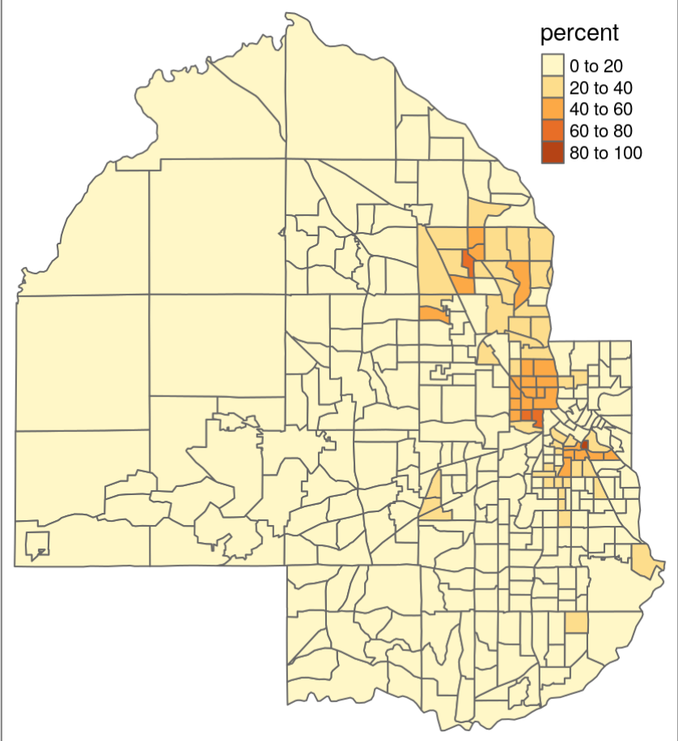
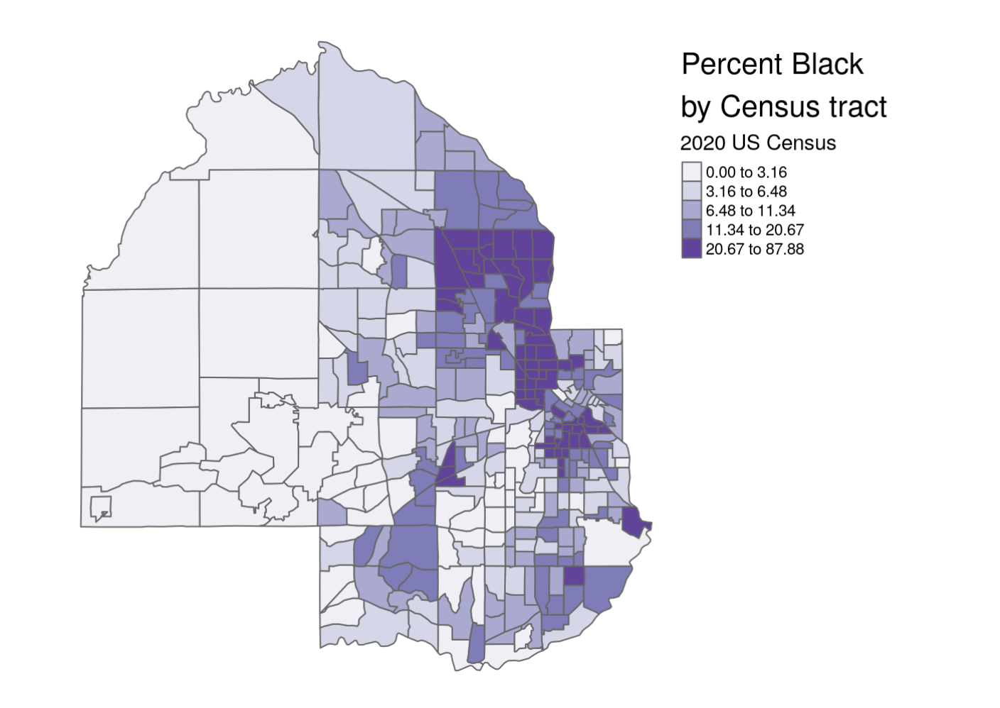
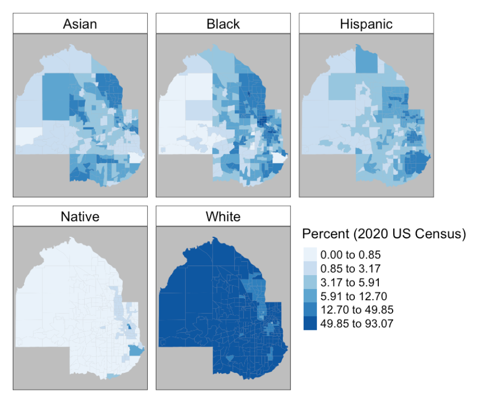

```{r setup, include = FALSE}
library(learnr)
library(tutorial.helpers)
library(knitr)
library(tidycensus)
library(tidyverse)
library(tigris)


knitr::opts_chunk$set(echo = FALSE)
options(tutorial.exercise.timelimit = 60, 
        tutorial.storage = "local") 
  
```

```{r copy-code-chunk, child = system.file("child_documents/copy_button.Rmd", package = "tutorial.helpers")}
```

```{r info-section, child = system.file("child_documents/info_section.Rmd", package = "tutorial.helpers")}
```

<!-- DK: To the extent possible, make the sections --- which are really "topics" --- match the sections in the chater. -->

<!-- DK: Remove any material which is not actual in the chapter. Be ruthless.  -->

## Introduction
### 

This tutorial covers [Chapter 5: Census geographic data and applications in R](https://walker-data.com/census-r/census-geographic-data-and-applications-in-r.html) from [*Analyzing US Census Data: Methods, Maps, and Models in R*](https://walker-data.com/census-r/index.html) by Kyle Walker. 


## Census geographic data and applications in R
### 

Census and ACS data are associated with geographies, which are the units at which the data is aggregated. We are going to learn how to work with these. These defined geographies are represented in the [US Census Bureau’s TIGER/Line database](https://www2.census.gov/geo/pdfs/maps-data/data/tiger/tgrshp2019/TGRSHP2019_TechDoc.pdf), where the acronym **TIGER** stands for Topologically Integrated Geographic Encoding and Referencing. 

### Exercise 1

Load the `tigris` package. 

```{r census-geographic-data-and-app-1, exercise = TRUE}

```

```{r census-geographic-data-and-app-1-hint-1, eval = FALSE}
library(...)
```

```{r census-geographic-data-and-app-1-test, include = FALSE}
library(tigris)
```

### 

Working with spatial data sets is quite complex. Fortunately, the `tigris` package does a lot of the work for us. Let's explore the basic functions of this package. 

### Exercise 2

One problem with `tigris` is that sometimes it will take a long time to download data. We can avoid this by editing our `.Rprofile` file. 

Run `usethis::edit_r_profile()` in the Console. Then put `options(tigris_use_cache = TRUE)` in your `.Rprofile` file. Save and close the file.

### 

Type `readLines("~/.Rprofile")` in the Console. CP/CR.

```{r census-geographic-data-and-app-2}
question_text(NULL,
	answer(NULL, correct = TRUE),
	allow_retry = TRUE,
	try_again_button = "Edit Answer",
	incorrect = NULL,
	rows = 3)
```

### 

The `~` symbol indicates your home directory. The command should have returned the content of your `.Rprofile` file, which should be the one line you just added. But, depending on your computer set up, this might not work. No worries if so!

### Exercise 3

Go ahead and restart your R session. This will close the tutorial. Just open it again after R restarts. (Note that restarting your R session is not the same thing as restarting RStudio.) 

Then in your console, run `options("tigris_use_cache")`. 

CP/CR. 

```{r census-geographic-data-and-app-3}
question_text(NULL,
	answer(NULL, correct = TRUE),
	allow_retry = TRUE,
	try_again_button = "Edit Answer",
	incorrect = NULL,
	rows = 3)
```

### 

This should return a value of `TRUE`. Now this setting will be in your `.Rprofile` until you change it.

### Exercise 4

Type `states()` and Hit "Run Code."

```{r census-geographic-data-and-app-4, exercise = TRUE}

```

```{r census-geographic-data-and-app-4-hint-1, eval = FALSE}
states()
```

### 

Generally speaking, each type of geographic dataset available in the Census Bureau’s TIGER/Line database is available with a corresponding function in **tigris**. For example, the `states()` function can be run without arguments to download a boundary file of US states and state equivalents.

### Exercise 5

We have assigned the previous code to an object called `st`. Run `st` to ensure it works. 

```{r census-geographic-data-and-app-5, exercise = TRUE}

```

```{r census-geographic-data-and-app-5-hint-1, eval = FALSE}
st
```

### 

The object `st`, representing all US states and territories, includes a data frame with a series of columns representing characteristics of those states, like a name, postal code, and Census ID (the `GEOID` column). It also contains a special list-column, `geometry`, which is made up of a sequence of coordinate of longitude/latitude coordinate pairs that collectively represent the boundary of each state.

### Exercise 6

Run `class()` with `st` as the argument. Hit "Run Code."

```{r census-geographic-data-and-app-6, exercise = TRUE}

```

```{r census-geographic-data-and-app-6-hint-1, eval = FALSE}
class(...)
```

### 

This should return two datatypes: `sf` and `data.frame`. We can visualize this `geometry` column with the `plot()` function.

### Exercise 7

Run `plot()` below with the `geometry` column as the argument. Remember we extract columns using the `$` operator. 

```{r census-geographic-data-and-app-7, exercise = TRUE}

```

<button onclick = "transfer_code(this)">Copy previous code</button>

```{r census-geographic-data-and-app-7-hint-1, eval = FALSE}
plot(st$...)
```

### 

This should show a zoomed out map of the US. 

### Exercise 8

Run `counties()` with the argument `"NM"` and hit "Run Code."

```{r census-geographic-data-and-app-8, exercise = TRUE}

```

```{r census-geographic-data-and-app-8-hint-1, eval = FALSE}
counties("NM")
```

### 

The [counties()](https://rdrr.io/pkg/tigris/man/counties.html) function can be used to obtain county boundaries for the entirety of the United States, but also can be used with the `state` argument to return only those counties from a specific state, like New Mexico.

### Exercise 9

We have assigned the previous code to an object called `nm_counties`. Run `nm_counties` to ensure it works.  

```{r census-geographic-data-and-app-9, exercise = TRUE}

```

```{r census-geographic-data-and-app-9-hint-1, eval = FALSE}
nm_counties
```

### 

```{r}
include_graphics("images/counties.png")
```

We can visualize all the counties in New Mexico with the `counties()` function. 

### Exercise 10

Run `plot()` with the `geometry` column extracted from the variable.

```{r census-geographic-data-and-app-10, exercise = TRUE}

```

<button onclick = "transfer_code(this)">Copy previous code</button>

```{r census-geographic-data-and-app-10-hint-1, eval = FALSE}
plot(nm_counties$...)
```

### 

We can do the same thing with the `tract()` function, using the `state` and `county` arguments. Obtaining Census shapefiles programmatically requires inputting the Federal Information Processing Standard (FIPS) code; however, **tigris** translates postal codes and names of states and counties to their FIPS codes so that R users do not have to look them up.

### Exercise 11

Run the function `tracts()` with the arguments `"NM"` and `"Los Alamos"`. Hit "Run Code."

```{r census-geographic-data-and-app-11, exercise = TRUE}

```

```{r census-geographic-data-and-app-11-hint-1, eval = FALSE}
tracts(..., ...)
```

### 

In this case the state postal code `"NM"` is used to instruct **tigris** to subset the counties dataset for counties in New Mexico. The full name of the state, `"New Mexico"`, would work the same here as well. 

### Exercise 12

We have assigned the previous code to an object called `la_tracts`. Run `la_tracts` to ensure it works. 

```{r census-geographic-data-and-app-12, exercise = TRUE}

```

```{r census-geographic-data-and-app-12-hint-1, eval = FALSE}
la_tracts
```

### 

The TIGER/Line shapefiles include three general types of data. The first one is *Legal entities*, which are geographies that have official legal standing in the United States. These include states and counties.

### Exercise 13

Then below that, run `plot()` with the `geometry` column extracted from the variable.

```{r census-geographic-data-and-app-13, exercise = TRUE}

```

<button onclick = "transfer_code(this)">Copy previous code</button>

```{r census-geographic-data-and-app-13-hint-1, eval = FALSE}
plot(la_tracts$...)
```

### 

The second type of data is *Statistical entities*, which are geographies defined by the Census Bureau for purposes of data collection and dissemination. Examples of statistical entities include Census tracts and block groups.

### Exercise 14

Run the function `area_water()` with the argument `"NM"` and `"Los Alamos"`. Hit "Run Code." 

and assign it to the variable `la_water`. Then below that, 

```{r census-geographic-data-and-app-14, exercise = TRUE}

```

```{r census-geographic-data-and-app-14-hint-1, eval = FALSE}
area_water(..., ...)
```

### 

The third type of data is *Geographic features*, which are geographies that are not linked with aggregate demographic data from the Census Bureau. These datasets include roads and water features.

### Exercise 15

We have assigned the previous code to an object called `la_water`. Run `la_water` to ensure it works. 

```{r census-geographic-data-and-app-15, exercise = TRUE}

```

```{r census-geographic-data-and-app-15-hint-1, eval = FALSE}
la_water
```

### 

Several geographic features are available in tigris as well, including roads and water features which can be useful for thematic mapping. 

### Exercise 16

Run `plot()` with the `geometry` column extracted from the variable. 

```{r census-geographic-data-and-app-16, exercise = TRUE}

```

<button onclick = "transfer_code(this)">Copy previous code</button>

```{r census-geographic-data-and-app-16-hint-1, eval = FALSE}
plot(la_water$...)
```

### 

Traditionally, TIGER/Line shapefiles are downloaded from a web interface as zipped folders, then unzipped for use in a Geographic Information System (GIS) or other software that can work with geographic data. However, the R package **tigris**  allows R users to access these datasets directly from their R sessions without having to go through these steps.

## Understanding tigris and simple features
### 

Data returned by the tigris package are examples of vector spatial data, a spatial data model that represents geographic features as points, lines, and polygons. The vector spatial data model is represented in R with the [sf package](https://r-spatial.github.io/sf/), an implementation of simple features in the R language. 

### Exercise 1

Now, Let’s acquire landmark point data for DC. Run the `landmarks()` function with the arguments `"DC"` and set the second argument, `type`, to `"point"`. 

Create a variable named `dc_landmarks`  Then below that, 

```{r understanding-tigris-and-simpl-1, exercise = TRUE}

```

```{r understanding-tigris-and-simpl-1-hint-1, eval = FALSE}
landmarks("...", type = "...")
```

### 

The **sf** package is an R interface to C libraries that power much of the broader geographic data ecosystem: [GDAL](https://gdal.org/) for reading & writing spatial data, [GEOS](https://trac.osgeo.org/geos/) for modeling spatial relationships, and [PROJ](https://proj.org/) for representing coordinate reference systems. These topics will be outlined in more detail in this chapter and the remainder of this section.

### Exercise 2

We have assigned the previous code to an object called `dc_landmarks`. Run `dc_landmarks` to ensure it works. 

```{r understanding-tigris-and-simpl-2, exercise = TRUE}

```

```{r understanding-tigris-and-simpl-2-hint-1, eval = FALSE}
dc_landmarks 
```

### 

As mentioned earlier, **sf** represents vector spatial data much like a regular R data frame, but with a special column, `geometry`, that represents the shape of each feature. When a simple features object is printed, the information above the data frame gives some additional geographic context to the coordinates in the `geometry` column.

### Exercise 3

Run `plot()` to plot the extracted geometry column from the variable.  

```{r understanding-tigris-and-simpl-3, exercise = TRUE}

```

<button onclick = "transfer_code(this)">Copy previous code</button>

```{r understanding-tigris-and-simpl-3-hint-1, eval = FALSE}
plot(dc_landmarks$...)
```

### 

This should produce a bunch of what seems like random points, which represent all the landmarks in DC. 

### Exercise 4

Run `primary_secondary_roads()` function with a single argument of `"DC"`.

```{r understanding-tigris-and-simpl-4, exercise = TRUE}

```

```{r understanding-tigris-and-simpl-4-hint-1, eval = FALSE}
primary_secondary_roads(...)
```

### 

We've created dots with landmarks, but what if we want to study something like roads? Lines would be more useful.

### Exercise 5

We have assigned the previous code to an object called `dc_roads`. Run `dc_roads` to ensure it works. 

```{r understanding-tigris-and-simpl-5, exercise = TRUE}

```

```{r understanding-tigris-and-simpl-5-hint-1, eval = FALSE}
dc_roads
```

### 

**Lines** are one-dimensional representations of geographic features that are used when the length, but not the area, of those features is of primary importance. With respect to the TIGER/Line shapefiles, transportation network features such as roads and railroads are represented as lines.

### Exercise 6

Plot the extracted `geometry` column from the variable just like before.

```{r understanding-tigris-and-simpl-6, exercise = TRUE}

```

<button onclick = "transfer_code(this)">Copy previous code</button>

```{r understanding-tigris-and-simpl-6-hint-1, eval = FALSE}
plot(dc_roads$...)
```

### 

Points and lines are cool, but sometimes we may need to use two-dimensional shapes/polygons. 

### Exercise 7

Run `block_groups()` with the argument `"DC"`. Hit "Run Code."

```{r understanding-tigris-and-simpl-7, exercise = TRUE}

```

```{r understanding-tigris-and-simpl-7-hint-1, eval = FALSE}
block_groups("DC")
```

### 

**Polygons** are enclosed shapes with at least three connected coordinate pairs. With respect to Census geometries, enumeration units like block groups are represented as polygons in the TIGER/Line files. Polygon geometry is useful when an analyst needs to represent the shape or area of geographic features in their project. 

### Exercise 8

We have assigned the previous code to an object called `dc_block_groups`. Run `dc_block_groups` to ensure it works. 

```{r understanding-tigris-and-simpl-8, exercise = TRUE}

```

```{r understanding-tigris-and-simpl-8-hint-1, eval = FALSE}
dc_block_groups
```

### 

These three core geometries (point, line, and polygon) can be encoded in more complex ways in the simple features representation used by sf. For example, the geometry type `POLYGON` will use one row in a simple features data frame for each discrete shape; the geometry type `MULTIPOLYGON`, in contrast, can link multiple discrete shapes as part of the same geographic feature.

### Exercise 9

Run `plot()` to plot the extracted geometry column from the variable.   

```{r understanding-tigris-and-simpl-9, exercise = TRUE}

```

<button onclick = "transfer_code(this)">Copy previous code</button>

```{r understanding-tigris-and-simpl-9-hint-1, eval = FALSE}
plot(dc_block_groups$...))
```

### 

This is important for encoding features that may have detached parts, such as a series of islands that belong to the same county. In this vein, points can be represented as `MULTIPOINT` and lines can be represented as MULTILINESTRING, respectively, to accommodate similar scenarios.

### Exercise 10

Run `la_tracts` and hit "Run Code."

```{r understanding-tigris-and-simpl-10, exercise = TRUE}

```

```{r understanding-tigris-and-simpl-10-hint-1, eval = FALSE}
la_tracts
```

### 

We just went throught the basic usage of the `tigris` package. Now we're going to plot geographic data using the `ggplot2` package. 

### Exercise 11

Run `ggplot()` with `la_tracts` as the argument and then add the `geom_sf()` layer. 
```{r understanding-tigris-and-simpl-11, exercise = TRUE}

```

<button onclick = "transfer_code(this)">Copy previous code</button>

```{r understanding-tigris-and-simpl-11-hint-1, eval = FALSE}
ggplot(...) + 
  geom_sf()
```

### 

By default, ggplot2 includes its standard grey grid with latitude and longitude values displayed along the axes. For many cartographic applications, an analyst will want to remove this background information. 

### Exercise 12

Copy and paste your code from before and add the `theme_void()` layer. 

```{r understanding-tigris-and-simpl-12, exercise = TRUE}

```

<button onclick = "transfer_code(this)">Copy previous code</button>

```{r understanding-tigris-and-simpl-12-hint-1, eval = FALSE}
... +
  theme_void()
```

### 

The `theme_void()` function strips the background grid and axis labels from the plot accordingly:

### Exercise 13

Load the `patchwork` package. 

```{r understanding-tigris-and-simpl-13, exercise = TRUE}

```

```{r understanding-tigris-and-simpl-13-hint-1, eval = FALSE}
library(patchwork)
```

### 

We can use *faceted plots* to compare different views, which is also a very useful concept for geographic visualization. Faceted mapping will be addressed directly in the next chapter. For comparative spatial plots, the [patchwork](https://cran.r-project.org/web/packages/patchwork/vignettes/patchwork.html) R package (Pedersen 2020) works very well for arranging a multi-plot layout. 

### Exercise 14

Run `block_groups()` function, set the arguments to `"NM"` and `"Los Alamos"`. 

```{r understanding-tigris-and-simpl-14, exercise = TRUE}

```

```{r understanding-tigris-and-simpl-14-hint-1, eval = FALSE}
block_groups(..., ...)
```

### 

Below, we’ll use patchwork to put two **ggplot2** spatial plots - one of Census tracts and one of block groups in Los Alamos County - side-by-side using the + operator.

### Exercise 15

We have assigned the previous code to an object called `la_block_groups_2`. Type `la_block_groups_2` and hit "Run Code."

```{r understanding-tigris-and-simpl-15, exercise = TRUE}

```

```{r understanding-tigris-and-simpl-15-hint-1, eval = FALSE}
la_block_groups_2
```

### 

### Exercise 16

We can also make our graphs interactive by using the `mapview` package. The package visualizes geographic data on an interactive, zoomable map.

Run `mapview()` with `la_tracts` as the argument.

```{r understanding-tigris-and-simpl-16, exercise = TRUE}

```

<button onclick = "transfer_code(this)">Copy previous code</button>

```{r understanding-tigris-and-simpl-16-hint-1, eval = FALSE}
mapview(...)
```

### 

Notice that our map is now interactive. We can hover above areas and see something pop up, and we can also zoom in and out.

### Exercise 17

Let's take it one step further. Logically, we can assume that tracts change with each decennial census. In order to show this, we will need the packages `patchwork` and `glue` along with `tidyverse`. Load the `glue` and `patchwork` packages.

```{r understanding-tigris-and-simpl-17, exercise = TRUE}

```

```{r understanding-tigris-and-simpl-17-hint-1, eval = FALSE}
library(...)
...(patchwork)
```

### Exercise 18

Take a look below. We have created a variable for you already. This will focus on data from Tarrant County, Texas. The `map` function iterates through each year, grabbing a cartographic boundary file of Census tracts for the four decennial Census years.

Below the `tracts()` function but inside the end `})`, start a graph with `ggplot()` and `year_tracts` as the argument. Add the `geom_sf()` layer and the `theme_void` layer. Finally, add the following layer: `labs(title = glue("{.x}: {nrow(year_tracts)} tracts"))`.


```{r understanding-tigris-and-simpl-18, exercise = TRUE}
yearly_plots <- map(seq(1990, 2020, 10), ~{
  year_tracts <- tracts("TX", "Tarrant", year = .x,
                        cb = TRUE)

})
```

<button onclick = "transfer_code(this)">Copy previous code</button>

```{r understanding-tigris-and-simpl-18-hint-1, eval = FALSE}
yearly_plots <- map(seq(1990, 2020, 10), ~{
  year_tracts <- tracts("TX", "Tarrant", year = .x,
                        cb = TRUE)

  ggplot(...) + 
    geom_sf() + 
    theme_void() + 
    labs(title = glue("{.x}: {nrow(year_tracts)} tracts"))
})
```

### 

By using the `glue` package in `labs()`, we create a custom title for each year that shows how many Census tracts are there. 

This generates the graphs, but we are not done yet. The graphs are now stored in the `yearly_plots` variable.  

### Exercise 19

Now, we can use `patchwork` to facet the graphs.

Copy and paste your code from above. Then below that, use `patchwork` to facet it. Check the hint to see how we should format this. We are indexing the `yearly_plot` object using double brackets. 

```{r understanding-tigris-and-simpl-19, exercise = TRUE}

```

<button onclick = "transfer_code(this)">Copy previous code</button>

```{r understanding-tigris-and-simpl-19-hint-1, eval = FALSE}
... 
(yearly_plots[[1]] + ...[[2]]) / 
  (yearly_plots[[...]] + ...[[...]])
I sense a pattern...
```

### 

Your graph should look like this:

```{r}
include_graphics("images/time_facet.png")
```

The forward slash that we included basically stacks graphs 1 and 2 on top of graphs 3 and 4 instead of putting all 4 next to each other. 

### 

We've successfuly faceted a graph by time, how cool is that?!

### Exercise 20

For geographic data to appropriately represent locations in mapping and spatial analysis, they must be referenced to some model of the Earth’s surface correctly. In simpler terms - a data model of the state of Florida should represent where Florida is actually located relative to other locations! This is defined as a coordinate reference system (CRS).

### 

When plotting an object with `geom_sf()` we can specify a CRS with `coord_sf()`

Create a variable named `fl_counties` and assign it to the `counties()` function with arguments `"FL"` and `cb = TRUE`. Below that, use `ggplot()` and `geom_sf()` to plot the variable. 

```{r understanding-tigris-and-simpl-20, exercise = TRUE}

```

<button onclick = "transfer_code(this)">Copy previous code</button>

```{r understanding-tigris-and-simpl-20-hint-1, eval = FALSE}
fl_counties <- counties("...", cb = ...)
ggplot(...) + 
  geom_sf()
```

### 

Good! Now let's incorporate a specified CRS with `coord_sf()`.

### Exercise 21

Copy and paste your code from before. Add the `coord_sf()` layer and set the argument `crs` to `3087`.

```{r understanding-tigris-and-simpl-21, exercise = TRUE}

```

<button onclick = "transfer_code(this)">Copy previous code</button>

```{r understanding-tigris-and-simpl-21-hint-1, eval = FALSE}
... + 
  coord_sf(crs = ...)
```

### 

Now that we've specified a CRS, your graph should look like this:

```{r}
include_graphics("images/crs_mod.png")
```

### Exercise 22

As seen in the earlier graph, the tick marks default to longitude and latitude. We can change this with the `datum` argument.

Copy and paste your code from above. Within `coord_sf()`, add another argument (`datum`) and set it to `3087`.

```{r understanding-tigris-and-simpl-22, exercise = TRUE}

```

<button onclick = "transfer_code(this)">Copy previous code</button>

```{r understanding-tigris-and-simpl-22-hint-1, eval = FALSE}
... + 
  coord_sf(... = ..., datum = ...)
```

### 

Now we know how to modify both our CRS, and our axis ticks. 

### Exercise 23

Let's shift gears to national US mapping. A common problem for national display of the United States is the fragmented nature of US states and territories geographically. A lot of times, programmers have to decide what to do with Hawaii, Alaska, and Puerto Rico. 

Using the `tigris` function `states()` with `cb` set to `TRUE`, create a variable named `us_states` and assign it. Below that, use `ggplot()`, `geom_sf()` and `theme_void()` to construct a map. 


```{r understanding-tigris-and-simpl-23, exercise = TRUE}

```

<button onclick = "transfer_code(this)">Copy previous code</button>

```{r understanding-tigris-and-simpl-23-hint-1, eval = FALSE}
us_states <- states(cb = ...)
ggplot(...) + 
  geom_sf() +
  theme_void()
```

### 

We can see how difficult it is to get anything useful from this map. 

### Exercise 24

We can fix this by using a a projected coordinate reference system appropriate for the United States, such as the continental US Albers Equal Area projection. 

### 

Copy and paste your code from earlier and add the `coord_sf()` layer. Within this function, set `crs` to `"ESRI:102003"`. 


```{r understanding-tigris-and-simpl-24, exercise = TRUE}

```

<button onclick = "transfer_code(this)">Copy previous code</button>

```{r understanding-tigris-and-simpl-24-hint-1, eval = FALSE}
... + 
  coord_sf(crs = "...")
```

### 

Notice that this reformats the graph and makes it much easier to analyze. 

### Exercise 25

We can do this same thing and make it a lot easier through the `tigris` package. 

Notice that we redefined `us_states` for you. Below that, create a new variable named `us_states_shifted` and assign it to the function `shift_geometry()` with `us_states` as the argument. 

```{r understanding-tigris-and-simpl-25, exercise = TRUE}
us_states <- states(cb = TRUE)
```

<button onclick = "transfer_code(this)">Copy previous code</button>

```{r understanding-tigris-and-simpl-25-hint-1, eval = FALSE}
us_states <- states(cb = TRUE)
us_states_shifted <- shift_geometry(...)
```

### 

`shift_geometry()` does all the reformatting work for us, so now we can just plot it.

### Exercise 26

Copy and paste your code from above. Below that, create a plot using `ggplot()`, `geom_sf()`, and `theme_void()`.

```{r understanding-tigris-and-simpl-26, exercise = TRUE}

```

<button onclick = "transfer_code(this)">Copy previous code</button>

```{r understanding-tigris-and-simpl-26-hint-1, eval = FALSE}
us_states <- states(cb = TRUE)
us_states_shifted <- shift_geometry(...)
ggplot(...) +
  geom_sf() +
  theme_void()
```

### 

Your graph should look like this:

```{r}
include_graphics("images/shift_geom.png")
```

We have seen how we can `tigris` and its functions to reformat graphs. Learn more about `shift_geometry()` and its arguments [here](https://walker-data.com/census-r/census-geographic-data-and-applications-in-r.html#shifting-and-rescaling-geometry-for-national-us-mapping).

### Exercise 27

Let's explore some other useful reformatting options, such as changing polygons to points. 

### 

Look below to what we've already written. `tx_places` uses the `places()` function to get places from Texas, and `tx_outline` gets the actual state outline of Texas using `states()`. Click run code. 

```{r understanding-tigris-and-simpl-27, exercise = TRUE}
tx_places <- places("TX", cb = TRUE) %>%
  filter(NAME %in% c("Dallas", "Fort Worth", "Houston",
                     "Austin", "San Antonio", "El Paso")) %>%
  st_transform(6580)

tx_outline <- states(cb = TRUE) %>%
  filter(NAME == "Texas") %>%
  st_transform(6580)

ggplot() + 
  geom_sf(data = tx_outline) + 
  geom_sf(data = tx_places, fill = "red", color = NA) + 
  theme_void()
```

<button onclick = "transfer_code(this)">Copy previous code</button>

### 

The issue with this graphic is that city geographies are pretty irregular All  cities spread across large areas, have holes, and  include portions that are far from the main city. We can fix this by making the polygons into points. 

### Exercise 28

Copy and paste the code above. Before `ggplot()`, create a new variable named `tx_centroids`. Set this variable to the `st_centroid()` function with the argument `tx_places`. Then in the second `geom_sf()`, set `data` to `tx_centroids`, `color` to `"red"`, and `size` to `3`.

```{r understanding-tigris-and-simpl-28, exercise = TRUE}

```

<button onclick = "transfer_code(this)">Copy previous code</button>

```{r understanding-tigris-and-simpl-28-hint-1, eval = FALSE}
...

tx_centroids <- st_centroids(...)
ggplot() +
  geom_sf(...) + 
  geom_sf(data = ..., color = "...", size = ...) + 
  theme_void()
```

### 

Notice that the cities are displayed as circles instead of irregular polygons now. 

### 

Learn more about polygons and their features [here](https://walker-data.com/census-r/census-geographic-data-and-applications-in-r.html#exploding-multipolygon-geometries-to-single-parts).

### 

In this section, we learned how to work with geographic data and different ways to format and map it. 

## Mapping Census data
### 

This chapter will cover map-making with Census data utilizing the **tidycensus** package.

### Exercise 1

Run `get_acs()` below setting `geography` to `"tract"`, `variables` to `"B19013_001"`, `state` to `"DC"`, `year` to `2020`, and `geometry` to `TRUE` and assign this to an object named `dc_income`.

```{r mapping-census-data-1, exercise = TRUE}

```

<button onclick = "transfer_code(this)">Copy previous code</button>

```{r mapping-census-data-1-hint-1, eval = FALSE}
dc_income <- get_acs(
  geography = "...", 
  variables = "...",
  ... = "...", 
  ... = 2020,
  ... = TRUE
)
```

### 

The code above fetches information on median household income for Census tracts in the District of Columbia. By setting the `geometry` argument to `TRUE`, we enable ourselves to map this data. 

### Exercise 2

The result from Exercise 1 is very hard to understand. Let's fix this by visualizing our data.

Run `plot()` below selecting the `"estimate"` column from `dc_income` using brackets. 

```{r mapping-census-data-2, exercise = TRUE}

```

<button onclick = "transfer_code(this)">Copy previous code</button>

```{r mapping-census-data-2-hint-1, eval = FALSE}
plot(dc_income["..."])
```

### 

Most objects in R have an associated "method" for the function `plot()`. In other words, `plot()` knows to do different things depending on the class of the object which you give it.

### Exercise 3

Along with **tidycensus**, we can create maps using `ggplot()` and `geom_sf()`. In order to do this, we will need to have **tidyverse**, **tidycensus**, and **tigris** loaded, which we have already done for you in this tutorial. 

Run `get_acs()` below setting `geography` to `"state"`, `variables` to `"B01002_001"`, `year` to `2019`, `survey` to `"acs1"`, `geometry` to `TRUE`, and `resolution` to `"20m"`, and pipe this to `shift_geometry()`.

```{r mapping-census-data-3, exercise = TRUE}

```

<button onclick = "transfer_code(this)">Copy previous code</button>

```{r mapping-census-data-3-hint-1, eval = FALSE}
get_acs(geography = "...",
        variables = "...",
        ... = 2019,
        survey = "...",
        geometry = ...,
        ... = "20m") |> 
  shift_geometry()
```

### 

The `resolution` argument is necessary in this case because it will omit the long archipelago of islands to the northwest of Hawaii. The `shift_geometry()` function shifts and rescales areas for national mapping. 

### Exercise 4

Copy and paste your code from last time. Set the result from `get_acs()` to an object named `us_median_age`. Then below that, run `plot()` with `us_median_age$geometry` as the argument

```{r mapping-census-data-4, exercise = TRUE}

```

<button onclick = "transfer_code(this)">Copy previous code</button>

```{r mapping-census-data-4-hint-1, eval = FALSE}
us_median_age <- get_acs(
  geography = "...",
  variables = "...",
  ... = 2019,
  survey = "...",
  geometry = ...,
  ... = "20m"
)  |> 
  shift_geometry()

plot(...$...)
```

### 

This should produce a map of the US. 

### Exercise 5

Instead of using `plot()`, we can just pass `us_median_age` as the argument to `ggplot()`. Run `ggplot()` setting `data` to `us_median_age`, and within `aes()`, set `fill` to `estimate`. Add a `geom_sf()` layer. 

```{r mapping-census-data-5, exercise = TRUE}

```

<button onclick = "transfer_code(this)">Copy previous code</button>

```{r mapping-census-data-5-hint-1, eval = FALSE}
ggplot(data = ..., 
       ...(... = estimate)) + 
  geom_sf()
```

### 

Just a few lines of code are producing some impressive looking plots! As you can see, it is now shaded depending on the `estimate` column. 

### Exercise 6

We can customize this even further. Copy and paste your code from last time and add the layer `scale_fill_distiller()`, setting `palette` to `"RdPu"`, and `direction` to `1`.

```{r mapping-census-data-6, exercise = TRUE}

```

<button onclick = "transfer_code(this)">Copy previous code</button>

```{r mapping-census-data-6-hint-1, eval = FALSE}
... +
  scale_fill_distiller(palette = "..."
                       direction = ...)
```

### 

`scale_fill_distiller()` changes the color palette of the graph. 

### Exercise 7

Copy and paste your code from above. Add appropriate labels using the `labs()` function and also add the `theme_void()` layer. Additionally within `labs()`, set the `fill` argument to `"ACS estimate"`

```{r mapping-census-data-7, exercise = TRUE}

```

<button onclick = "transfer_code(this)">Copy previous code</button>

```{r mapping-census-data-7-hint-1, eval = FALSE}
... +
  labs(title = "...",
       caption = "...",
       fill = "ACS estimate") + 
  theme_void()
```

### 

Nice! You've successfully mapped Census data with `ggplot()`. 

### Exercise 8

Along with `plot()` and `ggplot()`, we can also use functions from another package, **tmap**, to map Census data.

### 

We have defined a variable for you already named `hennepin_race` as seen below. It holds data on non-Hispanic white, non-Hispanic Black, Asian, and Hispanic populations for Census tracts in Hennepin County, Minnesota. Click "run code". 

```{r mapping-census-data-8, exercise = TRUE}
hennepin_race <- 
  get_decennial(geography = "tract",
                state = "MN",
                county = "Hennepin",
                variables = c(Hispanic = "P2_002N",
                              White = "P2_005N",
                              Black = "P2_006N",
                              Native = "P2_007N",
                              Asian = "P2_008N"),
                summary_var = "P2_001N",
                year = 2020,
                geometry = TRUE) |> 
  mutate(percent = 100 * (value / summary_value))
```

<button onclick = "transfer_code(this)">Copy previous code</button>

```{r mapping-census-data-8-hint-1, eval = FALSE}

```

### 

Now that you've inspected the data, let's create the graph with `tmap`, which is very similar to `ggplot()` in the sense that they both use layers to construct graphs. 

### Exercise 9

Create a variable named `hennepin_black` which is just `hennepin_race` but **filtered** so it is when `variable` is "Black". 

```{r mapping-census-data-9, exercise = TRUE}

```

<button onclick = "transfer_code(this)">Copy previous code</button>

```{r mapping-census-data-9-hint-1, eval = FALSE}
hennepin_black <- hennepin_race |> 
  filter(variable == "...")
```

### 

Now we only have data on the "Black" population from Hennepin County. 

### Exercise 10

Run `tm_shape()` with `hennepin_black` as the argument, and add the `tm_polygons()` layer. 

```{r mapping-census-data-10, exercise = TRUE}

```

<button onclick = "transfer_code(this)">Copy previous code</button>

```{r mapping-census-data-10-hint-1, eval = FALSE}
tm_shape(...) + 
  tm_polygons()
```

### 

This should show a default view of Hennepin County. 

**We always have to initialize graphs in `tmap` with the `tm_shape()` function.**

### Exercise 11

Copy and paste your code from before. Within `tm_polygons()`, set `col` to `"percent"`

```{r mapping-census-data-11, exercise = TRUE}

```

<button onclick = "transfer_code(this)">Copy previous code</button>

```{r mapping-census-data-11-hint-1, eval = FALSE}
... + 
  ...(col = "...")
```

### 

This should produce a graph which looks like this:

```{r}

```

By adding a `col` argument, we can see the change. 

### Exercise 12

Because our data is skewed, we have a lot of the same color on our graph. We can change the way data is divided for different colors. 

### 

Copy and paste your code from above and add the following arguments to `tm_polygons()`. Set `style` to `"quantile"` and `n` to `5`, which solves our problem above. Also set `palette` to `"Purples"` and `title` to `"2020 US Census"` for further customization. 

```{r mapping-census-data-12, exercise = TRUE}

```

<button onclick = "transfer_code(this)">Copy previous code</button>

```{r mapping-census-data-12-hint-1, eval = FALSE}
... + 
  ...(col = "...",
          style = "...",
          ... = 5,
          palette = "...",
          title = "...")
```

### 

This changed the color of our graph and also added more variation throughout the county. By switching to `quantile`, we ensure that each class has the same number of Census tracts. The `n = 5` shows that we want 5 quantiles. 

### Exercise 13

Finish off your graph by adding the `tm_layout()` layer and set `title` to `"Percent Black\nby Census Tract"`, `frame` to `FALSE`, and `legend.outside` to `TRUE`.

```{r mapping-census-data-13, exercise = TRUE}

```

<button onclick = "transfer_code(this)">Copy previous code</button>

```{r mapping-census-data-13-hint-1, eval = FALSE}
... + 
  tm_layout(title = "...",
            frame = ...,
            legend.outside = ...)
```

### 

Your graph should look like this: 

```{r}

```

`tm_layout()` is used to customize the styling of the map. You can learn more about it by running `??tm_layout` in your console. 

### Exercise 14

We can also facet `tmap` graphs with the `tm_facets()` function. The `by` argument specifies the column to be used to identify unique groups in the data.

Initialize the graph using `tm_shape()` with `hennepin_race` as the argument. Add the `tm_facets()` layer setting `by` to `"variable"` and `scale.factor` to `4`. 

```{r mapping-census-data-14, exercise = TRUE}

```

<button onclick = "transfer_code(this)">Copy previous code</button>

```{r mapping-census-data-14-hint-1, eval = FALSE}
...(hennepin_race) + 
  tm_facets(by = "...", scale.factor = ...)
```

Note: this will result in an error that will be fixed in the next exercise.

### 

This facets the graph by the `variable` column. 

### Exercise 15

Copy and paste your code from before. Add the `tm_fill()` layer setting `col` to `"percent"`, `style` to `"quantile"`, `n` to `6`, `palette` to `"Blues"`, and `title` to `"Percent (2020 US Census)"`.

```{r mapping-census-data-15, exercise = TRUE}

```

<button onclick = "transfer_code(this)">Copy previous code</button>

```{r mapping-census-data-15-hint-1, eval = FALSE}
... + 
  tm_fill(... = "percent",
          style = "...",
          ... = 6,
          palette = "...",
          title = "...") 
```

### 

This should change the color palette a bit. We are also changing our fill to be based on the `percent` column in a "quantile" `style`. By now, we are starting to get an idea of the arguments that we can use to customize our graph. 

### Exercise 16

Finally, let's add some text. Copy and paste your code from earlier and add the `tm_layout()` layer, setting `bg.color` (background color) to `"grey"`, `legend.position` to a vector containing (-0.7, 0.15), and `panel.label.bg.color` to `"white"`. 

```{r mapping-census-data-16, exercise = TRUE}

```

<button onclick = "transfer_code(this)">Copy previous code</button>

```{r mapping-census-data-16-hint-1, eval = FALSE}
tm_layout(... = "grey", 
            ... = c(-..., ...),
            panel.label.bg.color = "...")
```

### 

Your graph should look like this:

```{r}

```

As you can see, it is successful faceted by race!

### 

There are so many different things you can do with `tmap` that we can't possibly cover in this tutorial, so check out this [link](https://walker-data.com/census-r/mapping-census-data-with-r.html#choropleth-maps-with-tmap) to learn more about it.

### Exercise 17

Now, all of the graphs we've covered so far are static; however, what if we want to create an interactive graph. We can do this using the `leaflet`, `mapview`, or `tmap` package. Let's dive in!

We have defined a variable, `dallas_bachelors`, for you below which holds data from Dallas County, Texas tracts. Below that, use the `mapview()` function with `dallas_bachelors` as the first argument, and set `zcol` to `"estimate"`.  

```{r mapping-census-data-17, exercise = TRUE}
dallas_bachelors <- get_acs(
  geography = "tract",
  variables = "DP02_0068P",
  year = 2020,
  state = "TX",
  county = "Dallas",
  geometry = TRUE
)
```

<button onclick = "transfer_code(this)">Copy previous code</button>

```{r mapping-census-data-17-hint-1, eval = FALSE}
...
mapview(..., zcol = "...")
```

### 

This should create an interactive map. Hover your mouse over different parts of it and see what it says. Note that you can also zoom in and out. 

The `zcol` argument takes a column in the dataset as an argument, and visualizes that column with an interactive map. The first argument just tells `mapview()` which dataset to take the column from. 

### Exercise 18

Another way you can make interactive graphs is through `tmap` itself. Before creating any graphs, you can do `tmap_mode("view")`. This will make all future tmap graphs interactive

Run `tmap_mode("view")` below. Then below that use `tm_shape()` to initialize the `dallas_bachelors`. 

```{r mapping-census-data-18, exercise = TRUE}

```

<button onclick = "transfer_code(this)">Copy previous code</button>

```{r mapping-census-data-18-hint-1, eval = FALSE}
tmap_mode("...")
tm_shape(...)
```

### Exercise 19

Copy and paste your code from above. Now let's add the `tm_fill()` layer, setting `col` to `"estimate"`, `palette` to `"magma"`, and `alpha` to `0.5`.

```{r mapping-census-data-19, exercise = TRUE}

```

<button onclick = "transfer_code(this)">Copy previous code</button>

```{r mapping-census-data-19-hint-1, eval = FALSE}
...
... + 
  tm_fill(col = "...",
          palette = "...",
          alpha = ...)
```

### 

You can switch back to static graphs by doing `tmap_mode("plot")`.

### Exercise 20

Finally, we can create interactive graphs using `leaflet`. This package gives us more fine-grained control over our interactive graph.

### 

We have defined `pal` variable below which is storing a function to convert data values to colors for a given color palette.  

```{r mapping-census-data-20, exercise = TRUE}
pal <- colorNumeric(
  palette = "magma",
  domain = dallas_bachelors$estimate
)
```

<button onclick = "transfer_code(this)">Copy previous code</button>

```{r mapping-census-data-20-hint-1, eval = FALSE}

```

For exercises 21-23, start the code box with the following code before anything else. You will get some strange bugs and your graph won't be interactive otherwise.

Code: `pal(c(10, 20, 30, 40, 50))`

### Exercise 21

Start a pipe with `leaflet()`. Then pipe it into `addProviderTiles()` with the argument `providers$Stamen.TonerLite`.

```{r mapping-census-data-21, exercise = TRUE}

```

<button onclick = "transfer_code(this)">Copy previous code</button>

```{r mapping-census-data-21-hint-1, eval = FALSE}
pal(c(10, 20, 30, 40, 50)) 
leaflet() |> 
  addProviderTiles(providers$Stamen.TonerLite)
```

### 

All we did so far was initialize the graph and add a basemap under it for reference. 

### Exercise 22

Copy and paste your earlier code and pipe `addPolygons()`. Within this, set `data` to `dallas_bachelors`, `color` to `pal(estimate)`, `weight` to `0.5`, `smoothFactor` to `0.2`, `fillOpacity` to `0.5`, and `label` to `~estimate`.

```{r mapping-census-data-22, exercise = TRUE}

```

<button onclick = "transfer_code(this)">Copy previous code</button>

```{r mapping-census-data-22-hint-1, eval = FALSE}
... |> 
  addPolygons(data = ...,
              ... = ~pal(estimate),
              weight = ...,
              smoothFactor = ...,
              fillOpacity = ...,
              ... = ~estimate)
```

### 

This has added shapes to our maps. 

### Exercise 23

Copy and paste your code from earlier and pipe `addLegend()`. Within this function, set `position` to `"bottomright"`, `pal` to `pal`, `values` to `dallas_bachelors$estimate`, and `title` to `"% with bachelor's<br/>degree"`

```{r mapping-census-data-23, exercise = TRUE}

```

<button onclick = "transfer_code(this)">Copy previous code</button>

```{r mapping-census-data-23-hint-1, eval = FALSE}
... |> 
  addLegend(
    ... = "bottomright",
    pal = pal,
    values = ...,
    ... = "% with bachelor's<br/>degree"
  )
```

### 

We just added a legend for your graph and finished it off. Congrats!

### 

You should now have a basic sense of how to create interactive graphs in multiple ways. 

There are alternate ways to create interactive graphs that you can check out [here](https://walker-data.com/census-r/mapping-census-data-with-r.html#interactive-mapping).


## Summary
### 

This tutorial covered [Chapter 5: Census geographic data and applications in R](https://walker-data.com/census-r/census-geographic-data-and-applications-in-r.html) from [*Analyzing US Census Data: Methods, Maps, and Models in R*](https://walker-data.com/census-r/index.html) by Kyle Walker. 


```{r download-answers, child = system.file("child_documents/download_answers.Rmd", package = "tutorial.helpers")}
```
