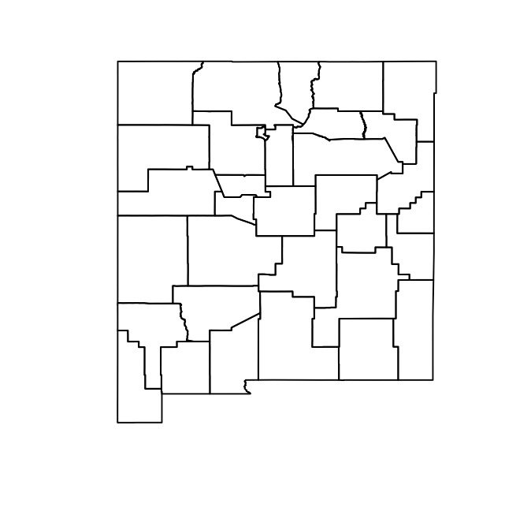
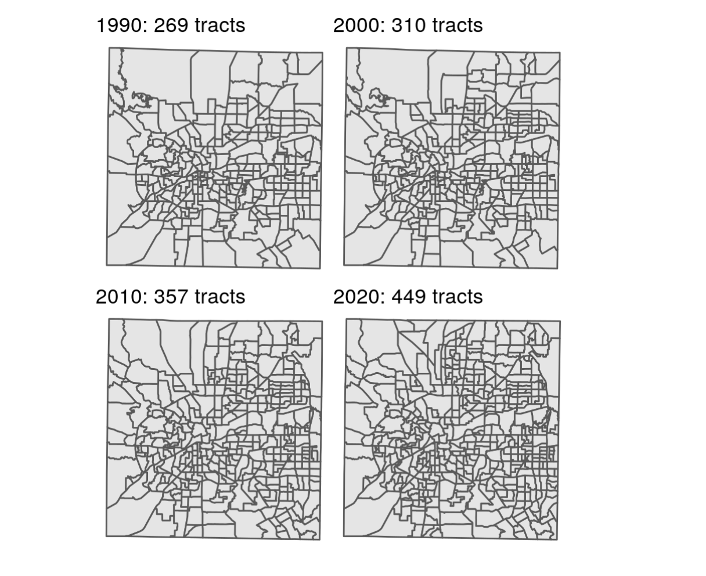
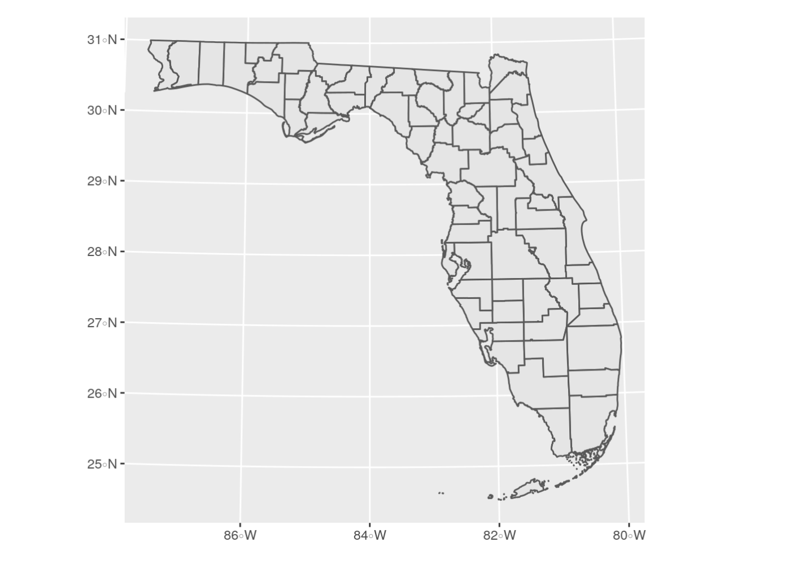
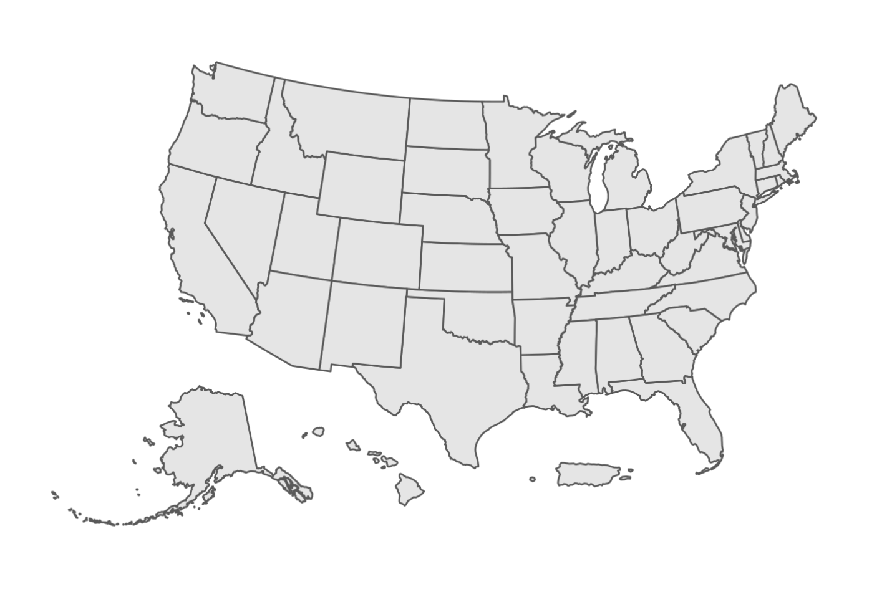

```{r setup, include = FALSE}
library(learnr)
library(tutorial.helpers)
library(knitr)
library(tidycensus)
library(tidyverse)
library(tigris)


knitr::opts_chunk$set(echo = FALSE)
options(tutorial.exercise.timelimit = 60, 
        tutorial.storage = "local") 
  
```

```{r copy-code-chunk, child = system.file("child_documents/copy_button.Rmd", package = "tutorial.helpers")}
```

```{r info-section, child = system.file("child_documents/info_section.Rmd", package = "tutorial.helpers")}
```

<!-- DK: To the extent possible, make the sections --- which are really "topics" --- match the sections in the chater. -->

<!-- DK: Remove any material which is not actual in the chapter. Be ruthless.  -->

## Introduction
### 

This tutorial covers [Chapter 5: Census geographic data and applications in R](https://walker-data.com/census-r/census-geographic-data-and-applications-in-r.html) from [*Analyzing US Census Data: Methods, Maps, and Models in R*](https://walker-data.com/census-r/index.html) by Kyle Walker. 


## Basic usage of tigris 
### 

Census and ACS data are associated with geographies, which are the units at which the data is aggregated. We are going to learn how to work with these. These defined geographies are represented in the [US Census Bureau’s TIGER/Line database](https://www2.census.gov/geo/pdfs/maps-data/data/tiger/tgrshp2019/TGRSHP2019_TechDoc.pdf), where the acronym **TIGER** stands for Topologically Integrated Geographic Encoding and Referencing. 

### Exercise 1

Load the `tigris` package. 

```{r basic-usage-of-tigris-1, exercise = TRUE}

```

```{r basic-usage-of-tigris-1-hint-1, eval = FALSE}
library(...)
```

```{r basic-usage-of-tigris-1-test, include = FALSE}
library(tigris)
```

### 

Working with spatial data sets is quite complex. Fortunately, the `tigris` package does a lot of the work for us. Let's explore the basic functions of this package. 

### Exercise 2

One problem with `tigris` is that sometimes it will take a long time to download data. We can avoid this by editing our `.Rprofile` file. 

Run `usethis::edit_r_profile()` in the Console. Then put `options(tigris_use_cache = TRUE)` in your `.Rprofile` file. Save and close the file.

### 

Type `readLines("~/.Rprofile")` in the Console. CP/CR.

```{r basic-usage-of-tigris-2}
question_text(NULL,
	answer(NULL, correct = TRUE),
	allow_retry = TRUE,
	try_again_button = "Edit Answer",
	incorrect = NULL,
	rows = 3)
```

### 

The `~` symbol indicates your home directory. The command should have returned the content of your `.Rprofile` file, which should be the one line you just added. But, depending on your computer set up, this might not work. No worries if so!

### Exercise 3

Go ahead and restart your R session. This will close the tutorial. Just open it again after R restarts. (Note that restarting your R session is not the same thing as restarting RStudio.) 

Then in your console, run `options("tigris_use_cache")`. 

CP/CR. 

```{r basic-usage-of-tigris-3}
question_text(NULL,
	answer(NULL, correct = TRUE),
	allow_retry = TRUE,
	try_again_button = "Edit Answer",
	incorrect = NULL,
	rows = 3)
```

### 

This should return a value of `TRUE`. Now this setting will be in your `.Rprofile` until you change it.

### Exercise 4

Type `states()` and Hit "Run Code."

```{r basic-usage-of-tigris-4, exercise = TRUE}

```

```{r basic-usage-of-tigris-4-hint-1, eval = FALSE}
states()
```

### 

Generally speaking, each type of geographic dataset available in the Census Bureau’s TIGER/Line database is available with a corresponding function in **tigris**. For example, the `states()` function can be run without arguments to download a boundary file of US states and state equivalents.

### Exercise 5

We have assigned the previous code to an object called `st`. Run `st` to ensure it works. 

```{r basic-usage-of-tigris-5, exercise = TRUE}

```

```{r basic-usage-of-tigris-5-hint-1, eval = FALSE}
st
```

### 

The object `st`, representing all US states and territories, includes a data frame with a series of columns representing characteristics of those states, like a name, postal code, and Census ID (the `GEOID` column). It also contains a special list-column, `geometry`, which is made up of a sequence of coordinate of longitude/latitude coordinate pairs that collectively represent the boundary of each state.

### Exercise 6

Run `class()` with `st` as the argument. Hit "Run Code."

```{r basic-usage-of-tigris-6, exercise = TRUE}

```

```{r basic-usage-of-tigris-6-hint-1, eval = FALSE}
class(...)
```

### 

This should return two datatypes: `sf` and `data.frame`. We can visualize this `geometry` column with the `plot()` function.

### Exercise 7

Run `plot()` below with the `geometry` column as the argument. Remember we extract columns using the `$` operator. 

```{r basic-usage-of-tigris-7, exercise = TRUE}

```

<button onclick = "transfer_code(this)">Copy previous code</button>

```{r basic-usage-of-tigris-7-hint-1, eval = FALSE}
plot(st$...)
```

### 

This should show a zoomed out map of the US. 

### Exercise 8

Run `counties()` with the argument `"NM"` and hit "Run Code."

```{r basic-usage-of-tigris-8, exercise = TRUE}

```

```{r basic-usage-of-tigris-8-hint-1, eval = FALSE}
counties("NM")
```

### 

The [counties()](https://rdrr.io/pkg/tigris/man/counties.html) function can be used to obtain county boundaries for the entirety of the United States, but also can be used with the `state` argument to return only those counties from a specific state, like New Mexico.

### Exercise 9

We have assigned the previous code to an object called `nm_counties`. Run `nm_counties` to ensure it works.  

```{r basic-usage-of-tigris-9, exercise = TRUE}

```

```{r basic-usage-of-tigris-9-hint-1, eval = FALSE}
nm_counties
```

### 

```{r}

```

We can visualize all the counties in New Mexico with the `counties()` function. 

### Exercise 10

Run `plot()` with the `geometry` column extracted from the variable.

```{r basic-usage-of-tigris-10, exercise = TRUE}

```

<button onclick = "transfer_code(this)">Copy previous code</button>

```{r basic-usage-of-tigris-10-hint-1, eval = FALSE}
plot(nm_counties$...)
```

### 

We can do the same thing with the `tract()` function, using the `state` and `county` arguments. Obtaining Census shapefiles programmatically requires inputting the Federal Information Processing Standard (FIPS) code; however, **tigris** translates postal codes and names of states and counties to their FIPS codes so that R users do not have to look them up.

### Exercise 11

Run the function `tracts()` with the arguments `"NM"` and `"Los Alamos"`. Hit "Run Code."

```{r basic-usage-of-tigris-11, exercise = TRUE}

```

```{r basic-usage-of-tigris-11-hint-1, eval = FALSE}
tracts(..., ...)
```

### 

In this case the state postal code `"NM"` is used to instruct **tigris** to subset the counties dataset for counties in New Mexico. The full name of the state, `"New Mexico"`, would work the same here as well. 

### Exercise 12

We have assigned the previous code to an object called `la_tracts`. Run `la_tracts` to ensure it works. 

```{r basic-usage-of-tigris-12, exercise = TRUE}

```

```{r basic-usage-of-tigris-12-hint-1, eval = FALSE}
la_tracts
```

### 

The TIGER/Line shapefiles include three general types of data. The first one is *Legal entities*, which are geographies that have official legal standing in the United States. These include states and counties.

### Exercise 13

Then below that, run `plot()` with the `geometry` column extracted from the variable.

```{r basic-usage-of-tigris-13, exercise = TRUE}

```

<button onclick = "transfer_code(this)">Copy previous code</button>

```{r basic-usage-of-tigris-13-hint-1, eval = FALSE}
plot(la_tracts$...)
```

### 

The second type of data is *Statistical entities*, which are geographies defined by the Census Bureau for purposes of data collection and dissemination. Examples of statistical entities include Census tracts and block groups.

### Exercise 14

Run the function `area_water()` with the argument `"NM"` and `"Los Alamos"`. Hit "Run Code." 

and assign it to the variable `la_water`. Then below that, 

```{r basic-usage-of-tigris-14, exercise = TRUE}

```

```{r basic-usage-of-tigris-14-hint-1, eval = FALSE}
area_water(..., ...)
```

### 

The third type of data is *Geographic features*, which are geographies that are not linked with aggregate demographic data from the Census Bureau. These datasets include roads and water features.

### Exercise 15

We have assigned the previous code to an object called `la_water`. Run `la_water` to ensure it works. 

```{r basic-usage-of-tigris-15, exercise = TRUE}

```

```{r basic-usage-of-tigris-15-hint-1, eval = FALSE}
la_water
```

### 

Several geographic features are available in tigris as well, including roads and water features which can be useful for thematic mapping. 

### Exercise 16

Run `plot()` with the `geometry` column extracted from the variable. 

```{r basic-usage-of-tigris-16, exercise = TRUE}

```

<button onclick = "transfer_code(this)">Copy previous code</button>

```{r basic-usage-of-tigris-16-hint-1, eval = FALSE}
plot(la_water$...)
```

### 

Traditionally, TIGER/Line shapefiles are downloaded from a web interface as zipped folders, then unzipped for use in a Geographic Information System (GIS) or other software that can work with geographic data. However, the R package **tigris**  allows R users to access these datasets directly from their R sessions without having to go through these steps.

## Understanding tigris and simple features
### 

Data returned by the tigris package are examples of vector spatial data, a spatial data model that represents geographic features as points, lines, and polygons. The vector spatial data model is represented in R with the [sf package](https://r-spatial.github.io/sf/), an implementation of simple features in the R language. 

### Exercise 1

Now, Let’s acquire landmark point data for DC. Run the `landmarks()` function with the arguments `"DC"` and set the second argument, `type`, to `"point"`. 

Create a variable named `dc_landmarks`  Then below that, 

```{r understanding-tigris-and-simpl-1, exercise = TRUE}

```

```{r understanding-tigris-and-simpl-1-hint-1, eval = FALSE}
landmarks("...", type = "...")
```

### 

The **sf** package is an R interface to C libraries that power much of the broader geographic data ecosystem: [GDAL](https://gdal.org/) for reading & writing spatial data, [GEOS](https://trac.osgeo.org/geos/) for modeling spatial relationships, and [PROJ](https://proj.org/) for representing coordinate reference systems. These topics will be outlined in more detail in this chapter and the remainder of this section.

### Exercise 2

We have assigned the previous code to an object called `dc_landmarks`. Run `dc_landmarks` to ensure it works. 

```{r understanding-tigris-and-simpl-2, exercise = TRUE}

```

```{r understanding-tigris-and-simpl-2-hint-1, eval = FALSE}
dc_landmarks 
```

### 

As mentioned earlier, **sf** represents vector spatial data much like a regular R data frame, but with a special column, `geometry`, that represents the shape of each feature. When a simple features object is printed, the information above the data frame gives some additional geographic context to the coordinates in the `geometry` column.

### Exercise 3

Run `plot()` to plot the extracted geometry column from the variable.  

```{r understanding-tigris-and-simpl-3, exercise = TRUE}

```

<button onclick = "transfer_code(this)">Copy previous code</button>

```{r understanding-tigris-and-simpl-3-hint-1, eval = FALSE}
plot(dc_landmarks$...)
```

### 

This should produce a bunch of what seems like random points, which represent all the landmarks in DC. 

### Exercise 4

Run `primary_secondary_roads()` function with a single argument of `"DC"`.

```{r understanding-tigris-and-simpl-4, exercise = TRUE}

```

```{r understanding-tigris-and-simpl-4-hint-1, eval = FALSE}
primary_secondary_roads(...)
```

### 

We've created dots with landmarks, but what if we want to study something like roads? Lines would be more useful.

### Exercise 5

We have assigned the previous code to an object called `dc_roads`. Run `dc_roads` to ensure it works. 

```{r understanding-tigris-and-simpl-5, exercise = TRUE}

```

```{r understanding-tigris-and-simpl-5-hint-1, eval = FALSE}
dc_roads
```

### 

**Lines** are one-dimensional representations of geographic features that are used when the length, but not the area, of those features is of primary importance. With respect to the TIGER/Line shapefiles, transportation network features such as roads and railroads are represented as lines.

### Exercise 6

Plot the extracted `geometry` column from the variable just like before.

```{r understanding-tigris-and-simpl-6, exercise = TRUE}

```

<button onclick = "transfer_code(this)">Copy previous code</button>

```{r understanding-tigris-and-simpl-6-hint-1, eval = FALSE}
plot(dc_roads$...)
```

### 

Points and lines are cool, but sometimes we may need to use two-dimensional shapes/polygons. 

### Exercise 7

Run `block_groups()` with the argument `"DC"`. Hit "Run Code."

```{r understanding-tigris-and-simpl-7, exercise = TRUE}

```

```{r understanding-tigris-and-simpl-7-hint-1, eval = FALSE}
block_groups("DC")
```

### 

**Polygons** are enclosed shapes with at least three connected coordinate pairs. With respect to Census geometries, enumeration units like block groups are represented as polygons in the TIGER/Line files. Polygon geometry is useful when an analyst needs to represent the shape or area of geographic features in their project. 

### Exercise 8

We have assigned the previous code to an object called `dc_block_groups`. Run `dc_block_groups` to ensure it works. 

```{r understanding-tigris-and-simpl-8, exercise = TRUE}

```

```{r understanding-tigris-and-simpl-8-hint-1, eval = FALSE}
dc_block_groups
```

### 

These three core geometries (point, line, and polygon) can be encoded in more complex ways in the simple features representation used by sf. For example, the geometry type `POLYGON` will use one row in a simple features data frame for each discrete shape; the geometry type `MULTIPOLYGON`, in contrast, can link multiple discrete shapes as part of the same geographic feature.

### Exercise 9

Run `plot()` to plot the extracted geometry column from the variable.   

```{r understanding-tigris-and-simpl-9, exercise = TRUE}

```

<button onclick = "transfer_code(this)">Copy previous code</button>

```{r understanding-tigris-and-simpl-9-hint-1, eval = FALSE}
plot(dc_block_groups$...))
```

### 

This is important for encoding features that may have detached parts, such as a series of islands that belong to the same county. In this vein, points can be represented as `MULTIPOINT` and lines can be represented as MULTILINESTRING, respectively, to accommodate similar scenarios.

## Plotting geographic data
### 

Geographic information science is an inherently visual discipline. For analysts coming to R from a desktop GIS background (e.g. ArcGIS, QGIS), they will be used to having a visual display of their geographic data as central to their interactions with it. This may make the transition to R unfamiliar for geospatial analysts as geographic data will be first and foremost represented as a tabular data frame.

### Exercise 1

Run `la_tracts` and hit "Run Code."

```{r plotting-geographic-data-1, exercise = TRUE}

```

```{r plotting-geographic-data-1-hint-1, eval = FALSE}
la_tracts
```

### 

We just went throught the basic usage of the `tigris` package. Now we're going to plot geographic data using the `ggplot2` package. 

### Exercise 2

Load the `ggplot2` package. 

```{r plotting-geographic-data-2, exercise = TRUE}

```

```{r plotting-geographic-data-2-hint-1, eval = FALSE}
library(...)
```

### 

As of ggplot2 version 3.0, the package released support for plotting simple features objects directly with the function `geom_sf()`. `geom_sf()` streamlines the geographic visualization process and makes ggplot2 a go-to package for visualization of simple features objects.

### Exercise 3

Run `ggplot()` with `la_tracts` as the argument and then add the `geom_sf()` layer. 
```{r plotting-geographic-data-3, exercise = TRUE}

```

<button onclick = "transfer_code(this)">Copy previous code</button>

```{r plotting-geographic-data-3-hint-1, eval = FALSE}
ggplot(...) + 
  geom_sf()
```

### 

By default, ggplot2 includes its standard grey grid with latitude and longitude values displayed along the axes. For many cartographic applications, an analyst will want to remove this background information. 

### Exercise 4

Copy and paste your code from before and add the `theme_void()` layer. 

```{r plotting-geographic-data-4, exercise = TRUE}

```

<button onclick = "transfer_code(this)">Copy previous code</button>

```{r plotting-geographic-data-4-hint-1, eval = FALSE}
... +
  theme_void()
```

### 

The `theme_void()` function strips the background grid and axis labels from the plot accordingly:

### Exercise 5

Load the `patchwork` package. 

```{r plotting-geographic-data-5, exercise = TRUE}

```

```{r plotting-geographic-data-5-hint-1, eval = FALSE}
library(patchwork)
```

### 

We can use *faceted plots* to compare different views, which is also a very useful concept for geographic visualization. Faceted mapping will be addressed directly in the next chapter. For comparative spatial plots, the [patchwork](https://cran.r-project.org/web/packages/patchwork/vignettes/patchwork.html) R package (Pedersen 2020) works very well for arranging a multi-plot layout. 

### Exercise 6

Run `block_groups()` function, set the arguments to `"NM"` and `"Los Alamos"`. 

```{r plotting-geographic-data-6, exercise = TRUE}

```

```{r plotting-geographic-data-6-hint-1, eval = FALSE}
block_groups(..., ...)
```

### 

Below, we’ll use patchwork to put two **ggplot2** spatial plots - one of Census tracts and one of block groups in Los Alamos County - side-by-side using the + operator.

### Exercise 7

We have assigned the previous code to an object called `la_block_groups_2`. Type `la_block_groups_2` and hit "Run Code." to ensure it works. 

```{r plotting-geographic-data-7, exercise = TRUE}

```

```{r plotting-geographic-data-7-hint-1, eval = FALSE}
la_block_groups_2
```

### 

Alternatively, patchwork allows R users to arrange plots vertically using the `/` operator.

### Exercise 8

Run `ggplot()` with `la_tracts` as the argument and then add `geom_sf()` and `theme_void()` as the two layers. Hit "Run Code."

```{r plotting-geographic-data-8, exercise = TRUE}

```

```{r plotting-geographic-data-8-hint-1, eval = FALSE}
ggplot(...) + 
  ... +
  ...
  
```

### 

This produce a plot of Census tracts in Los Alamos County. 

### Exercise 9

Copy your previous code, add the title to the plot as `"Census tracts"` using the `labs()` function. 

```{r plotting-geographic-data-9, exercise = TRUE}

```

<button onclick = "transfer_code(this)">Copy previous code</button>

```{r plotting-geographic-data-9-hint-1, eval = FALSE}
... +
  labs(title = "...")
```

### 

We can produce the same plot for the `la_block_groups_2` object that produce a plot of block groups in Los Alamos County.

### Exercise 10

Run `ggplot()` with `la_blocks_groups_2` as the argument and then add `geom_sf()` and `theme_void()` as the two layers. Hit "Run Code."

```{r plotting-geographic-data-10, exercise = TRUE}

```

```{r plotting-geographic-data-10-hint-1, eval = FALSE}
ggplot(...) + 
  ... +
  ...
```

### 

### Exercise 11

Copy your previous code, add the title to the plot as `"Block groups"` using the `labs()` function. 

```{r plotting-geographic-data-11, exercise = TRUE}

```

<button onclick = "transfer_code(this)">Copy previous code</button>

```{r plotting-geographic-data-11-hint-1, eval = FALSE}
... +
  labs(title = "...")
```

### 

### Exercise 12

We have assigned the plots for `"Census tracts"` and `"Block groups"` to the variables `gg1` and `gg2`, respectively. Run `gg1 + gg2` to see the plots side by side. 

```{r plotting-geographic-data-12, exercise = TRUE}

```

```{r plotting-geographic-data-12-hint-1, eval = FALSE}
... + ...
```

### 

We can also make our graphs interactive by using the `mapview` package. The package visualizes geographic data on an interactive, zoomable map.

### Exercise 13

Load the `mapview` package. 

```{r plotting-geographic-data-13, exercise = TRUE}

```

```{r plotting-geographic-data-13-hint-1, eval = FALSE}
library(...)
```

### 

With a single call to its function [mapview()](https://rdrr.io/pkg/mapview/man/mapView.html), **mapview** visualizes geographic data on an interactive, zoomable map. Let’s try it here with our Census tracts in Los Alamos County.

### Exercise 14

Run `mapview()` with `la_tracts` as the argument.

```{r plotting-geographic-data-14, exercise = TRUE}

```

```{r plotting-geographic-data-14-hint-1, eval = FALSE}
mapview(...)
```

### 

Clicking on a Census tract shape reveals a pop-up with attribute information found in the dataset. Additionally, users can change the underlying basemap to understand the geographic context surrounding their data. **mapview** also includes significant functionality for interactive mapping and data display beyond this basic example; some of these features are covered in the next chapter.

## tigris workflows
### 

As covered in the previous sections, tigris is a useful package for getting TIGER/Line shapefiles into your R geospatial projects without having to navigate the Census website. Functions in **tigris** include additional options to allow for customization of output and better integration into geospatial projects. The sections below provide an overview of some of these options.

### Exercise 1

Run `counties()` function with `"MI"` as the argument. 

```{r tigris-workflows-1, exercise = TRUE}

```

```{r tigris-workflows-1-hint-1, eval = FALSE}
counties("MI")
```

### 

This function returns a simple features object of all counties in Michigan.

### Exercise 2

We have assigned the previous code to an object called `mi_counties`. Run `mi_counties` to ensure it works. 

```{r tigris-workflows-2, exercise = TRUE}

```

```{r tigris-workflows-2-hint-1, eval = FALSE}
mi_counties
```

### 

The TIGER/Line shapefiles include water area for geographic features, connecting the Upper Peninsula of Michigan with the southern part of the state and giving an unfamiliar representation of Michigan’s land area. 

### Exercise 3

Run `ggplot()` on the `mi_counties`, add `geom_sf()` and `theme_void()` as the two layers. Add the title to the plot as `"TIGER/LINE"` using the `labs()` function. 

```{r tigris-workflows-3, exercise = TRUE}

```

```{r tigris-workflows-3-hint-1, eval = FALSE}
ggplot(...) + 
  geom_sf() + 
  theme_void() + 
  labs(title = "...")
```

### 

While the TIGER/Line shapefiles may represent “official” areas of counties - which include water area - they look very unfamiliar to viewers expecting a usual representation of land area in Michigan.

### Exercise 4

Run `counties()` function with `"MI"` and `cb = TRUE` as the arguments. 

```{r tigris-workflows-4, exercise = TRUE}

```

```{r tigris-workflows-4-hint-1, eval = FALSE}
counties("MI", cb = TRUE)
```

### 

This function returns a simple features object of all counties in Michigan as cartographic boundary files. Let’s use patchwork to compare the TIGER/Line and cartographic boundary shapefiles for counties in Michigan as an illustration.

### Exercise 5

We have assigned the previous code to an object called `mi_counties_cb`. Run `mi_counties_cb` to ensure it works. 

```{r tigris-workflows-5, exercise = TRUE}

```

```{r tigris-workflows-5-hint-1, eval = FALSE}
mi_counties_cb
```

### 

We will produce a plot of the cartographic boundary shapefiles for Michigan counties then compare it with the TIGER/Line shapefiles using the `+` operator.

### Exercise 6

Run `ggplot()` on the `mi_counties_cb`, add `geom_sf()` and `theme_void()` as the two layers. Add the title to the plot as `"Cartographic Boundary"` using the `labs()` function. 

```{r tigris-workflows-6, exercise = TRUE}

```

```{r tigris-workflows-6-hint-1, eval = FALSE}
ggplot(...) + 
  geom_sf() + 
  theme_void() + 
  labs(title = "...")
```

### 

As the cartographic boundary file shows islands and a distinct coastline, it will be the better option for most thematic mapping projects. When using the `cb = TRUE` argument with counties and larger geographies, users can also specify one of three resolutions with the resolution argument: `"500k"` (the default), `"5m"`, or `"20m"`, with higher values representing more generalized boundaries and smaller file sizes.

### Exercise 7

Load the `tidyverse` package. 

```{r tigris-workflows-7, exercise = TRUE}

```

```{r tigris-workflows-7-hint-1, eval = FALSE}
library(...)
```

### 

The US Census Bureau offers a time series of TIGER/Line and cartographic boundary shapefiles from 1990 to 2020. While some geographies are reasonably static, such as state boundaries, others change regularly with each decennial US Census, such as Census tracts, block groups, and blocks. 

### Exercise 8

Load the `patchwork` package.

```{r tigris-workflows-8, exercise = TRUE}

```

```{r tigris-workflows-8-hint-1, eval = FALSE}
library(...)
```

### 

An example of these changes is shown below with Census tracts in Tarrant County, Texas displayed, a county that added nearly 1 million people between 1990 and 2020. Given that the US Census Bureau aims to make the population sizes of Census tracts relatively consistent (around 4,000 people), it will subdivide and re-draw tracts in fast-growing areas for each Census to provide better geographic granularity.

### Exercise 9

Load the `glue` package.

```{r tigris-workflows-9, exercise = TRUE}

```

```{r tigris-workflows-9-hint-1, eval = FALSE}
library(...)
```

### 

The `glue()` function in the glue package is used to create a custom title that shows the number of Census tracts in each year.

### Exercise 10

Take a look below. We have created a variable for you already. This will focus on data from Tarrant County, Texas. The `map` function iterates through each year, grabbing a cartographic boundary file of Census tracts for the four decennial Census years.

Below the `tracts()` function but inside the end `})`, start a graph with `ggplot()` and `year_tracts` as the argument. Add the `geom_sf()` layer and the `theme_void` layer. Finally, add the following layer: `labs(title = glue("{.x}: {nrow(year_tracts)} tracts"))`.


```{r tigris-workflows-10, exercise = TRUE}
yearly_plots <- map(seq(1990, 2020, 10), ~{
  year_tracts <- tracts("TX", "Tarrant", year = .x,
                        cb = TRUE)

})
```

<button onclick = "transfer_code(this)">Copy previous code</button>

```{r tigris-workflows-10-hint-1, eval = FALSE}
yearly_plots <- map(seq(1990, 2020, 10), ~{
  year_tracts <- tracts("TX", "Tarrant", year = .x,
                        cb = TRUE)

  ggplot(...) + 
    geom_sf() + 
    theme_void() + 
    labs(title = glue("{.x}: {nrow(year_tracts)} tracts"))
})
```

### 

By using the `glue` package in `labs()`, we create a custom title for each year that shows how many Census tracts are there. 

This generates the graphs, but we are not done yet. The graphs are now stored in the `yearly_plots` variable.  

### Exercise 11

Now, we can use `patchwork` to facet the graphs.

Copy and paste your code from above. Then below that, use `patchwork` to facet it. Check the hint to see how we should format this. We are indexing the `yearly_plot` object using double brackets. 

```{r tigris-workflows-11, exercise = TRUE}

```

<button onclick = "transfer_code(this)">Copy previous code</button>

```{r tigris-workflows-11-hint-1, eval = FALSE}
... 
(yearly_plots[[1]] + ...[[2]]) / 
  (yearly_plots[[...]] + ...[[...]])
I sense a pattern...
```

### 

Your graph should look like this:

```{r}

```

The forward slash that we included basically stacks graphs 1 and 2 on top of graphs 3 and 4 instead of putting all 4 next to each other. 

### 

We've successfuly faceted a graph by time, how cool is that?!

### Exercise 12

For geographic data to appropriately represent locations in mapping and spatial analysis, they must be referenced to some model of the Earth’s surface correctly. In simpler terms - a data model of the state of Florida should represent where Florida is actually located relative to other locations! This is defined as a coordinate reference system (CRS).

### 

When plotting an object with `geom_sf()` we can specify a CRS with `coord_sf()`

Create a variable named `fl_counties` and assign it to the `counties()` function with arguments `"FL"` and `cb = TRUE`. Below that, use `ggplot()` and `geom_sf()` to plot the variable. 

```{r tigris-workflows-12, exercise = TRUE}

```

<button onclick = "transfer_code(this)">Copy previous code</button>

```{r tigris-workflows-12-hint-1, eval = FALSE}
fl_counties <- counties("...", cb = ...)
ggplot(...) + 
  geom_sf()
```

### 

Good! Now let's incorporate a specified CRS with `coord_sf()`.

### Exercise 13

Copy and paste your code from before. Add the `coord_sf()` layer and set the argument `crs` to `3087`.

```{r tigris-workflows-13, exercise = TRUE}

```

<button onclick = "transfer_code(this)">Copy previous code</button>

```{r tigris-workflows-13-hint-1, eval = FALSE}
... + 
  coord_sf(crs = ...)
```

### 

Now that we've specified a CRS, your graph should look like this:

```{r}

```

### Exercise 14

As seen in the earlier graph, the tick marks default to longitude and latitude. We can change this with the `datum` argument.

Copy and paste your code from above. Within `coord_sf()`, add another argument (`datum`) and set it to `3087`.

```{r tigris-workflows-14, exercise = TRUE}

```

<button onclick = "transfer_code(this)">Copy previous code</button>

```{r tigris-workflows-14-hint-1, eval = FALSE}
... + 
  coord_sf(... = ..., datum = ...)
```

### 

Now we know how to modify both our CRS, and our axis ticks. 

### Exercise 15

Let's shift gears to national US mapping. A common problem for national display of the United States is the fragmented nature of US states and territories geographically. A lot of times, programmers have to decide what to do with Hawaii, Alaska, and Puerto Rico. 

Using the `tigris` function `states()` with `cb` set to `TRUE`, create a variable named `us_states` and assign it. Below that, use `ggplot()`, `geom_sf()` and `theme_void()` to construct a map. 


```{r tigris-workflows-15, exercise = TRUE}

```

<button onclick = "transfer_code(this)">Copy previous code</button>

```{r tigris-workflows-15-hint-1, eval = FALSE}
us_states <- states(cb = ...)
ggplot(...) + 
  geom_sf() +
  theme_void()
```

### 

We can see how difficult it is to get anything useful from this map. 

### Exercise 16

We can fix this by using a a projected coordinate reference system appropriate for the United States, such as the continental US Albers Equal Area projection. 

### 

Copy and paste your code from earlier and add the `coord_sf()` layer. Within this function, set `crs` to `"ESRI:102003"`. 


```{r tigris-workflows-16, exercise = TRUE}

```

<button onclick = "transfer_code(this)">Copy previous code</button>

```{r tigris-workflows-16-hint-1, eval = FALSE}
... + 
  coord_sf(crs = "...")
```

### 

Notice that this reformats the graph and makes it much easier to analyze. 

### Exercise 17

We can do this same thing and make it a lot easier through the `tigris` package. 

Notice that we redefined `us_states` for you. Below that, create a new variable named `us_states_shifted` and assign it to the function `shift_geometry()` with `us_states` as the argument. 

```{r tigris-workflows-17, exercise = TRUE}
us_states <- states(cb = TRUE)
```

<button onclick = "transfer_code(this)">Copy previous code</button>

```{r tigris-workflows-17-hint-1, eval = FALSE}
us_states <- states(cb = TRUE)
us_states_shifted <- shift_geometry(...)
```

### 

`shift_geometry()` does all the reformatting work for us, so now we can just plot it.

### Exercise 18

Copy and paste your code from above. Below that, create a plot using `ggplot()`, `geom_sf()`, and `theme_void()`.

```{r tigris-workflows-18, exercise = TRUE}

```

<button onclick = "transfer_code(this)">Copy previous code</button>

```{r tigris-workflows-18-hint-1, eval = FALSE}
us_states <- states(cb = TRUE)
us_states_shifted <- shift_geometry(...)
ggplot(...) +
  geom_sf() +
  theme_void()
```

### 

Your graph should look like this:

```{r}

```

We have seen how we can `tigris` and its functions to reformat graphs. Learn more about `shift_geometry()` and its arguments [here](https://walker-data.com/census-r/census-geographic-data-and-applications-in-r.html#shifting-and-rescaling-geometry-for-national-us-mapping).

### Exercise 19

Let's explore some other useful reformatting options, such as changing polygons to points. 

### 

Look below to what we've already written. `tx_places` uses the `places()` function to get places from Texas, and `tx_outline` gets the actual state outline of Texas using `states()`. Click run code. 

```{r tigris-workflows-19, exercise = TRUE}
tx_places <- places("TX", cb = TRUE) %>%
  filter(NAME %in% c("Dallas", "Fort Worth", "Houston",
                     "Austin", "San Antonio", "El Paso")) %>%
  st_transform(6580)

tx_outline <- states(cb = TRUE) %>%
  filter(NAME == "Texas") %>%
  st_transform(6580)

ggplot() + 
  geom_sf(data = tx_outline) + 
  geom_sf(data = tx_places, fill = "red", color = NA) + 
  theme_void()
```

<button onclick = "transfer_code(this)">Copy previous code</button>

### 

The issue with this graphic is that city geographies are pretty irregular All  cities spread across large areas, have holes, and  include portions that are far from the main city. We can fix this by making the polygons into points. 

### Exercise 20

Copy and paste the code above. Before `ggplot()`, create a new variable named `tx_centroids`. Set this variable to the `st_centroid()` function with the argument `tx_places`. Then in the second `geom_sf()`, set `data` to `tx_centroids`, `color` to `"red"`, and `size` to `3`.

```{r tigris-workflows-20, exercise = TRUE}

```

<button onclick = "transfer_code(this)">Copy previous code</button>

```{r tigris-workflows-20-hint-1, eval = FALSE}
...

tx_centroids <- st_centroids(...)
ggplot() +
  geom_sf(...) + 
  geom_sf(data = ..., color = "...", size = ...) + 
  theme_void()
```

### 

Notice that the cities are displayed as circles instead of irregular polygons now. 

### 

## Summary
### 

This tutorial covered [Chapter 5: Census geographic data and applications in R](https://walker-data.com/census-r/census-geographic-data-and-applications-in-r.html) from [*Analyzing US Census Data: Methods, Maps, and Models in R*](https://walker-data.com/census-r/index.html) by Kyle Walker. 


```{r download-answers, child = system.file("child_documents/download_answers.Rmd", package = "tutorial.helpers")}
```
