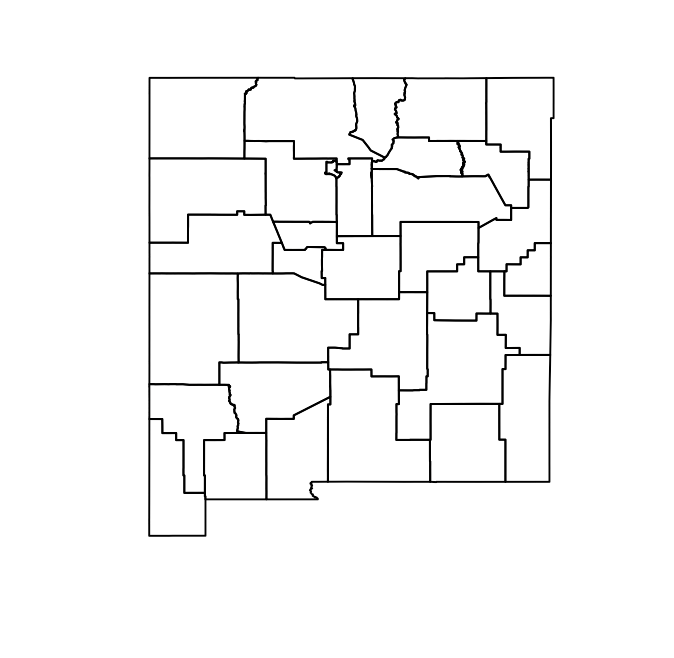
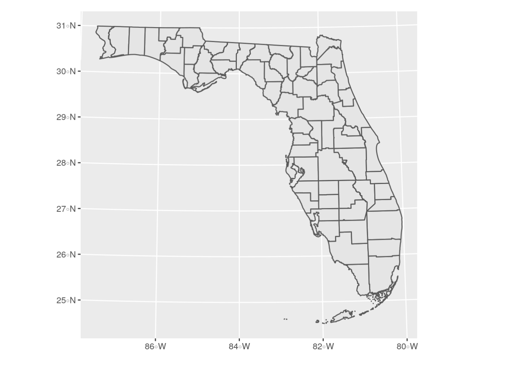

```{r setup, include = FALSE}
library(learnr)
library(tutorial.helpers)
library(knitr)
library(tidycensus)
library(tidyverse)
library(tigris)
# library(mapview)
library(patchwork)
library(glue)
library(sf)
library(crsuggest)

knitr::opts_chunk$set(echo = FALSE)
options(tutorial.exercise.timelimit = 60, 
        tutorial.storage = "local") 

# st <- states()
# write_rds(st, "data/st.rds")
st <- read_rds("data/st.rds")

# nm_counties <- counties("NM")
# write_rds(nm_counties, "data/nm_counties.rds")
nm_counties <- read_rds("data/nm_counties.rds")

# la_tracts <- tracts("NM", "Los Alamos")
# write_rds(la_tracts, "data/la_tracts.rds")
la_tracts <- read_rds("data/la_tracts.rds")

# la_water <- area_water("NM", "Los Alamos")
# write_rds(la_water, "data/la_water.rds")
la_water <- read_rds("data/la_water.rds")

# dc_landmarks <- landmarks("DC", "point")
# write_rds(dc_landmarks, "data/dc_landmarks.rds")
dc_landmarks <- read_rds("data/dc_landmarks.rds")


# dc_roads <- primary_secondary_roads("DC")
# write_rds(dc_roads, "data/dc_roads.rds")
dc_roads <- read_rds("data/dc_roads.rds")

# dc_block_groups <- block_groups("DC")
# write_rds(dc_block_groups, "data/dc_block_groups.rds")
dc_block_groups <- read_rds("data/dc_block_groups.rds")

# mi_counties <- counties("MI")
# write_rds(mi_counties, "data/mi_counties.rds")
mi_counties <- read_rds("data/mi_counties.rds")

# mi_counties_cb <- counties("MI", cb = TRUE)
# write_rds(mi_counties_cb, "data/mi_counties_cb.rds")
mi_counties_cb <- read_rds("data/mi_counties_cb.rds")


# Tarrant County here


# Left off at state codes.

# fl_counties <- counties("FL", cb = TRUE)
# write_rds(fl_counties, "data/fl_counties.rds")
fl_counties <- read_rds("data/fl_counties.rds")

fl_crs <- suggest_crs(fl_counties)

fl_projected <- st_transform(fl_counties, crs = 3087)

# us_states <- states(cb = TRUE, resolution = "20m")
# write_rds(us_states, "data/us_states.rds")
us_states <- read_rds("data/us_states.rds")

us_states_shifted <- shift_geometry(us_states)

us_states_outside <- shift_geometry(us_states, 
                                    preserve_area = FALSE, 
                                    position = "outside")
```

```{r copy-code-chunk, child = system.file("child_documents/copy_button.Rmd", package = "tutorial.helpers")}
```

```{r info-section, child = system.file("child_documents/info_section.Rmd", package = "tutorial.helpers")}
```

<!-- Does it really make sense to create 20 objects and save them above? -->

<!-- Deal with Tarrant County questions? -->

<!-- Entire second half of tigris workflows section is missing us_bgs_2020 is too big a data set for GitHub. -->

<!-- Working with geometries section needs test cases and clean up. Also, commented out the last dozen questions.-->

## Introduction
### 

This tutorial covers [Chapter 5: Census geographic data and applications in R](https://walker-data.com/census-r/census-geographic-data-and-applications-in-r.html) from [*Analyzing US Census Data: Methods, Maps, and Models in R*](https://walker-data.com/census-r/index.html) by Kyle Walker. 


## Basic usage of tigris 
### 

Census and ACS data are associated with geographies, which are the units at which the data is aggregated. We are going to learn how to work with these. These defined geographies are represented in the [US Census Bureau’s TIGER/Line database](https://www2.census.gov/geo/pdfs/maps-data/data/tiger/tgrshp2019/TGRSHP2019_TechDoc.pdf), where the acronym **TIGER** stands for Topologically Integrated Geographic Encoding and Referencing. 

### Exercise 1

Load the `tigris` package. 

```{r basic-usage-of-tigris-1, exercise = TRUE}

```

```{r basic-usage-of-tigris-1-hint-1, eval = FALSE}
library(...)
```

```{r basic-usage-of-tigris-1-test, include = FALSE}
library(tigris)
```

### 

Working with spatial data sets is quite complex. Fortunately, the `tigris` package does a lot of the work for us. Let's explore the basic functions of this package. 

### Exercise 2

One problem with `tigris` is that sometimes it will take a long time to download data. We can avoid this by editing our `.Rprofile` file. 

Run `usethis::edit_r_profile()` in the Console. Then put `options(tigris_use_cache = TRUE)` in your `.Rprofile` file. Save and close the file.

### 

Type `readLines("~/.Rprofile")` in the Console. CP/CR.

```{r basic-usage-of-tigris-2}
question_text(NULL,
	answer(NULL, correct = TRUE),
	allow_retry = TRUE,
	try_again_button = "Edit Answer",
	incorrect = NULL,
	rows = 3)
```

### 

The `~` symbol indicates your home directory. The command should have returned the content of your `.Rprofile` file, which should be the one line you just added. But, depending on your computer set up, this might not work. No worries if so!

### Exercise 3

Go ahead and restart your R session. This will close the tutorial. Just open it again after R restarts. (Note that restarting your R session is not the same thing as restarting RStudio.) 

Then in your console, run `options("tigris_use_cache")`. 

CP/CR. 

```{r basic-usage-of-tigris-3}
question_text(NULL,
	answer(NULL, correct = TRUE),
	allow_retry = TRUE,
	try_again_button = "Edit Answer",
	incorrect = NULL,
	rows = 3)
```

### 

This should return a value of `TRUE`. Now this setting will be in your `.Rprofile` until you change it.

### Exercise 4

Type `states()` and Hit "Run Code."

```{r basic-usage-of-tigris-4, exercise = TRUE}

```

```{r basic-usage-of-tigris-4-hint-1, eval = FALSE}
states()
```

### 

Generally speaking, each type of geographic dataset available in the Census Bureau’s TIGER/Line database is available with a corresponding function in **tigris**. For example, the `states()` function can be run without arguments to download a boundary file of US states and state equivalents.

### Exercise 5

We have assigned the previous code to an object called `st`. Run `st` to ensure it works. 

```{r basic-usage-of-tigris-5, exercise = TRUE}

```

```{r basic-usage-of-tigris-5-hint-1, eval = FALSE}
st
```

```{r basic-usage-of-tigris-5-test, include = FALSE}
st
```

### 

The object `st`, representing all US states and territories, includes a data frame with a series of columns representing characteristics of those states, like a name, postal code, and Census ID (the `GEOID` column). It also contains a special list-column, `geometry`, which is made up of a sequence of coordinate of longitude/latitude coordinate pairs that collectively represent the boundary of each state.

### Exercise 6

Run `class()` with `st` as the argument. Hit "Run Code."

```{r basic-usage-of-tigris-6, exercise = TRUE}

```

```{r basic-usage-of-tigris-6-hint-1, eval = FALSE}
class(...)
```

### 

This should return two datatypes: `sf` and `data.frame`. We can visualize this `geometry` column with the `plot()` function.

### Exercise 7

Run `plot()` below with the `geometry` column as the argument. Remember we extract columns using the `$` operator. 

```{r basic-usage-of-tigris-7, exercise = TRUE}

```

<button onclick = "transfer_code(this)">Copy previous code</button>

```{r basic-usage-of-tigris-7-hint-1, eval = FALSE}
plot(st$...)
```

### 

This should show a zoomed out map of the US. 

### Exercise 8

Run `counties()` with the argument `"NM"` and hit "Run Code."

```{r basic-usage-of-tigris-8, exercise = TRUE}

```

```{r basic-usage-of-tigris-8-hint-1, eval = FALSE}
counties("NM")
```

### 

The [counties()](https://rdrr.io/pkg/tigris/man/counties.html) function can be used to obtain county boundaries for the entirety of the United States, but also can be used with the `state` argument to return only those counties from a specific state, like New Mexico.

### Exercise 9

We have assigned the previous code to an object called `nm_counties`. Run `nm_counties` to ensure it works.  

```{r basic-usage-of-tigris-9, exercise = TRUE}

```

```{r basic-usage-of-tigris-9-hint-1, eval = FALSE}
nm_counties
```

```{r basic-usage-of-tigris-9-test, include = FALSE}
nm_counties
```

### 

```{r}

```

We can visualize all the counties in New Mexico with the `counties()` function. 

### Exercise 10

Run `plot()` with the `geometry` column extracted from the variable.

```{r basic-usage-of-tigris-10, exercise = TRUE}

```

<button onclick = "transfer_code(this)">Copy previous code</button>

```{r basic-usage-of-tigris-10-hint-1, eval = FALSE}
plot(nm_counties$...)
```

```{r basic-usage-of-tigris-10-test, include = FALSE}
plot(nm_counties$geometry)
```

### 

We can do the same thing with the `tract()` function, using the `state` and `county` arguments. Obtaining Census shapefiles programmatically requires inputting the Federal Information Processing Standard (FIPS) code; however, **tigris** translates postal codes and names of states and counties to their FIPS codes so that R users do not have to look them up.

### Exercise 11

Run the function `tracts()` with the arguments `"NM"` and `"Los Alamos"`. Hit "Run Code."

```{r basic-usage-of-tigris-11, exercise = TRUE}

```

```{r basic-usage-of-tigris-11-hint-1, eval = FALSE}
tracts(..., ...)
```

```{r basic-usage-of-tigris-11-test, include = FALSE}
tracts("NM", "Los Alamos")
```

### 

In this case the state postal code `"NM"` is used to instruct **tigris** to subset the counties dataset for counties in New Mexico. The full name of the state, `"New Mexico"`, would work the same here as well. 

### Exercise 12

We have assigned the previous code to an object called `la_tracts`. Run `la_tracts` to ensure it works. 

```{r basic-usage-of-tigris-12, exercise = TRUE}

```

```{r basic-usage-of-tigris-12-hint-1, eval = FALSE}
la_tracts
```

```{r basic-usage-of-tigris-12-test, include = FALSE}
la_tracts
```

### 

The TIGER/Line shapefiles include three general types of data. The first one is *Legal entities*, which are geographies that have official legal standing in the United States. These include states and counties.

### Exercise 13

Then below that, run `plot()` with the `geometry` column extracted from the variable.

```{r basic-usage-of-tigris-13, exercise = TRUE}

```

<button onclick = "transfer_code(this)">Copy previous code</button>

```{r basic-usage-of-tigris-13-hint-1, eval = FALSE}
plot(la_tracts$...)
```

```{r basic-usage-of-tigris-13-hint-2, eval = FALSE}
plot(la_tracts$geometry)
```

### 

The second type of data is *Statistical entities*, which are geographies defined by the Census Bureau for purposes of data collection and dissemination. Examples of statistical entities include Census tracts and block groups.

### Exercise 14

Run the function `area_water()` with the argument `"NM"` and `"Los Alamos"`. Hit "Run Code." 

```{r basic-usage-of-tigris-14, exercise = TRUE}

```

```{r basic-usage-of-tigris-14-hint-1, eval = FALSE}
area_water(..., ...)
```

### 

The third type of data is *Geographic features*, which are geographies that are not linked with aggregate demographic data from the Census Bureau. These datasets include roads and water features.

### Exercise 15

We have assigned the previous code to an object called `la_water`. Run `la_water` to ensure it works. 

```{r basic-usage-of-tigris-15, exercise = TRUE}

```

```{r basic-usage-of-tigris-15-hint-1, eval = FALSE}
la_water
```

```{r basic-usage-of-tigris-15-test, include = FALSE}
la_water
```

### 

Several geographic features are available in tigris as well, including roads and water features which can be useful for thematic mapping. 

### Exercise 16

Run `plot()` with the `geometry` column extracted from the variable. 

```{r basic-usage-of-tigris-16, exercise = TRUE}

```

<button onclick = "transfer_code(this)">Copy previous code</button>

```{r basic-usage-of-tigris-16-hint-1, eval = FALSE}
plot(la_water$...)
```

```{r basic-usage-of-tigris-16-test, include = FALSE}
plot(la_water$geometry)
```

### 

Traditionally, TIGER/Line shapefiles are downloaded from a web interface as zipped folders, then unzipped for use in a Geographic Information System (GIS) or other software that can work with geographic data. However, the R package **tigris**  allows R users to access these datasets directly from their R sessions without having to go through these steps.

## Understanding tigris and simple features
### 

Data returned by the tigris package are examples of vector spatial data, a spatial data model that represents geographic features as points, lines, and polygons. The vector spatial data model is represented in R with the [sf package](https://r-spatial.github.io/sf/), an implementation of simple features in the R language. 

### Exercise 1

Now, Let’s acquire landmark point data for DC. Run the `landmarks()` function with the arguments `"DC"` and set the second argument, `type`, to `"point"`. 

```{r understanding-tigris-and-simpl-1, exercise = TRUE}

```

```{r understanding-tigris-and-simpl-1-hint-1, eval = FALSE}
landmarks("...", type = "...")
```

### 

The **sf** package is an R interface to C libraries that power much of the broader geographic data ecosystem: [GDAL](https://gdal.org/) for reading & writing spatial data, [GEOS](https://trac.osgeo.org/geos/) for modeling spatial relationships, and [PROJ](https://proj.org/) for representing coordinate reference systems. These topics will be outlined in more detail in this chapter and the remainder of this section.

### Exercise 2

We have assigned the previous code to an object called `dc_landmarks`. Run `dc_landmarks` to ensure it works. 

```{r understanding-tigris-and-simpl-2, exercise = TRUE}

```

```{r understanding-tigris-and-simpl-2-hint-1, eval = FALSE}
dc_landmarks 
```

```{r understanding-tigris-and-simpl-2-test, include = FALSE}
dc_landmarks 
```

### 

As mentioned earlier, **sf** represents vector spatial data much like a regular R data frame, but with a special column, `geometry`, that represents the shape of each feature. When a simple features object is printed, the information above the data frame gives some additional geographic context to the coordinates in the `geometry` column.

### Exercise 3

Run `plot()` to plot the extracted geometry column from the variable.  

```{r understanding-tigris-and-simpl-3, exercise = TRUE}

```

<button onclick = "transfer_code(this)">Copy previous code</button>

```{r understanding-tigris-and-simpl-3-hint-1, eval = FALSE}
plot(dc_landmarks$...)
```

```{r understanding-tigris-and-simpl-3-test, include = FALSE}
plot(dc_landmarks$geometry)
```

### 

This should produce a bunch of what seems like random points, which represent all the landmarks in DC. 

### Exercise 4

Run `primary_secondary_roads()` function with a single argument of `"DC"`.

```{r understanding-tigris-and-simpl-4, exercise = TRUE}

```

```{r understanding-tigris-and-simpl-4-hint-1, eval = FALSE}
primary_secondary_roads(...)
```

### 

We've created dots with landmarks, but what if we want to study something like roads? Lines would be more useful.

### Exercise 5

We have assigned the previous code to an object called `dc_roads`. Run `dc_roads` to ensure it works. 

```{r understanding-tigris-and-simpl-5, exercise = TRUE}

```

```{r understanding-tigris-and-simpl-5-hint-1, eval = FALSE}
dc_roads
```

```{r understanding-tigris-and-simpl-5-test, include = FALSE}
dc_roads
```

### 

**Lines** are one-dimensional representations of geographic features that are used when the length, but not the area, of those features is of primary importance. With respect to the TIGER/Line shapefiles, transportation network features such as roads and railroads are represented as lines.

### Exercise 6

Plot the extracted `geometry` column from the variable just like before.

```{r understanding-tigris-and-simpl-6, exercise = TRUE}

```

<button onclick = "transfer_code(this)">Copy previous code</button>

```{r understanding-tigris-and-simpl-6-hint-1, eval = FALSE}
plot(dc_roads$...)
```

```{r understanding-tigris-and-simpl-6-test, include = FALSE}
plot(dc_roads$geometry)
```

### 

Points and lines are cool, but sometimes we may need to use two-dimensional shapes/polygons. 

### Exercise 7

Run `block_groups()` with the argument `"DC"`. Hit "Run Code."

```{r understanding-tigris-and-simpl-7, exercise = TRUE}

```

```{r understanding-tigris-and-simpl-7-hint-1, eval = FALSE}
block_groups("DC")
```

### 

**Polygons** are enclosed shapes with at least three connected coordinate pairs. With respect to Census geometries, enumeration units like block groups are represented as polygons in the TIGER/Line files. Polygon geometry is useful when an analyst needs to represent the shape or area of geographic features in their project. 

### Exercise 8

We have assigned the previous code to an object called `dc_block_groups`. Run `dc_block_groups` to ensure it works. 

```{r understanding-tigris-and-simpl-8, exercise = TRUE}

```

```{r understanding-tigris-and-simpl-8-hint-1, eval = FALSE}
dc_block_groups
```

```{r understanding-tigris-and-simpl-8-test, include = FALSE}
dc_block_groups
```

### 

These three core geometries (point, line, and polygon) can be encoded in more complex ways in the simple features representation used by sf. For example, the geometry type `POLYGON` will use one row in a simple features data frame for each discrete shape; the geometry type `MULTIPOLYGON`, in contrast, can link multiple discrete shapes as part of the same geographic feature.

### Exercise 9

Run `plot()` to plot the extracted geometry column from the variable.   

```{r understanding-tigris-and-simpl-9, exercise = TRUE}

```

<button onclick = "transfer_code(this)">Copy previous code</button>

```{r understanding-tigris-and-simpl-9-hint-1, eval = FALSE}
plot(dc_block_groups$...)
```

```{r understanding-tigris-and-simpl-9-test, include = FALSE}
plot(dc_block_groups$geometry)
```

### 

This is important for encoding features that may have detached parts, such as a series of islands that belong to the same county. In this vein, points can be represented as `MULTIPOINT` and lines can be represented as `MULTILINESTRING`, respectively, to accommodate similar scenarios.

## Plotting geographic data
### 

Geographic information science is an inherently visual discipline. For analysts coming to R from a desktop GIS background (e.g. ArcGIS, QGIS), they will be used to having a visual display of their geographic data as central to their interactions with it. This may make the transition to R unfamiliar for geospatial analysts as geographic data will be first and foremost represented as a tabular data frame.

### Exercise 1

Run `la_tracts` and hit "Run Code."

```{r plotting-geographic-data-1, exercise = TRUE}

```

```{r plotting-geographic-data-1-hint-1, eval = FALSE}
la_tracts
```

### 

We just went throught the basic usage of the `tigris` package. Now we're going to plot geographic data using the `ggplot2` package. 

### Exercise 2

Load the `ggplot2` package. 

```{r plotting-geographic-data-2, exercise = TRUE}

```

```{r plotting-geographic-data-2-hint-1, eval = FALSE}
library(...)
```

### 

As of **ggplot2** version 3.0, the package released support for plotting simple features objects directly with the function `geom_sf()`. `geom_sf()` streamlines the geographic visualization process and makes **ggplot2** a go-to package for visualization of simple features objects.

### Exercise 3

Run `ggplot()` with `la_tracts` as the argument and then add the `geom_sf()` layer. 

```{r plotting-geographic-data-3, exercise = TRUE}

```

<button onclick = "transfer_code(this)">Copy previous code</button>

```{r plotting-geographic-data-3-hint-1, eval = FALSE}
ggplot(...) + 
  geom_sf()
```

### 

By default, ggplot2 includes its standard grey grid with latitude and longitude values displayed along the axes. For many cartographic applications, an analyst will want to remove this background information. 

### Exercise 4

Copy and paste your code from before and add the `theme_void()` layer. 

```{r plotting-geographic-data-4, exercise = TRUE}

```

<button onclick = "transfer_code(this)">Copy previous code</button>

```{r plotting-geographic-data-4-hint-1, eval = FALSE}
... +
  theme_void()
```

```{r plotting-geographic-data-4-test, include = FALSE}
ggplot(la_tracts) + 
  geom_sf() +
  theme_void()
```

### 

The `theme_void()` function strips the background grid and axis labels from the plot accordingly:


### Exercise 5

Copy your previous code, add the title to the plot as `"Census tracts"` using the `labs()` function. 

```{r plotting-geographic-data-5, exercise = TRUE}

```

<button onclick = "transfer_code(this)">Copy previous code</button>

```{r plotting-geographic-data-5-hint-1, eval = FALSE}
... +
  labs(title = "...")
```

```{r plotting-geographic-data-5-test, include = FALSE}
ggplot(la_tracts) + 
  geom_sf() +
  theme_void() +
  labs(title = "Census tracts")
```

### 

If you make more than one such plot, you can combine them into a single graphic with the [**patchwork**](https://patchwork.data-imaginist.com/) package.

### Exercise 6

Load the `mapview` package. 

```{r plotting-geographic-data-6, exercise = TRUE}

```

```{r plotting-geographic-data-6-hint-1, eval = FALSE}
library(...)
```

```{r plotting-geographic-data-6-test, include = FALSE}
# library(mapview)
```

### 

With a single call to its function [`mapview()`](https://r-spatial.github.io/mapview/articles/mapview_01-basics.html), **mapview** visualizes geographic data on an interactive, zoomable map. Let’s try it here with our Census tracts in Los Alamos County.

### Exercise 7

Run `mapview()` with `la_tracts` as the argument.

```{r plotting-geographic-data-7, exercise = TRUE}

```

```{r plotting-geographic-data-7-hint-1, eval = FALSE}
mapview(...)
```

```{r plotting-geographic-data-7-test, include = FALSE}
# mapview(la_tracts)
```

### 

Clicking on a Census tract shape reveals a pop-up with attribute information found in the dataset. Additionally, users can change the underlying basemap to understand the geographic context surrounding their data. **mapview** also includes significant functionality for interactive mapping and data display beyond this basic example; some of these features are covered in the next chapter.

## tigris workflows
### 

As covered in the previous sections, tigris is a useful package for getting TIGER/Line shapefiles into your R geospatial projects without having to navigate the Census website. Functions in **tigris** include additional options to allow for customization of output and better integration into geospatial projects. The sections below provide an overview of some of these options.

### Exercise 1

Run `counties()` function with `"MI"` as the argument. 

```{r tigris-workflows-1, exercise = TRUE}

```

```{r tigris-workflows-1-hint-1, eval = FALSE}
counties("MI")
```

### 

This function returns a simple features object of all counties in Michigan.

### Exercise 2

We have assigned the previous code to an object called `mi_counties`. Run `mi_counties` to ensure it works. 

```{r tigris-workflows-2, exercise = TRUE}

```

```{r tigris-workflows-2-hint-1, eval = FALSE}
mi_counties
```

```{r tigris-workflows-2-test, include = FALSE}
mi_counties
```

### 

The TIGER/Line shapefiles include water area for geographic features, connecting the Upper Peninsula of Michigan with the southern part of the state and giving an unfamiliar representation of Michigan’s land area. 

### Exercise 3

Run `ggplot()` on the `mi_counties`, add `geom_sf()` and `theme_void()` as the two layers. Add the title to the plot as `"TIGER/LINE"` using the `labs()` function. 

```{r tigris-workflows-3, exercise = TRUE}

```

```{r tigris-workflows-3-hint-1, eval = FALSE}
ggplot(...) + 
  geom_sf() + 
  theme_void() + 
  labs(title = "...")
```

```{r tigris-workflows-3-hint-2, eval = FALSE}
ggplot(mi_counties) + 
  geom_sf() + 
  theme_void() + 
  labs(title = "TIGER/LINE")
```

### 

While the TIGER/Line shapefiles may represent “official” areas of counties - which include water area - they look very unfamiliar to viewers expecting a usual representation of land area in Michigan.

### Exercise 4

Run `counties()` function with `"MI"` and `cb = TRUE` as the arguments. 

```{r tigris-workflows-4, exercise = TRUE}

```

```{r tigris-workflows-4-hint-1, eval = FALSE}
counties("MI", cb = TRUE)
```

### 

This function returns a simple features object of all counties in Michigan as cartographic boundary files. Let’s use **patchwork** to compare the TIGER/Line and cartographic boundary shapefiles for counties in Michigan as an illustration.

### Exercise 5

We have assigned the previous code to an object called `mi_counties_cb`. Run `mi_counties_cb` to ensure it works. 

```{r tigris-workflows-5, exercise = TRUE}

```

```{r tigris-workflows-5-hint-1, eval = FALSE}
mi_counties_cb
```

```{r tigris-workflows-5-test, include = FALSE}
mi_counties_cb
```

### 

We will produce a plot of the cartographic boundary shapefiles for Michigan counties then compare it with the TIGER/Line shapefiles using the `+` operator.

### Exercise 6

Run `ggplot()` on the `mi_counties_cb`, add `geom_sf()` and `theme_void()` as the two layers. Add the title to the plot as `"Cartographic Boundary"` using the `labs()` function. 

```{r tigris-workflows-6, exercise = TRUE}

```

```{r tigris-workflows-6-hint-1, eval = FALSE}
ggplot(...) + 
  geom_sf() + 
  theme_void() + 
  labs(title = "...")
```

```{r tigris-workflows-6-test, include = FALSE}
ggplot(mi_counties_cb) + 
  geom_sf() + 
  theme_void() + 
  labs(title = "Cartographic Boundary")
```

### 

As the cartographic boundary file shows islands and a distinct coastline, it will be the better option for most thematic mapping projects. When using the `cb = TRUE` argument with counties and larger geographies, users can also specify one of three resolutions with the resolution argument: `"500k"` (the default), `"5m"`, or `"20m"`, with higher values representing more generalized boundaries and smaller file sizes.

### Exercise 7

Load the `tidyverse` package. 

```{r tigris-workflows-7, exercise = TRUE}

```

```{r tigris-workflows-7-hint-1, eval = FALSE}
library(...)
```

```{r tigris-workflows-7-hint-2, eval = FALSE}
library(...)
```

```{r tigris-workflows-7-test, include = FALSE}
library(tidyverse)
```

### 

The US Census Bureau offers a time series of TIGER/Line and cartographic boundary shapefiles from 1990 to 2020. While some geographies are reasonably static, such as state boundaries, others change regularly with each decennial US Census, such as Census tracts, block groups, and blocks. 


##  Coordinate reference systems
### 

### Exercise 1

Load the `sf` package. 

```{r coordinate-reference-systems-1, exercise = TRUE}

```

```{r coordinate-reference-systems-1-hint-1, eval = FALSE}
library(sf)
```

```{r coordinate-reference-systems-1-test, include = FALSE}
library(sf)
```

### 

The CRS specifies not only how data coordinates should be mapped to a model of the Earth’s surface but also how measurements should be computed using a given dataset. A more complete discussion of coordinate reference systems is found in [(Lovelace, Nowosad, and Muenchow 2019)](https://walker-data.com/census-r/references.html#ref-lovelace_geocomputation_2019); an overview of how to work with coordinate systems in relationship to tigris is covered below.

### Exercise 2

Run `counties()` with the arguments `"FL"` and `cb = TRUE`. 

```{r coordinate-reference-systems-2, exercise = TRUE}

```

```{r coordinate-reference-systems-2-hint-1, eval = FALSE}
counties(..., cb = ...)
```

### 

By default, datasets returned by tigris are stored in a geographic coordinate system, in which coordinates are represented as longitude and latitude relative to a three-dimensional model of the earth.

### Exercise 3

We have assigned the previous code to an object called `fl_counties`. Run `fl_counties` to ensure it works. 

```{r coordinate-reference-systems-3, exercise = TRUE}

```

```{r coordinate-reference-systems-3-hint-1, eval = FALSE}
fl_counties
```

```{r coordinate-reference-systems-3-test, include = FALSE}
fl_counties
```

### 

The `st_crs()` function in the sf package helps us check the CRS of our data; let’s do this for counties in Florida.

### Exercise 4

Run `st_crs()` with `fl_counties` as the argument. 

```{r coordinate-reference-systems-4, exercise = TRUE}

```

```{r coordinate-reference-systems-4-hint-1, eval = FALSE}
st_crs(...)
```

```{r coordinate-reference-systems-4-test, include = FALSE}
st_crs(fl_counties)
```

### 

The function returns a [well-known text representation](https://www.ogc.org/standards/wkt-crs) of information about the coordinate reference system. All Census Bureau datasets are stored in the “NAD83” geographic coordinate system, which refers to the North American Datum of 1983. 

### Exercise 5

Load the `crsuggest` package. 

```{r coordinate-reference-systems-5, exercise = TRUE}

```

```{r coordinate-reference-systems-5-hint-1, eval = FALSE}
library(...)
```

```{r coordinate-reference-systems-5-test, include = FALSE}
library(crsuggest)
```

### 

When working with and visualizing geographic data for smaller areas, however, a projected coordinate reference system that represents the data in two-dimensions on a planar surface may be preferable. While it can be a challenge to decide on the right projected CRS for your data, the [crsuggest](https://cran.r-project.org/web/packages/crsuggest/index.html) package  can help narrow down the choices.

### Exercise 6

Run `suggest_crs()` with `fl_counties` as the argument. 

```{r coordinate-reference-systems-6, exercise = TRUE}

```

```{r coordinate-reference-systems-6-hint-1, eval = FALSE}
suggest_crs(...)
```

```{r coordinate-reference-systems-6-test, include = FALSE}
suggest_crs(fl_counties)
```

### 

The `suggest_crs()` function returns a tibble of possible choices for a suitable projected CRS for your data. The function works by analyzing the geometry of your input dataset then comparing it to a built-in dataset of CRS extents and choosing the CRSs that minimize the [Hausdorff distance](https://en.wikipedia.org/wiki/Hausdorff_distance) between your dataset and those extents.

### Exercise 7

We have assigned the result of running `suggest_crs(fl_counties)` to an object called `fl_crs`. Run `fl_crs` to ensure it works.

```{r coordinate-reference-systems-7, exercise = TRUE}

```

```{r coordinate-reference-systems-7-hint-1, eval = FALSE}
fl_crs
```

```{r coordinate-reference-systems-7-test, include = FALSE}
fl_crs
```

### 

The “best choice” is the CRS “Florida GDL Albers” coordinate reference system, which is available with four different variations on the NAD1983 datum. “Florida GDL” refers to the Florida Geographic Data Library which distributes all of its data in this [state-wide equal-area coordinate reference system](https://www.fgdl.org/metadataexplorer/fgdlfaq.html#3.1). 

### Exercise 8

Run `st_transform()` with `fl_counties` and `crs = 3087` as the arguments. 

```{r coordinate-reference-systems-8, exercise = TRUE}

```

```{r coordinate-reference-systems-8-hint-1, eval = FALSE}
st_transform(..., crs = ...)
```

```{r coordinate-reference-systems-8-test, include = FALSE}
st_transform(fl_counties, crs = 3087)
```

### 

Other large states with large or irregular extents like Florida (Texas is one such example) maintain statewide coordinate reference systems like this suitable for statewide mapping and analysis. Coordinate reference system transformations in **sf** are implemented in the `st_transform()` function.

### Exercise 9

We have assigned the previous code to an object called `fl_projected`. Run `head(fl_projected)`.

```{r coordinate-reference-systems-9, exercise = TRUE}

```

```{r coordinate-reference-systems-9-hint-1, eval = FALSE}
head(...)
```

```{r coordinate-reference-systems-9-test, include = FALSE}
head(fl_projected)
```

### 

Note that the coordinates for the bounding box and the feature geometry have changed to much larger numbers; they are expressed in meters rather than the decimal degrees used by the NAD83 geographic coordinate system. 

### Exercise 10

Let’s take a closer look at our selected CRS. Run `st_crs()` with `fl_projected` as the argument. 

```{r coordinate-reference-systems-10, exercise = TRUE}

```

```{r coordinate-reference-systems-10-hint-1, eval = FALSE}
st_crs(...)
```

```{r coordinate-reference-systems-10-test, include = FALSE}
st_crs(fl_projected)
```

### 

There is a lot more information in the CRS’s well-known text than for the NAD83 geographic CRS. Information about the base geographic CRS is provided along with parameters for a “false origin.” This “false origin” is located at -84 degrees longitude, 24 degrees latitude (SW of the Florida Keys and north of western Cuba) with a false X value of 400,000 and a false Y value of 0.

### Exercise 11

When plotting an object with `geom_sf()` we can specify a CRS with `coord_sf()`

Pipe `fl_counties` to `ggplot()` and then `geom_sf()`. 

```{r coordinate-reference-systems-11, exercise = TRUE}

```

```{r coordinate-reference-systems-11-hint-1, eval = FALSE}
fl_counties |> 
  ggplot() + 
    ...()
```

```{r coordinate-reference-systems-11-test, incude = FALSE}
fl_counties |> 
  ggplot() + 
    geom_sf()
```

### 

Good! Now let's incorporate a specified CRS with `coord_sf()`.

### Exercise 12

Copy and paste your code from before. Add the `coord_sf()` layer and set the argument `crs` to `3087`.

```{r coordinate-reference-systems-12, exercise = TRUE}

```

<button onclick = "transfer_code(this)">Copy previous code</button>

```{r coordinate-reference-systems-12-hint-1, eval = FALSE}
... + 
  coord_sf(crs = ...)
```

```{r coordinate-reference-systems-12-test, incude = FALSE}
fl_counties |> 
  ggplot() + 
    geom_sf() +
    coord_sf(crs = 3087)
```

### 

Now that we've specified a CRS, your graph should look like this:

```{r}

```

### Exercise 13

As seen in the earlier graph, the tick marks default to longitude and latitude. We can change this with the `datum` argument.

Copy and paste your code from above. Within `coord_sf()`, add another argument (`datum`) and set it to `3087`.

```{r coordinate-reference-systems-13, exercise = TRUE}

```

<button onclick = "transfer_code(this)">Copy previous code</button>

```{r coordinate-reference-systems-13-hint-1, eval = FALSE}
... + 
  coord_sf(... = ..., datum = ...)
```

```{r coordinate-reference-systems-13-test, incude = FALSE}
fl_counties |> 
  ggplot() + 
    geom_sf() +
    coord_sf(crs = 3087, datum = 3087)
```

### 

Now we know how to modify both our CRS, and our axis ticks. 

## Working with geometries
### 

While understanding coordinate reference system transformations is important for spatial data management and geographic visualization, other types of geometric manipulations may be required by the spatial analyst. This can include shifting geometries from their “correct” positions for better cartographic display; changing the geometry type of a spatial object; or “exploding” multipart geometries into individual geometric units. This section gives examples of each of these three scenarios.

### Exercise 1

Run `states()` with the arguments `cb = TRUE` and `resolution = "20m"`. 

```{r working-with-geometries-1, exercise = TRUE}

```

```{r working-with-geometries-1-hint-1, eval = FALSE}
states(cb = ..., resolution = ...)
```

### 

A common problem for national display of the United States is the fragmented nature of US states and territories geographically. The continental United States can be displayed on a map in a relatively straightforward way, and there are a number of projected coordinate reference systems designed for correct display of the continental US.

### Exercise 2

We have assigned the previous code to an object called `us_states`. Run `us_states` to ensure it works. 

```{r working-with-geometries-2, exercise = TRUE}

```

```{r working-with-geometries-2-hint-1, eval = FALSE}
us_states
```

```{r working-with-geometries-2-test, include = FALSE}
us_states
```

### 

Often, analysts and cartographers then have to make decisions about how to handle Alaska, Hawaii, and Puerto Rico, which cannot be reasonably plotted using default US projections.

### Exercise 3

Run `ggplot()` on `us_states`. Add `geom_sf()` and `theme_void()` to construct a map. 
```{r working-with-geometries-3, exercise = TRUE}

```

```{r working-with-geometries-3-hint-1, eval = FALSE}
ggplot(...) + 
  geom_sf() +
  theme_void()
```

### 

The plot does not work well, in part because the Aleutian Islands in far west Alaska cross the 180 degree line of longitude and are plotted on the opposite side of the map. In response, a projected coordinate reference system appropriate for the United States could be used, such as the continental US Albers Equal Area projection:

### Exercise 4

Copy your previous code, add the `coord_sf()` layer. Within this function, set `crs` to `"ESRI:102003"`. 


```{r working-with-geometries-4, exercise = TRUE}

```

```{r working-with-geometries-4-hint-1, eval = FALSE}
... + 
  coord_sf(crs = "...")
```

### 

While this representation puts all territories in their appropriate locations, it is clearly not appropriate for Alaska, Hawaii, and Puerto Rico which appear distorted. This coordinate reference system is also not ideal for comparative mapping of states given the large amount of blank space between the states on the map.

### Exercise 5

Run `shift_geometry()` with `us_states` as the argument. 

```{r working-with-geometries-5, exercise = TRUE}

```

```{r working-with-geometries-5-hint-1, eval = FALSE}
shift_geometry(...)
```

### 

The `shift_geometry()` function takes an opinionated approach to the shifting and rescaling of Alaska, Hawaii, and Puerto Rico geometries to offer four options for an alternative view of the US.

### Exercise 6

We have assigned the previous code to an object called `us_states_shifted`. Run `us_states_shifted` to ensure it works. 

```{r working-with-geometries-6, exercise = TRUE}

```

```{r working-with-geometries-6-hint-1, eval = FALSE}
us_states_shifted
```

### 

The function works by projecting geometries in Alaska, Hawaii, and Puerto Rico to appropriate coordinate reference systems for those areas, then re-sizing the geometries (if requested) and moving them to an alternative layout in relationship to the rest of the US using the Albers Equal Area CRS.

### Exercise 7

Run `ggplot()` on `us_states_shifted`. Add `geom_sf()` and `theme_void()` to construct this map:

```{r}
include_graphics("images/shift_geom.png")
```

```{r working-with-geometries-7, exercise = TRUE}

```

```{r working-with-geometries-7-hint-1, eval = FALSE}
ggplot(...) +
  geom_sf() +
  theme_void()
```

### 

This view uses two default arguments: `preserve_area = FALSE`, which shrinks Alaska and inflates Hawaii and Puerto Rico, and `position = "below"`, which places these areas below the continental United States. 

### Exercise 8

Alternatively, we can set `preserve_area = TRUE` and `position = "outside"` (used together below, but they can be mixed and matched) for a different view. Run `shift_geometry()` on `us_states` with these arguments. 

```{r working-with-geometries-8, exercise = TRUE}

```

```{r working-with-geometries-8-hint-1, eval = FALSE}
shift_geometry(..., preserve_area = ..., position = ...)
```

### 

This view maintains the area of Alaska, Hawaii, and Puerto Rico, but places them outside the continental US.

### Exercise 9

We have assigned the previous code to an object called `us_states_outside`. Run `us_states_outside` to ensure it works. 

```{r working-with-geometries-9, exercise = TRUE}

```

```{r working-with-geometries-9-hint-1, eval = FALSE}
us_states_outside
```

### 

The areas of Alaska, Hawaii, and Puerto Rico are preserved relative to the continental United States, and the three areas are directionally in their correct positions while still in proximity to the continental US for national display. 

### Exercise 10

Run `ggplot()` on `us_states_outside`. Add `geom_sf()` and `theme_void()` as two layers.

```{r working-with-geometries-10, exercise = TRUE}

```

```{r working-with-geometries-10-hint-1, eval = FALSE}
ggplot(...) +
  geom_sf() +
  theme_void()
```

### 

In addition to spatial objects obtained with tigris, `shift_geometry()` can shift and rescale other geographic datasets for display in this way. Just make sure you use the same arguments in `shift_geometry()` for all layers or they will end up misaligned!

<!-- ### Exercise 11 -->

<!-- Let's explore some other useful reformatting options, such as changing polygons to points. Hit "Run Code." -->

<!-- ```{r working-with-geometries-11, exercise = TRUE} -->
<!-- places("TX", cb = TRUE) |> -->
<!--   filter(NAME |> c("Dallas", "Fort Worth", "Houston", -->
<!--                      "Austin", "San Antonio", "El Paso")) |> -->
<!--   st_transform(6580) -->
<!-- ``` -->

<!-- ###  -->

<!-- The `places()` function can obtain city geometries.  -->

<!-- ### Exercise 12 -->

<!-- We have assigned the previous code to an object called `tx_places`. Run `tx_places` to ensure it works.  -->

<!-- ```{r working-with-geometries-12, exercise = TRUE} -->

<!-- ``` -->

<!-- ```{r working-with-geometries-12-hint-1, eval = FALSE} -->
<!-- tx_places -->
<!-- ``` -->

<!-- ###  -->

<!-- We can obtain the outline of the state of Texas using the `states()` function. -->

<!-- ### Exercise 13 -->

<!-- Hit "Run Code." -->

<!-- ```{r working-with-geometries-13, exercise = TRUE} -->
<!-- states(cb = TRUE) |> -->
<!--   filter(NAME == "Texas") |> -->
<!--   st_transform(6580) -->
<!-- ``` -->

<!-- ###  -->

<!-- As discussed earlier in this chapter, most datasets obtained with tigris are returned with geometry type `POLYGON` or `MULTIPOLYGON`, reflecting the fact that Census geometries are generally areal units to which Census data are aggregated. While this makes sense for many applications, there are some instances in which the default geometry type of Census shapes is not necessary. -->

<!-- ### Exercise 14 -->

<!-- We have assigned the previous code to an object called `tx_outline`. Run `tx_outline` to ensure it works.  -->

<!-- ```{r working-with-geometries-14, exercise = TRUE} -->

<!-- ``` -->

<!-- ```{r working-with-geometries-14-hint-1, eval = FALSE} -->
<!-- tx_outline -->
<!-- ``` -->

<!-- ###  -->

<!-- Two successive calls to `geom_sf()` create a graphic that displays those cities on top of the state outline. -->

<!-- ### Exercise 15 -->

<!-- Run `ggplot()`, add `geom_sf(data = tx_outline)` and `geom_sf(data = tx_places, fill = "red", color = NA)`. Finally, add `theme_void()` to construct the map. -->

<!-- ```{r working-with-geometries-15, exercise = TRUE} -->

<!-- ``` -->

<!-- ```{r working-with-geometries-15-hint-1, eval = FALSE} -->
<!-- ggplot() + -->
<!--   geom_sf(data = ...) +  -->
<!--   geom_sf(data = ..., fill = ..., color = ...) +  -->
<!--   theme_void() -->
<!-- ``` -->

<!-- ###  -->

<!-- The issue with this graphic is that city geographies are actually quite irregular and disjoint in practice. All six cities spread across large areas, have holes, and even in some cases include portions that are detached from the main part of the city. This information is important for local planning purposes, but are unnecessary for a state-wide map. -->

<!-- ### Exercise 16 -->

<!-- Run `st_centroid()` with `tx_places` as the argument. Hit "Run Code." -->

<!-- ```{r working-with-geometries-16, exercise = TRUE} -->

<!-- ``` -->

<!-- ```{r working-with-geometries-16-hint-1, eval = FALSE} -->
<!-- st_centroid(...) -->
<!-- ``` -->

<!-- ###  -->

<!-- An alternative representation is possible by converting the city polygons to points where each point represents the centroid of each polygon, placed at their geometric centers. In sf, this conversion is implemented with the function `st_centroid()`. -->

<!-- ### Exercise 17 -->

<!-- We have assigned the previous code to an object called `tx_centroids`. Run `tx_centroids` to ensure it works.  -->

<!-- ```{r working-with-geometries-17, exercise = TRUE} -->

<!-- ``` -->

<!-- ```{r working-with-geometries-17-hint-1, eval = FALSE} -->
<!-- tx_centroids -->
<!-- ``` -->

<!-- ###  -->

<!-- Now, we can plot the cities as points instead of irregular polygons. -->

<!-- ### Exercise 18 -->

<!-- Run `ggplot()`, add `geom_sf(data = tx_outline)` and `geom_sf(data = tx_centroids, color = "red", size = 3)`. Finally, add `theme_void()` to construct the map. -->

<!-- ```{r working-with-geometries-18, exercise = TRUE} -->

<!-- ``` -->

<!-- ```{r working-with-geometries-18-hint-1, eval = FALSE} -->
<!-- ggplot() + -->
<!--   geom_sf(data = ...) +  -->
<!--   geom_sf(data = ..., color = ..., size = ...) +  -->
<!--   theme_void() -->
<!-- ``` -->

<!-- ###  -->

<!-- The cities are displayed as circles rather than as irregular polygons, which makes more sense for visualization of the cities’ locations at this scale. -->

<!-- ### Exercise 19 -->

<!-- Pipe `fl_projected` to `filter()` with the argument `NAME == "Lee"`.  -->

<!-- ```{r working-with-geometries-19, exercise = TRUE} -->

<!-- ``` -->

<!-- ```{r working-with-geometries-19-hint-1, eval = FALSE} -->
<!-- fl_projected |>  -->
<!--   filter(NAME == ...) -->
<!-- ``` -->

<!-- ###  -->

<!-- The Lee County polygon has four distinct parts as displayed on the map: the mainland area that contains the cities of Cape Coral and Fort Myers, and three disjoint island areas. -->

<!-- ### Exercise 20 -->

<!-- We have assigned the previous code to an object called `lee`. Run `lee` to ensure it works.  -->

<!-- ```{r working-with-geometries-20, exercise = TRUE} -->

<!-- ``` -->

<!-- ```{r working-with-geometries-20-hint-1, eval = FALSE} -->
<!-- lee -->
<!-- ``` -->

<!-- ###  -->

<!-- Specific parts of the multipolygon Lee County object can be extracted by exploding the multipart geometry into single parts. This is accomplished with sf’s function `st_cast()`. -->

<!-- ### Exercise 21 -->

<!-- Run `st_cast()` with `lee` and `"POLYGON"` as the arguments.  -->

<!-- ```{r working-with-geometries-21, exercise = TRUE} -->

<!-- ``` -->

<!-- ```{r working-with-geometries-21-hint-1, eval = FALSE} -->
<!-- st_cast(..., "...") -->
<!-- ``` -->

<!-- ###  -->

<!-- The `st_cast()` function cconverts spatial objects from one geometry type to another. In this example, we will “cast” Lee County as a `POLYGON` object which will create a separate row for each non-contiguous area. -->

<!-- ### Exercise 22 -->

<!-- We have assigned the previous code to an object called `lee_singlepart`. Run `lee_singlepart` to ensure it works.  -->

<!-- ```{r working-with-geometries-22, exercise = TRUE} -->

<!-- ``` -->

<!-- ```{r working-with-geometries-22-hint-1, eval = FALSE} -->
<!-- lee_singlepart -->
<!-- ``` -->

<!-- ###  -->

<!-- The resulting spatial object now has four rows. Using row indexing, we can extract any of these rows as an individual object, such as the area representing Sanibel Island. -->

<!-- ### Exercise 23 -->

<!-- Run `lee_singlepart[2, ]` to extract the second row.  -->

<!-- ```{r working-with-geometries-23, exercise = TRUE} -->

<!-- ``` -->

<!-- <button onclick = "transfer_code(this)">Copy previous code</button> -->

<!-- ```{r working-with-geometries-23-hint-1, eval = FALSE} -->
<!-- lee_singlepart[2,] -->
<!-- ``` -->

<!-- ###  -->

<!-- The second row of the `lee_singlepart` object represents Sanibel Island. -->

<!-- ### Exercise 24 -->

<!-- We have assigned the previous code to an object called `sanibel`. Run `mapview(sanibel)` to see the graph. -->

<!-- ```{r working-with-geometries-24, exercise = TRUE} -->

<!-- ``` -->

<!-- ```{r working-with-geometries-24-hint-1, eval = FALSE} -->
<!-- mapview(...) -->
<!-- ``` -->

<!-- ###  -->

<!-- Here are some excerises that you can practice yourself:  -->

<!-- * Give **tigris** a try for yourselves! Go through the available geographies in **tigris** and fetch data for a state and/or county of your choosing. -->

<!-- * Using your data, try some of the plotting options covered in this chapter. Plot the data with `plot()`, `geom_sf()`, and with `mapview()`. -->

<!-- * Use `suggest_crs()` from the **crsuggest** package to identify an appropriate projected coordinate reference system for your data. Then, use `st_transform()` from the sf package to apply a CRS transformation to your data. -->

## Summary
### 

This tutorial covered [Chapter 5: Census geographic data and applications in R](https://walker-data.com/census-r/census-geographic-data-and-applications-in-r.html) from [*Analyzing US Census Data: Methods, Maps, and Models in R*](https://walker-data.com/census-r/index.html) by Kyle Walker. 


```{r download-answers, child = system.file("child_documents/download_answers.Rmd", package = "tutorial.helpers")}
```
