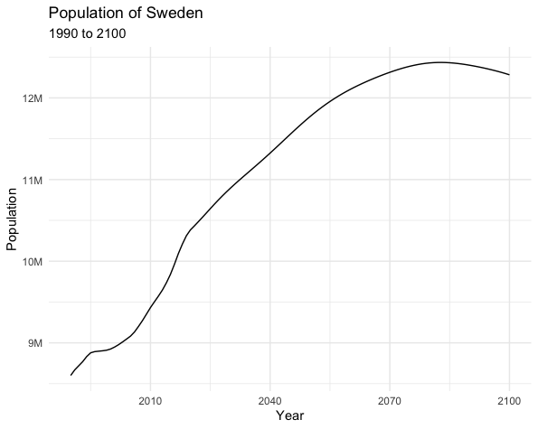
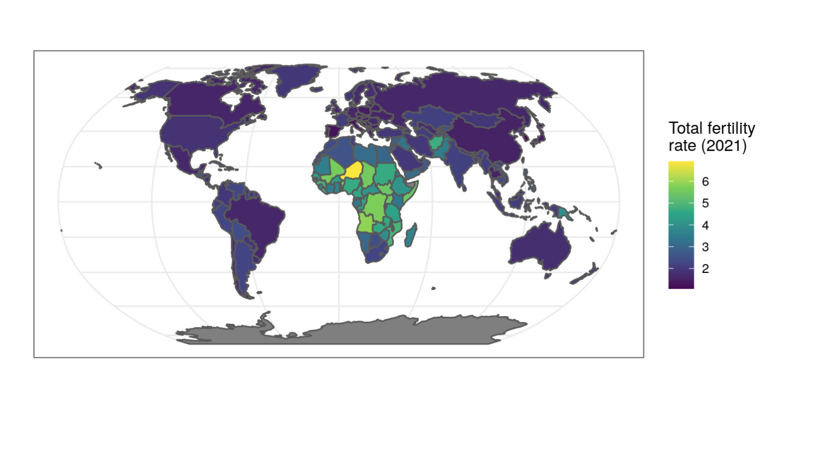

```{r setup, include = FALSE}
library(learnr)
library(knitr)
library(tutorial.helpers)
library(tidycensus)
library(tidyverse)
library(stringr)
library(plotly)

# Time limit is longer than the default because plotting was taking longer than
# the usual limit of 60 seconds, at least for some students.

fertility_data <- read_rds("data/fertility_data.rds")

fertility_data$tooltip <- paste0(fertility_data$name, ": ", 
                                 round(fertility_data$tfr, 2))

knitr::opts_chunk$set(echo = FALSE)
options(tutorial.exercise.timelimit = 240, 
        tutorial.storage = "local",
        tigris_use_cache = TRUE) 
```

```{r copy-code-chunk, child = system.file("child_documents/copy_button.Rmd", package = "tutorial.helpers")}
```

```{r info-section, child = system.file("child_documents/info_section.Rmd", package = "tutorial.helpers")}
```


## International data
###

We can use the **ibdr** package to get information about other countries from the US Census Bureau.

### Exercise 1

We will be making this plot:

<!-- DK: Fix this warning message: -->
<!-- Warning message: -->
<!-- `label_number_si()` was deprecated in scales 1.2.0. -->
<!-- ℹ Please use the `scale_cut` argument of `label_number()` instead. -->
<!-- This warning is displayed once every 8 hours. -->
<!-- Call `lifecycle::last_lifecycle_warnings()` to see where this warning was generated.  -->

<!-- MH: Fixed. -->

```{r eval = FALSE, include = FALSE}
sweden_pop <- get_idb(country = "Sweden",
        variables = "pop",
        year = 1990:2100) |>
  ggplot(mapping = aes(x = year,
                       y = pop)) +
  geom_line() +
  theme_minimal() +
  scale_y_continuous(labels = scales::label_number())+
  labs(title = "Population of Sweden",
       subtitle = "1990 to 2100",
       y = "Population",
       x = "Year")
# API key required for github, here is the code
```

```{r, out.width= "100%"}

```

###

Load the `idbr` package. On the next line, run `get_idb()` with `country` set to `"Sweden"`, `variables` to `"pop"`, and `year` to `1990:2100`.

```{r international-data-1, exercise = TRUE}

```

<button onclick = "transfer_code(this)">Copy previous code</button>

```{r international-data-1-hint-1, eval = FALSE}
library(...)
get_idb(country = "...",
        variables = "...",
        year = 1990:2100)
```

### 

Notice how we can not only use historical data, but also projected data for the future. 

### Exercise 2

Let's make a plot. Pipe this into `ggplot()` setting `x` to `year` and `y` to `pop`. Use `geom_line()`

```{r international-data-2, exercise = TRUE}

```

<button onclick = "transfer_code(this)">Copy previous code</button>

```{r international-data-2-hint-1, eval = FALSE}
... |> 
  ggplot(mapping = aes(x = ..., y = ...)) + 
  geom_line()
```

### 

### Exercise 3

Add the `theme_minimal()` layer and the `scale_y_continuous()` layer setting `labels` to `scales::label_number()`. 

```{r international-data-3, exercise = TRUE}

```

<button onclick = "transfer_code(this)">Copy previous code</button>

```{r international-data-3-hint-1, eval = FALSE}
... +
  theme_minimal() +
  scale_y_continuous(... = scales::label_number())
```

### Exercise 4

Add the appropriate labels using `labs()`.

```{r international-data-4, exercise = TRUE}

```

<button onclick = "transfer_code(this)">Copy previous code</button>

```{r international-data-4-hint-1, eval = FALSE}

```

Reminder: This is what your plot should look like:

```{r, out.width= "100%"}

```

### 

Nice! We just successfully made a plot using international Census data. 
###

Go to [Chapter 12](https://walker-data.com/census-r/working-with-census-data-outside-the-united-states.html#visualizing-idb-data) of Kyle Walkers book on Census Data for information on more advanced plotting!

### Exercise 5

Now we are going to learn how to map this data.

###

This is the map we are going to make:

```{r, eval = FALSE}
get_idb(country = "all",
        year = 2021,
        variables = "tfr",
        geometry = TRUE) %>% 
  ggplot(aes(fill = tfr)) +
  geom_sf() +
  theme_bw() +
  coord_sf(crs = "ESRI:54030") +
  scale_fill_viridis_c() +
  labs(fill = "Total fertility rate\n(2021)") 

```

```{r}

```

### 

Run `get_idb()` below setting `country` to `"all"`, `year` to `2021`, `variables` to `"tfr"`, and `geometry` to `TRUE`.

```{r international-data-5, exercise = TRUE}

```

<button onclick = "transfer_code(this)">Copy previous code</button>

```{r international-data-5-hint-1, eval = FALSE}
get_idb(country ="...",
        year = ...,
        variables = "...",
        geometry = ...)
```

### 

By importing the geometry argument, we enable ourselves to map it. 

### Exercise 6

Copy/paste your code from above. Pipe your code into `ggplot()` and, within `aes()`, set `fill` to `tfr`. Additionally, add the `geom_sf()` layer.

```{r international-data-6, exercise = TRUE}

```

<button onclick = "transfer_code(this)">Copy previous code</button>

```{r international-data-6-hint-1, eval = FALSE}
... |> 
  ggplot(mapping = aes(...)) +
  geom_sf()
```

### 

Our map is going to be shaded based on the `tfr` variable. 

### Exercise 7

Add the `theme_bw()` layer. Additionally, add the `coord_sf()` layer setting `crs` to `"ESRI:54030"`.

```{r international-data-7, exercise = TRUE}

```

<button onclick = "transfer_code(this)">Copy previous code</button>

```{r international-data-7-hint-1, eval = FALSE}
... + 
  theme_bw() + 
  coord_sf(crs = "...")
```

### 

Recall that by setting the `crs` argument, we make countries accurate relative to other countries.

### Exercise 8

Finally, add the `scale_fill_viridis_c()` layer and the `labs()` layer setting `fill` to `"Total fertility rate\n(2021)"`.

```{r international-data-8, exercise = TRUE}

```

<button onclick = "transfer_code(this)">Copy previous code</button>

```{r international-data-8-hint-1, eval = FALSE}
... + 
  labs(fill = "Total fertility rate\n(2021)")
```

### 

Your graph should look like this: 

```{r}

```

### 

We just successfully created a map using international Census data!

### Exercise 9

When making world maps, using animation or interactive functions will enhance the map greatly.

### 

We assigned the raw data we imported (in exercise 5) to `fertility_data` for you, which will be used in future exercises. Take a look at code below and run it.

```{r international-data-9, exercise = TRUE}
fertility_data$tooltip <- paste0(fertility_data$name, ": ", round(fertility_data$tfr, 2))
```

<button onclick = "transfer_code(this)">Copy previous code</button>

```{r international-data-9-hint-1, eval = FALSE}

```

### 

We created a new `tooltip` column in our `fertility_data` object which is what will display when our mouse hovers over a country in the interactive map. It will display the country name, colon, and tfr rounded to the hundreths place. 

### Exercise 10

Load the `ggiraph` package; we will use this to create an interactive map. 

```{r international-data-10, exercise = TRUE}

```

<button onclick = "transfer_code(this)">Copy previous code</button>

```{r international-data-10-hint-1, eval = FALSE}
library(...)
```

### 

Most of the mapping process is the same as a static graph; the only thing we will have to change is `geom_sf()` with one more step. 

### Exercise 11

Start a pipe with `fertility_data` and pipe it into `ggplot()`, setting `fill` to `tfr`. Additionally, add the `theme_bw()` layer.

```{r international-data-11, exercise = TRUE}

```

<button onclick = "transfer_code(this)">Copy previous code</button>

```{r international-data-11-hint-1, eval = FALSE}
fertilizer |> 
  ggplot(mapping = aes(fill = ...)) +
  theme_bw()
```

### 

As you can see our setup is pretty similar.

### Exercise 12

Add the `geom_sf_interactive()` layer. Inside `aes()`, set `tooltip` to `tooltip` and `data_id` to `code`. Outside the `aes()` function, set `size` to `0.1`. 

```{r international-data-12, exercise = TRUE}

```

<button onclick = "transfer_code(this)">Copy previous code</button>

```{r international-data-12-hint-1, eval = FALSE}
... +
  geom_sf_interactive(aes(tooltip = tooltip, data_id = ...), size = 0.1)
```

### 

The `geom_sf_interactive()` sets up the interactive element of the graph.

### Exercise 13

Add the `coord_sf()`, `scale_fill_viridis_c()`, and `labs()` layers with the same arguments as before in the static graph. 

```{r international-data-13, exercise = TRUE}

```

<button onclick = "transfer_code(this)">Copy previous code</button>

```{r international-data-13-hint-1, eval = FALSE}
... +
  coord_sf(crs = "ESRI:54030") +
  scale_fill_viridis_c() +
  labs(fill = "...")
```

### 

Notice that the output still isn't interactive. This is where we have to utilize the `ggiraph` package.

### Exercise 14

Copy/paste your code from above. Assign the whole pipe to a variable named `map`. Start a new line with the `girafe()` function, setting `ggobj` to `map`.

```{r international-data-14, exercise = TRUE}

```

<button onclick = "transfer_code(this)">Copy previous code</button>

```{r international-data-14-hint-1, eval = FALSE}
map <- ...
girafe(ggobj = map)
```

### 

Your map looks the same as the static one, but if you hover over a country, notice that a number pulls up.

### 

We successfully created a interactive graph with international data. 

### 

If you want to learn about other country-specific census databases, such as Cansensus (the Canadian Census), go to [Chapter 12](https://walker-data.com/census-r/working-with-census-data-outside-the-united-states.html#country-specific-census-data-packages) of Kyle Walker's Book.

## Summary

Now that you have finished, you should know how to get API keys for the Census, how to plot using `idbr`, and how to make maps with `geom_sf()`.

```{r download-answers, child = system.file("child_documents/download_answers.Rmd", package = "tutorial.helpers")}
```
